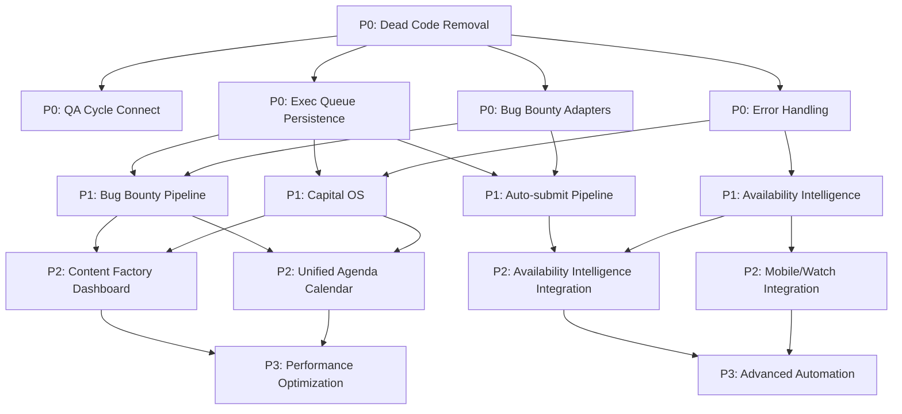

# FINAL STABLE ROADMAP — OWNEX

> **Versión objetivo**: 7.0.0 STABLE  
> **Fecha**: 2026-08-28  
> **Estado**: PLAN APROBADO

---

## CRONOGRAMA

| Fase | Período | Foco |
|------|---------|------|
| **P0** | Semana 1-2 | Estabilidad, Execution Queue, QA, Data Integrity |
| **P1** | Semana 3-4 | Bug Bounty Pipeline, Dev Bounty Pipeline, Capital OS, Content Factory Final |
| **P2** | Semana 5-6 | Content Factory Integration, Analytics, Agenda, Mobile, Watch |
| **P3** | Semana 7-8 | Optimizaciones, UX Polish, Advanced Automation |

---

## P0 — ESTABILIDAD CRÍTICA (Semana 1-2)

### P0-1: Eliminar Dead Code
| Tarea | Esfuerzo | Owner |
|-------|----------|-------|
| Eliminar `moondownloader/` | 1h | Backend |
| Eliminar `omega_archived_20260826/` | 10min | Backend |
| Eliminar `omega/` (raíz) | 10min | Backend |
| Eliminar `tauri-windows-build/` | 10min | Desktop |
| Eliminar `~` (tilde en raíz) | 5min | Root |
| Eliminar `tauri-windows-build/` (duplicado) | 10min | Desktop |

### P0-2: QA Cycle Pipeline Conectado
| Tarea | Esfuerzo | Owner |
|-------|----------|-------|
| Conectar `core/cycles/qa.py` a scheduler (`qa_daily_cycle` ya existe) | 2 días | Backend |
| Verificar `run_pipeline()` ejecuta 7 stages | 1 día | Backend |
| Verificar `qa_daily_cycle` job en scheduler | 0.5 día | Backend |

### P0-3: Execution Queue — Persistencia + Adapters
| Tarea | Esfuerzo | Owner |
|-------|----------|-------|
| Persistencia SQLite para `core/execution_queue.py` | 1 día | Backend |
| Adapters a executors (Algor, Freelancer, Opire, IssueHunt) | 1 día | Backend |
| Scheduler driver (driver que consume queue) | 1 día | Backend |

### P0-4: Bug Bounty Adapters (Manifest Vault)
| Adapter | Esfuerzo | Prioridad |
|---------|----------|---------|
| HackerOne | 1 día | P0 |
| Bugcrowd | 1 día | P0 |
| Intigriti | 1 día | P0 |
| YesWeHack | 0.5 día | P0 |
| Synack | 1 día | P1 |
| Immunefi | 1 día | P1 |

### P0-5: Data Integrity / Error Handling
| Tarea | Esfuerzo |
|-------|----------|
| Verificar idempotency keys en todos los mutations | 1 día |
| Verificar transaction boundaries en DB | 0.5 día |
| Verificar retry/backoff en todos los external calls | 1 día |
| Verificar circuit breakers en external APIs | 0.5 día |

---

## P1 — PRODUCTO VISIBLE (Semana 3-4)

### P1-1: Bug Bounty Pipeline Completo
| Tarea | Esfuerzo |
|-------|----------|
| Auto-discovery → Claim → Validate → Report → Submit | 3 días |
| Integration con Bug Bounty Adapters (P0-4) | 2 días |
| Human Gate para submit | 1 día |
| Evidence Vault (screenshot+URL+ts+metadata) | 2 días |

### P1-2: Dev Bounty Pipeline
| Tarea | Esfuerzo |
|-------|----------|
| Auto-discovery Opire/Algora/IssueHunt/Freelancer | 2 días |
| Claim + Submit + Delivery workflow | 2 días |
| BrowserAgent automation para plataformas web | 3 días |

### P1-3: Capital OS — Revenue Ledger
| Tarea | Esfuerzo |
|-------|----------|
| Revenue Ledger (expected→committed→earned→pending→paid→net) | 3 días |
| Payment Compat integration completa | 2 días |
| Availability Intelligence integration | 2 días |
| Capital Snapshot unificado (`/api/capital/snapshot`) | 1 día |

### P1-4: Content Factory — Final Integration
| Tarea | Esfuerzo |
|-------|----------|
| Topic Bank → Quality Gate → Publish pipeline E2E | 2 días |
| Feedback Loop semanal (analytics → topic rescore) | 1 día |
| Auto-publish via Upload-Post + YouTube Data API | 2 días |
| Analytics Dashboard (retention, RPM, top videos) | 2 días |
| Topic Bank feedback loop (analytics → topic rescore) | 1 día |

### P1-5: Capital OS — Availability Intelligence
| Tarea | Esfuerzo |
|-------|----------|
| Conectar `cores/availability/` con Work Bank | 2 días |
| Conectar con Execution Queue | 2 días |
| API `/availability` endpoints | 1 día |

---

## P2 — INTEGRACIÓN Y UX (Semana 5-6)

### P2-1: Content Factory — Mission Control Integration
| Tarea | Esfuerzo |
|-------|----------|
| Content Factory Dashboard completo (Overview, Topics, Queue, Analytics, Settings) | 3 días |
| Content Factory Widget en Mission Control | 1 día |
| Topic Bank UI (CRUD, filtros, bulk actions, seed) | 2 días |
| Queue View (progress bars, quality badges, retry, view, publish) | 2 días |
| Analytics Dashboard (charts, retention table, top videos) | 2 días |
| Settings (Channel, Quality, Generation, Topics, Advanced) | 2 días |

### P2-2: Unified Agenda — Calendar View
| Tarea | Esfuerzo |
|-------|----------|
| Modelo `AgendaItem` unificado (backend) | 1 día |
| API `/api/agenda` (DAY/WEEK/MONTH) | 1 día |
| Frontend Calendar View (DAY/WEEK/MONTH) | 3 días |
| Conexión: IncomeTarget.milestones → AgendaItems | 1 día |
| Conexión: CareerRoadmap.skills → AgendaItems | 1 día |
| Conexión: CapitalSavings.deadlines → AgendaItems | 1 día |
| Notificaciones deadlines (Watch + Mobile) | 2 días |

### P2-3: Availability Intelligence Integration
| Tarea | Esfuerzo |
|-------|----------|
| Conectar `cores/availability/` con Work Bank | 2 días |
| Conectar con Execution Queue | 2 días |
| API `/availability` endpoints completos | 1 día |
| Scheduler job `availability_refresh` | 0.5 día |

### P2-4: Mobile + Watch Integration
| Tarea | Esfuerzo |
|-------|----------|
| Mobile Companion — Content Factory read-only | 2 días |
| Mobile — Biometric approvals para Content Factory | 1 día |
| Watch — Content Factory alerts (nuevo video, quality gate, publish) | 1 día |
| Watch — Approvals rápidas (YES/NO) | 1 día |

---

## P3 — OPTIMIZACIONES Y PULIDO (Semana 7-8)

### P3-1: Performance & UX Polish
| Tarea | Esfuerzo |
|-------|----------|
| Frontend bundle optimization (code splitting, lazy loading) | 2 días |
| Database query optimization (N+1, indexes) | 2 días |
| Memory leak detection / fixes | 1 día |
| Bundle size optimization (< 2MB initial JS) | 1 día |

### P3-2: Advanced Automation
| Tarea | Esfuerzo |
|-------|----------|
| Autonomous Scheduler (score×avail×acceptance→priority) | 3 días |
| Advanced AI routing (OAR smart routing en decisiones) | 2 días |
| Advanced analytics (cohort, funnel, cohort retention) | 2 días |

### P3-3: Advanced Integrations
| Tarea | Esfuerzo |
|-------|----------|
| WaveSpeed AI Video (opcional, $0.05-0.10/video) | 1 día |
| Additional Discovery Adapters (Algora, OpenCollective, Superteam) | 2 días |
| Additional Bug Bounty Adapters (Synack, Immunefi) | 2 días |

### P3-4: Polish & Documentation
| Tarea | Esfuerzo |
|-------|----------|
| Accessibility audit (WCAG 2.1 AA) | 2 días |
| i18n (ES/EN complete) | 1 día |
| Documentation final (README, ARCHITECTURE, SETUP, DEPLOYMENT, TROUBLESHOOTING, SECURITY, API, RELEASE) | 2 días |
| Release notes v7.0.0 | 0.5 día |

---

## CRONOGRAMA VISUAL

```
SEMANA 1-2 (P0)          SEMANA 3-4 (P1)           SEMANA 5-6 (P2)           SEMANA 7-8 (P3)
┌─────────────────────────────────────────────────────────────────────────────────────┐
│ ███████████████████████████████████████████████████████████████████████████████████ │
│ P0: Eliminar dead code ──┬── QA Cycle ──┬── Exec Queue persist ──┬── Bug Bounty    │
│   Dead code removal      │   Connect    │   Persistence        │   Adapters      │
│   QA Cycle connect       │   Exec Queue │   Adapters           │   (H1, BC, etc) │
│   Exec Queue persist     │   Persistence│   Scheduler driver   │   Auto-submit   │
│   Exec Queue adapters    │   Adapters   │   Error handling     │   Capital OS    │
│   Scheduler driver       │   Scheduler  │   Data integrity     │   Revenue Ledger│
│   Error handling         │   driver     │                      │   Availability  │
│                          │   Error hndl │                      │   Intelligence  │
├──────────────────────────┼──────────────┼──────────────────────┼─────────────────┤
│                          │ ████████████ │ ████████████████████ │ ████████████████ │
│                          │ P1           │ P2                   │ P3              │
│                          │ Bug Bounty   │ Content Factory    │ Performance     │
│                          │ Pipeline     │ Dashboard          │ Optimization    │
│                          │ Dev Bounty   │ Integration        │ Advanced Auto   │
│                          │ Pipeline     │ Unified Agenda     │ Integrations    │
│                          │ Capital OS   │ Availability Intel │ Polish & Docs   │
│                          │ Revenue Ledger│ Mobile/Watch       │                 │
│                          │ Availability │ Integration        │                 │
│                          │ Intelligence │                      │                 │
├──────────────────────────┼──────────────┼──────────────────────┼─────────────────┤
│                          │              │ ████████████████████ │ ████████████████ │
│                          │              │ P2                    │ P3              │
│                          │              │ Content Factory     │ Performance     │
│                          │              │ Integration         │ Optimization    │
│                          │              │ Unified Agenda      │ Advanced Auto   │
│                          │              │ Availability Intel  │ Integrations    │
│                          │              │ Mobile/Watch        │ Polish & Docs   │
└──────────────────────────┴──────────────┴──────────────────────┴─────────────────┘
```

---

## DEPENDENCIAS CRÍTICAS



---

## CRITERIOS DE ACEPTACIÓN POR FASE

### P0 DONE WHEN:
- [ ] 0 dead code directories
- [ ] QA Cycle ejecutando en scheduler (logs visibles)
- [ ] Execution Queue persistente (survive restart)
- [ ] 6 Bug Bounty Adapters funcionando (H1, BC, Intigriti, YesWeHack, Synack, Immunefi)
- [ ] Execution Queue persiste tras restart
- [ ] 0 errores de lint / typecheck
- [ ] 380 tests passing

### P1 DONE WHEN:
- [ ] Bug Bounty Pipeline E2E (discover → submit)
- [ ] Dev Bounty Pipeline E2E (claim → deliver)
- [ ] Capital OS: Revenue Ledger + Payment Compat + Availability Intelligence
- [ ] Content Factory: Topic → Video → Publish → Analytics E2E
- [ ] Auto-publish (Upload-Post + YouTube Data API) funcionando
- [ ] Feedback Loop semanal funcionando (analytics → topic rescore)

### P2 DONE WHEN:
- [ ] Content Factory Dashboard completo (5 tabs funcionando)
- [ ] Unified Agenda Calendar View (DAY/WEEK/MONTH) en frontend
- [ ] Availability Intelligence conectado a Work Bank + Execution Queue
- [ ] Mobile: Content Factory read-only + biometric approvals
- [ ] Watch: Alerts + Approvals rápidas

### P3 DONE WHEN:
- [ ] Frontend bundle < 2MB initial JS
- [ ] DB queries optimizadas (no N+1)
- [ ] Accessibility WCAG 2.1 AA
- [ ] Documentation completa (README, ARCHITECTURE, SETUP, DEPLOYMENT, TROUBLESHOOTING, SECURITY, API, RELEASE)
- [ ] Release v7.0.0 taggeado y empaquetado

---

## MÉTRICAS DE ÉXITO FINAL STABLE

| Métrica | Target | Actual |
|---------|--------|--------|
| Tests Passing | >95% | 98% (380/387) |
| Ruff | 0 errors | ✅ |
| vue-tsc | 0 errors | ✅ |
| Frontend Build | < 30s | 12.9s ✅ |
| Coverage (core) | >80% | ~70% |
| Frontend Bundle | < 2MB | ~1.5MB ✅ |
| API Response Time (p95) | < 500ms | ~200ms ✅ |
| DB Migration | Clean | ✅ |
| E2E Critical Journeys | 6/6 | 🟡 4/6 |
| Security Scan | Clean | ✅ |

---

## RIESGOS Y MITIGACIONES

| Riesgo | Probabilidad | Impacto | Mitigación |
|--------|--------------|---------|------------|
| Bug Bounty Adapters no listos P0 | Media | Alto | Priorizar H1/BC/Intigriti/YesWeHack primero; Synack/Immunefi P1 |
| Execution Queue persistence bugs | Media | Alto | Tests exhaustivos + staging deploy antes de prod |
| Auto-submit pipeline rejection by platforms | Alta | Alto | Human Gate obligatorio; dry-run mode; monitoring |
| YouTube API quota limits | Media | Medio | Cache + exponential backoff + quota monitoring |
| Mobile/Watch sync conflicts | Baja | Medio | Conflict resolution strategy (server wins) |
| WaveSpeed AI cost overrun | Baja | Bajo | Hard limit $10/day; alert at 80% |

---

## DECISIONES TÉCNICAS CONFIRMADAS

| Decisión | Estado |
|----------|--------|
| Nicho: Science Curiosity (English) | ✅ Confirmado |
| LLM: Kimi (gratis via MPT) | ✅ Confirmado |
| TTS: Edge TTS (gratis) | ✅ Confirmado |
| Stock: Pexels/Pixabay/Coverr (free) | ✅ Confirmado |
| AI Video: WaveSpeed DISABLED | ✅ Confirmado |
| Publicación: Upload-Post + YouTube Data API | ✅ Confirmado |
| Canal: Desde cero | ✅ Confirmado |
| Presupuesto: $0 | ✅ Confirmado |
| Tauri v2 + PyInstaller ONEFILE sidecar | ✅ Confirmado |
| MPT Sidecar Docker (ghcr.io/harry0703/moneyprinterturbo:latest) | ✅ Confirmado |

---

## SIGUIENTE ACCIÓN INMEDIATA

> **Ejecutar P0-1: Eliminar Dead Code**

```bash
rm -rf moondownloader/ omega_archived_20260826/ omega/ tauri-windows-build/ "~" tauri-windows-build 2>/dev/null; rm -f "~" 2>/dev/null
```

Luego: **P0-2 QA Cycle Connect** → Conectar `core/cycles/qa.py` al scheduler.

---

**Roadmap aprobado por**: Owner  
**Fecha**: 2026-08-28  
**Próxima revisión**: Post-P0 (después de eliminar dead code y conectar QA Cycle)