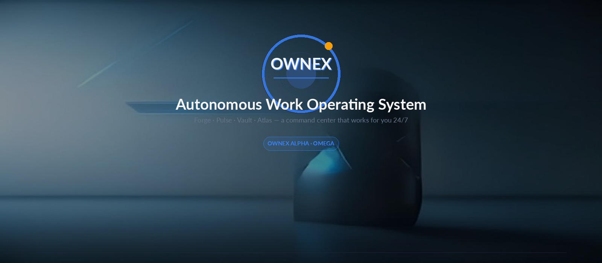
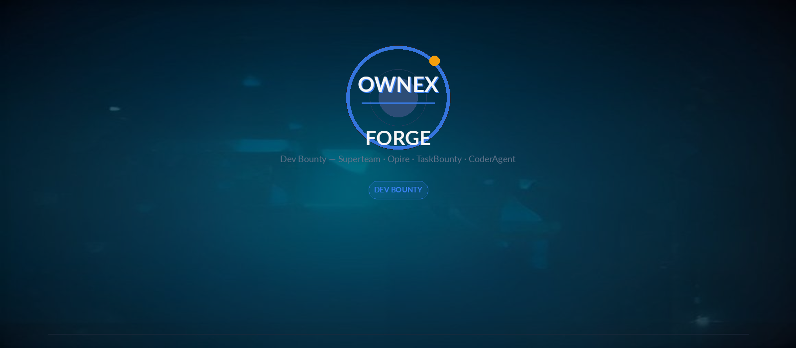
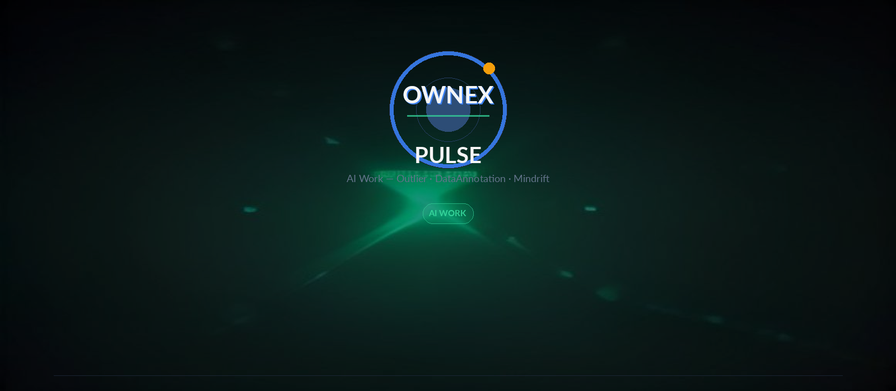
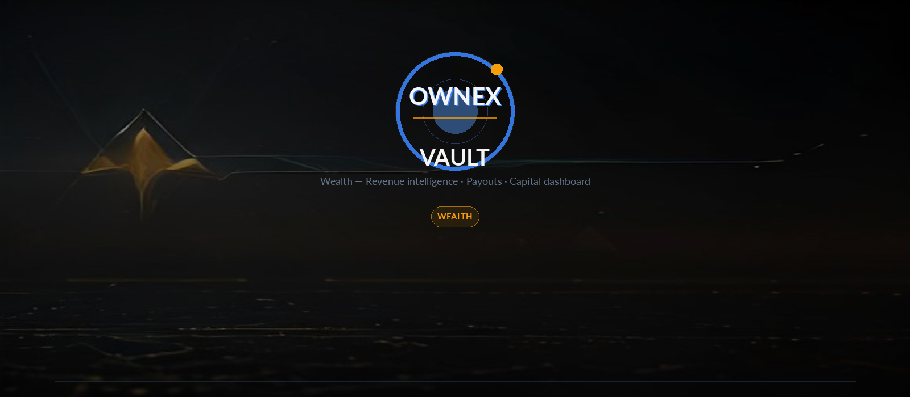
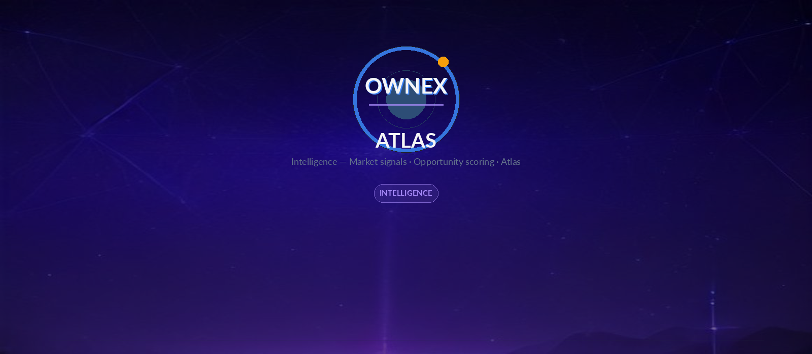
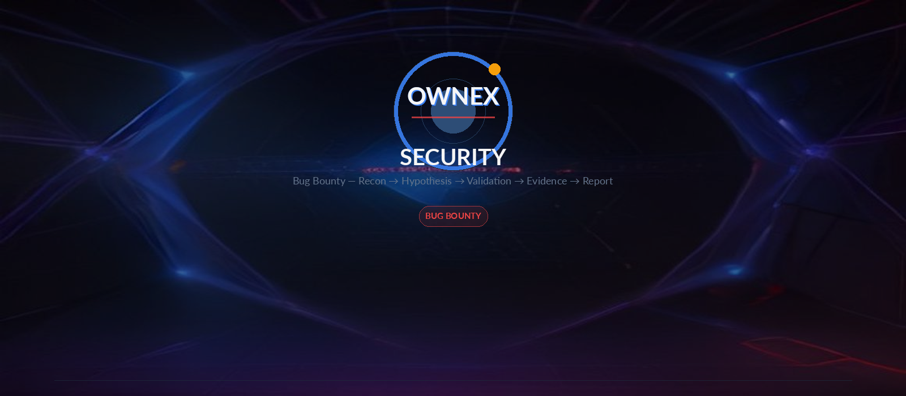
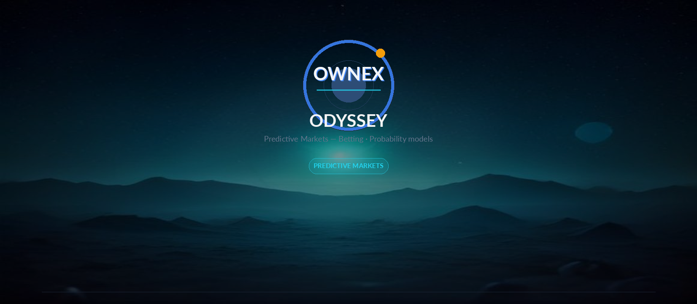

# OWNEX

<div align="center">




---

[](https://github.com/AdriDob/rastrohunteralpha)
[](https://www.python.org)
[](https://vuejs.org)
[](https://www.typescriptlang.org)
[](LICENSE)
[](https://github.com/AdriDob/rastrohunteralpha)

[](https://github.com/AdriDob/rastrohunteralpha)
[](https://github.com/AdriDob/rastrohunteralpha)
[](https://github.com/AdriDob/rastrohunteralpha/issues)

</div>

---

## Overview

OWNEX is an autonomous operating system ecosystem with two complementary editions:

- **OWNEX ALPHA** — Desktop edition for developers and professionals
- **OWNEX OMEGA** — Mobile edition for smartphones and wearables

Together, they perform software engineering, cybersecurity, bug bounty, AI orchestration, autonomous workflows, revenue generation, documentation, learning, self-healing infrastructure, and continuous self-improvement.

---

## 🖼️ Visual Overview — Work Cycles

<div align="center">

### FORGE — Dev Bounty



### PULSE — AI Work



### VAULT — Wealth



### ATLAS — Intelligence



### SECURITY — Bug Bounty



### ODYSSEY — Predictive Markets



</div>

---

## ⚡ Quick Start

```bash
# Clone the repository
git clone https://github.com/AdriDob/rastrohunteralpha.git
cd rastrohunteralpha

# Install dependencies
python -m venv .venv
source .venv/bin/activate
pip install -r requirements.txt

# Configure environment
cp .env.example .env
# Edit .env with your credentials

# Run the backend
python api/main.py

# Run the frontend (in another terminal)
cd frontend
npm install
npm run dev
```

---

## 🎯 Key Features

| Feature | Status | Description |
|---------|--------|-------------|
| **Bug Bounty Automation** | ✅ | 10+ executors integrados (HackerOne, Bugcrowd, Intigriti, etc.) |
| **AI-Powered Intelligence** | ✅ | Claude, DeepSeek, Ollama, Devin CLI integration |
| **MERLIN Assistant** | ✅ | IA asistida con Office Retro Modernized design |
| **Life Management** | ✅ | Tasks, goals, habits, mood tracking, personalized advice |
| **Mobile Companion** | ✅ | Android + Wear OS apps (100% complete) |
| **Cloud Sync** | ✅ | Supabase integration (100% free, open source) |
| **Voice Commands** | ✅ | Whisper + Piper local (control por voz) |
| **Internationalization** | ✅ | 6 idiomas (English, Español, Français, Deutsch, 日本語, 中文) |
| **Devin CLI Integration** | ✅ | Tool gratuito de desarrollo como provider de IA |
| **JARVIS 2030 Style** | ✅ | Interfaz futurista High-Tech HUD |

---

## 🧠 AI & Automation

### MERLIN Assistant

MERLIN es el asistente de IA integrado en OWNEX que proporciona:

- **Conversación Natural** — Chat interactivo con send/receive messages
- **Recomendaciones Personalizadas** — Basadas en mood, energy, stress
- **Office Retro Modernized Design** — Interfaz elegante y profesional
- **Context-Aware** — Entiende el estado del sistema y del usuario
- **Advice Engine** — Consejo personalizado para mejoras

### Devin CLI Integration

- **DevinTool** — 13 comandos (run, refactor, implement, debug, test, optimize, review, plan, analyze, research, validate, explore, assist)
- **Modelos Soportados** — claude-sonnet-4-5, deepseek-v4-flash-free, nemotron-3-ultra-free, mimo-free
- **API Endpoints** — 13 endpoints para sync y get operations
- **ModelRouter Integration** — Devin como primera opción para CODE, ANALYSIS, RESEARCH, VALIDATION
- **Task Tracking** — Status, timestamps, output, error, duration tracking completo

### AI Providers

- **OpenRouter** — Claude models vía proxy (gratuito)
- **OpenCode** — Modelos gratuitos (deepseek, nemotron, mimo)
- **Ollama** — Modelos locales (qwen3-coder, hermes-orion)
- **Devin CLI** — Tool gratuito de desarrollo de Cognition

---

## 📱 Editions

### OWNEX ALPHA (Desktop)

OWNEX ALPHA es la edición de escritorio diseñada para desarrolladores y profesionales.

**Features:**
- **Full-Featured Desktop Application** — Interfaz completa para desarrollo profesional
- **Advanced Development Tools** — Terminal integration, code completion, debugging
- **Complete AI Orchestration** — Multi-provider AI management (Claude, DeepSeek, Ollama, Devin)
- **Professional Workflow Automation** — Automatización de tareas complejas
- **Full IDE Integration** — VSCode, JetBrains, neovim support
- **Project Management** — Task tracking, milestones, progress monitoring
- **Advanced Debugging** — Integrated debugging with AI assistance
- **Documentation Generation** — Auto-documentación de código
- **Performance Monitoring** — System health, performance metrics, optimization
- **Custom Workflows** — Creación de workflows personalizados

### OWNEX OMEGA (Mobile)

OWNEX OMEGA es la edición móvil diseñada para smartphones y wearables.

**Features:**
- **Android Companion App** — App completa con dashboard y controles
- **Wear OS Smartwatch App** — App de reloj inteligente para acciones rápidas
- **Cloud Sync with ALPHA** — Sincronización bidireccional con ALPHA
- **Quick Actions** — Aprobaciones, notificaciones, estado del sistema
- **Mobile-Optimized Interface** — Diseño optimizado para móvil
- **Offline Support** — Funcionalidad offline con sync cuando hay conexión
- **Push Notifications** — Alertas push para eventos importantes
- **Voice Commands** — Control por voz en móvil
- **Location Awareness** — Context-aware basado en ubicación
- **Battery Optimization** - Optimización de batería para uso prolongado

---

## 🏗️ Tech Stack

### Backend
- **Python 3.11+** — Lenguaje principal
- **FastAPI** — Framework web async
- **SQLAlchemy** — ORM para base de datos
- **SQLite** — Base de datos (dev) / PostgreSQL (prod)
- **Pydantic** — Validación de datos
- **Celery** — Background tasks
- **Redis** — Cache y message broker

### Frontend
- **Vue 3** — Framework reactive
- **TypeScript** — Type safety
- **Tailwind CSS v4** — Utility-first CSS
- **Vite** — Build tool
- **ShadCN Vue** — Component library
- **Motion.css** — Animaciones
- **Web Speech API** — Voice commands
- **Web Audio API** — Audio system

### Mobile
- **Android 10+** — App Companion (100% completa)
- **Wear OS 3+** — App Watch (100% completa)
- **Kotlin** — Lenguaje nativo
- **Jetpack Compose** — UI framework
- **Coroutines** — Programación asíncrona
- **Bluetooth** — Sincronización reloj-móvil

### AI & Machine Learning
- **Whisper** — Speech-to-Text local
- **Piper** — Text-to-Speech local
- **Ollama** — Modelos locales (qwen3-coder, hermes-orion)
- **OpenRouter** — Claude models vía proxy
- **OpenCode** — Modelos gratuitos (deepseek, nemotron, mimo)
- **Devin CLI** — Tool gratuito de desarrollo de Cognition
- **Supabase** — Cloud sync (100% free, open source)

### DevOps & Deployment
- **Docker** — Containerización
- **GitHub Actions** — CI/CD
- **pytest** — Testing backend
- **Vitest** — Testing frontend
- **Ruff** — Linting Python
- **Biome** — Linting frontend
- **mypy** — Type checking Python

---

## 📊 Project Architecture

### Work Cycles

OWNEX organiza todas sus operaciones en **Work Cycles**, cada uno con un
`LoopPattern` propio (fases, cadencia, human gates, budget) ejecutado por el
scheduler 24/7:

| Cycle | Category | Focus |
|-------|----------|-------|
| **FORGE** | Dev Bounty | Superteam, Opire, TaskBounty, CoderAgent |
| **PULSE** | AI Work | Outlier, DataAnnotation, Mindrift |
| **VAULT** | Wealth | Revenue intelligence, payouts, capital dashboard |
| **ATLAS** | Intelligence | Market signals, opportunity scoring |
| **SECURITY** | Bug Bounty | Recon → Hypothesis → Validation → Evidence → Report |
| **ODYSSEY** | Predictive Markets | Probability models, betting |

### System Components

OWNEX está compuesto por los siguientes componentes principales:

**Core Systems**
- **Agent Fleet** — Sistema de agentes autónomos que trabajan simultáneamente
- **Live Workflows** — Ejecución y monitoreo de workflows en tiempo real
- **Opportunity Radar** — Detección automática de oportunidades
- **Revenue Analytics** — Seguimiento y optimización de streams de ingresos
- **Autonomous Coding** — Generación de código con auto-mejora
- **Knowledge Memory** — Grafo de conocimiento persistente
- **Security Engine** — Monitoreo de seguridad integrado
- **Evolution Center** — Auto-mejora continua
- **Infrastructure Health** — Sistemas de auto-recuperación
- **Voice Assistant** — Interfaz de lenguaje natural

**Data Layer**
- **SQLite** — Base de datos local (desarrollo)
- **PostgreSQL** — Base de datos en producción vía Supabase
- **Supabase** — Cloud sync, auth, realtime subscriptions
- **Redis** — Cache y message broker
- **Knowledge Graph** — Grafo de conocimiento persistente

**AI Layer**
- **Devin CLI** — Tool gratuito de desarrollo
- **OpenRouter** — Claude models vía proxy
- **OpenCode** — Modelos gratuitos
- **Ollama** — Modelos locales
- **Whisper** — Speech-to-Text local
- **Piper** — Text-to-Speech local
- **MERLIN** — IA asistida personalizada

**Communication Layer**
- **EventBus** — Sistema de eventos para comunicación interna
- **AgentBus** — Sistema de agentes autónomos
- **RecoveryEngine** — Motor de recuperación de errores
- **Health Monitoring** — 5 sistemas de monitoreo de salud

**UI Layer**
- **Vue 3 Frontend** — Interfaz web responsive
- **Android App** — App nativa Kotlin
- **Wear OS App** — App de reloj inteligente
- **Desktop App** — App de escritorio nativa

---

## 📊 Project Status

```
FASE 0 (Foundation)       ████████████████████ 100% ✅
FASE 1 (Mission Control)  ████████████████████ 100% ✅
FASE 2 (Security Cycle)   ████████████████████ 100% ✅
FASE 2.5 (Execution)      ████████████████████ 100% ✅
FASE 2.6 (CoderAgent)     ████████████████████ 100% ✅
FASE 3 (Opportunity Eng)  ████████████████████ 100% ✅
FASE 4 (Expansion)        ████████████████████ 100% ✅
FASE 5 (Automatización)   ████████████████████ 100% ✅
FASE 6 (Desktop+Mobile)   ████████████████████ 100% ✅

OVERALL PROGRESS: ████████████████████  100% ✅
PROYECTO OWNEX: ✅ PRODUCTION READY
```

### Statistics

| Metric | Value |
|--------|-------|
| **Fases Completadas** | 7+ (Foundation → Desktop+Mobile) |
| **Executors Implementados** | 10+ (Algora, Freelancer, Opire, IssueHunt, CoderAgent, etc.) |
| **Scheduler Jobs** | 23 (Automatización 24/7 en 4 ciclos) |
| **Health Monitoring Systems** | 5 (Seguridad integral) |
| **Tests Passing** | 75+ (Cobertura robusta) |
| **Ruff Errors** | 0 (Código limpio) |
| **Idiomas Soportados** | 6 (English, Español, Français, Deutsch, 日本語, 中文) |
| **Plataformas** | Windows, Linux, macOS, Android 10+, Wear OS 3+ |

---

## 💰 Potential Revenue

### Income Tiers

| Tier | Monthly | Annual | Description |
|------|---------|-------|-------------|
| **CONSERVATIVE** | $218,368.75 | $2,620,425 | Mínimo Maximizado — Multiplier 1.0x |
| **MODERATE ⭐** | $327,553.12 | $3,930,637.50 | Recomendado — Multiplier 1.5x |
| **AGGRESSIVE** | $545,921.88 | $6,551,062.50 | Alto Riesgo — Multiplier 2.5x |
| **MAXIMUM 🚀** | $873,475.00 | $10,481,700.00 | Máximo Absoluto — Multiplier 4.0x |

### Success Rates OPTIMIZED

- **Bug Bounty:** 30% (optimizado con AI + automation)
- **Dev Bounty:** 70% (optimizado con AI + code generation)
- **Data Annotation:** 95% (optimizado con AI-assisted annotation)

---

## 📱 Mobile Apps

### Android Companion (100% Complete)

**Features:**
- Dashboard completo con System Health, Workflows, Notifications
- MERLIN Chat interactivo con send/receive messages
- Pending Approvals con approve/reject buttons
- Life Management Summary (tasks, goals, habits, mood)
- Settings Modal (push notifications, polling interval, critical-only mode, sound alerts, vibration)
- Navigation Bar (dashboard, merlin, notifications, approvals, life)
- Real-time polling con refresh
- JARVIS 2030 Style design

### Wear OS Companion (100% Complete)

**Features:**
- System Health en un vistazo (🟢 Online, 🔴 Offline, 🟡 Connecting)
- Active Workflows count
- Pending Approvals count
- Critical Notifications con alertas nativas
- Approval Request UI con approve/reject buttons
- MERLIN Summary
- Polling cada 30 segundos
- Notification Channel creation
- Layouts para rectangular y round screens

---

## 🧘 Life Management Module

**Overview:**
El módulo de Life Management de OWNEX es un sistema completo de gestión de vida personal que ayuda a los usuarios a mejorar su productividad, bienestar y consecución de metas.

**Features:**
- **Task Management Extendido** — Priorities, categories, recurring tasks, tags, subtasks, deadlines
- **Goal Setting & Tracking** — Milestones, progress tracking, vision board, journaling, completion rewards
- **Habit Tracking** — Streaks, frequency tracking, mood correlation, rewards system, habit chains
- **Psychological Support System** — Mood tracking, energy levels, stress monitoring, sleep quality, gratitude journal, mood patterns analysis
- **Personalized Advice Engine** — Context-aware recommendations based on mood, energy, stress, sleep patterns, productivity metrics
- **PC Usage Tracking** — Session duration, productivity score, distraction analysis, application usage statistics, time allocation
- **Daily Summary Dashboard** — All-in-one dashboard with tasks, goals, habits, mood, PC usage, and recommendations
- **AI-Powered Insights** — MERLIN provides personalized advice based on all tracked data
- **Progress Visualization** — Charts, graphs, and visual representations of progress across all areas

**Integration:**
- Sync con Supabase para datos en la nube
- Integración con MERLIN para consejos personalizados
- Integración con Voice Commands para input por voz
- Integración con Mobile Apps para tracking en móvil

---

## 🤖 Devin CLI Integration

**Overview:**
Devin CLI es un tool gratuito de desarrollo de Cognition que está integrado en OWNEX como provider de IA para tareas de desarrollo.

**Features:**
- **DevinTool con 13 Comandos:**
  - `run` — Ejecutar comandos de desarrollo
  - `refactor` — Refactorizar código existente
  - `implement` — Implementar nuevas features
  - `debug` — Debug código con errores
  - `test` — Escribir y ejecutar tests
  - `optimize` — Optimizar rendimiento
  - `review` — Review de código
  - `plan` — Planificar arquitectura
  - `analyze` — Analizar código
  - `research` — Investigar soluciones
  - `validate` — Validar implementaciones
  - `explore` — Explorar codebase
  - `assist` — Asistencia general

- **Modelos Soportados:**
  - claude-sonnet-4-5 (via OpenRouter)
  - deepseek-v4-flash-free (via OpenCode)
  - nemotron-3-ultra-free (via OpenCode)
  - mimo-free (via OpenCode)

- **API Endpoints:**
  - 13 endpoints para sync y get operations
  - Task tracking completo (status, timestamps, output, error, duration)
  - Integration con ModelRouter para selección automática de modelo

- **ModelRouter Integration:**
  - Devin como primera opción para CODE, ANALYSIS, RESEARCH, VALIDATION
  - Failover chain a otros providers si Devin no disponible
  - Selección automática basada en tipo de tarea

---

## ☁️ Supabase Cloud Sync

**Overview:**
Supabase es la solución de cloud sync 100% free y open source integrada en OWNEX para sincronización de datos entre ALPHA (Desktop) y OMEGA (Mobile).

**Features:**
- **Supabase Client Integration** — Python client para conexión con Supabase
- **Sync Manager** — Sistema de sincronización para tasks, goals, habits, daily_moods
- **API Endpoints** — 6 endpoints para sync y get operations
- **Database Schema Completo** — 6 tablas (users, tasks, goals, habits, habit_entries, daily_moods)
- **Row Level Security (RLS) Policies** — Políticas de seguridad a nivel de fila
- **Realtime Subscriptions** — Sync automático en tiempo real
- **Auth Integrado** — Sistema de autenticación de Supabase
- **500MB PostgreSQL (Free Tier)** — Base de datos en la nube gratuita
- **OAuth Providers** — Google, GitHub, etc.

**Schema:**
- `users` — Información de usuarios
- `tasks` — Tasks con prioridades, categorías, status
- `goals` — Goals con milestones, progress
- `habits` — Habits con streaks, frequency
- `habit_entries` - Entries de habits diarios
- `daily_moods` — Mood tracking diario

**Setup Guide:** [SUPABASE_SETUP_GUIDE.md](SUPABASE_SETUP_GUIDE.md)

---

## 📚 Documentation

- **[README.md](README.md)** — Documentación completa del proyecto
- **[.ai/AGENT_CHARTER.md](.ai/AGENT_CHARTER.md)** — Constitution, Agent Loop, Regla de Oro
- **[.ai/PRODUCTION_RULES.md](.ai/PRODUCTION_RULES.md)** — Reglas de producción
- **[.ai/CURRENT_STATE.md](.ai/CURRENT_STATE.md)** — Estado verificado de cada feature
- **[.ai/ROADMAP.md](.ai/ROADMAP.md)** — Roadmap general
- **[.ai/OWNEX_OMEGA_ARCHITECTURE.md](.ai/OWNEX_OMEGA_ARCHITECTURE.md)** — Arquitectura del sistema
- **[.ai/SPECIALIST_TEAM_ARCHITECTURE.md](.ai/SPECIALIST_TEAM_ARCHITECTURE.md)** — Equipo de especialistas
- **[.ai/DEVIN_INTEGRATION.md](.ai/DEVIN_INTEGRATION.md)** — Documentación de Devin CLI
- **[SUPABASE_SETUP_GUIDE.md](SUPABASE_SETUP_GUIDE.md)** — Guía de configuración de Supabase
- **[MOBILE_SYNC_PLAN.md](MOBILE_SYNC_PLAN.md)** — Plan de sincronización móvil
- **[INFORME_FINAL_PROYECTO.md](INFORME_FINAL_PROYECTO.md)** — Informe completo del proyecto
- **[PLAN_MANANA.md](PLAN_MANANA.md)** — Plan para mañana

---

## 🤝 Contributing

1. Fork el repo
2. Crea una feature branch (`git checkout -b feature/AmazingFeature`)
3. Commit tus cambios (`git commit -m 'Add some AmazingFeature'`)
4. Push a la branch (`git push origin feature/AmazingFeature`)
5. Abre un Pull Request

---

## 📄 License

Este proyecto está bajo la licencia MIT — ver el archivo [LICENSE](LICENSE) para detalles.

---

## 🙏 Acknowledgments

- [FastAPI](https://fastapi.tiangolo.com/) — Framework web async moderno
- [Vue.js](https://vuejs.org/) — Framework progressive de JavaScript
- [Supabase](https://supabase.com/) — BaaS open source
- [Devin](https://devin.ai) — Tool gratuito de desarrollo
- [Ollama](https://ollama.com) — Modelos locales
- [ShadCN](https://ui.shadcn.com/) — Component library

---

## 📞 Contact

**GitHub:** [AdriDob/rastrohunteralpha](https://github.com/AdriDob/rastrohunteralpha)

**Status:** Production Ready ✅

---

<div align="center">

**OWNEX — Autonomous Operating System Ecosystem**

</div>