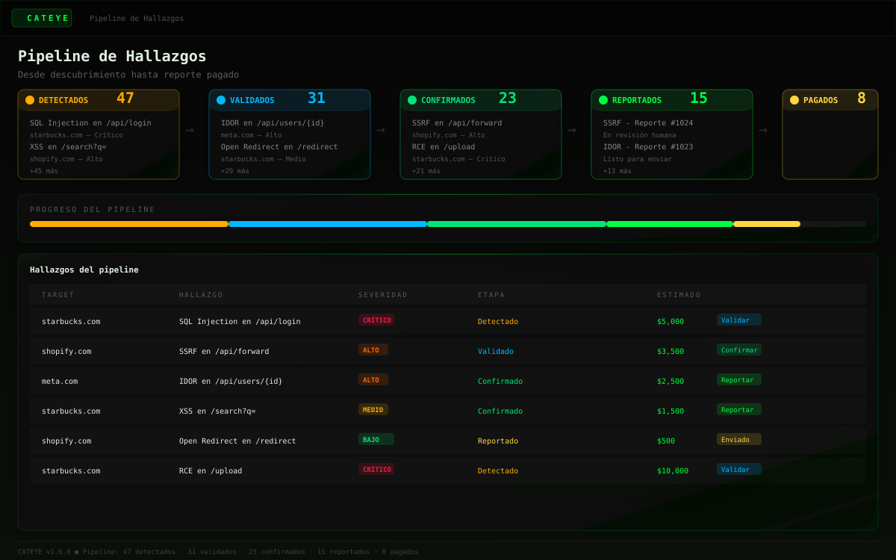
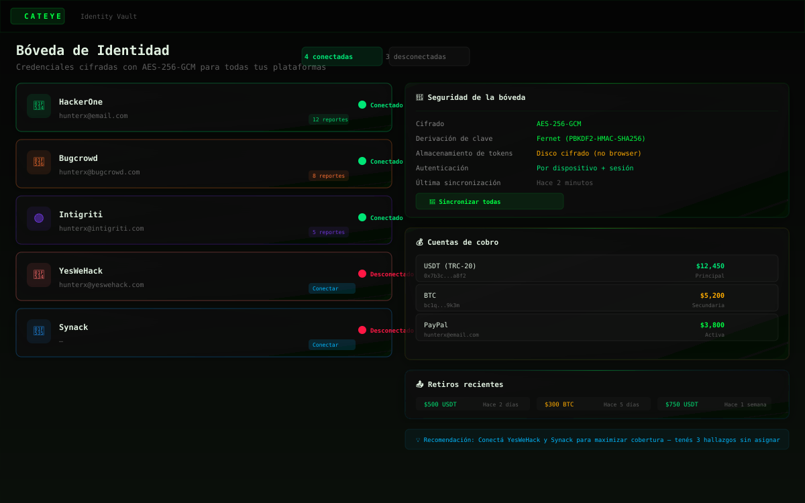
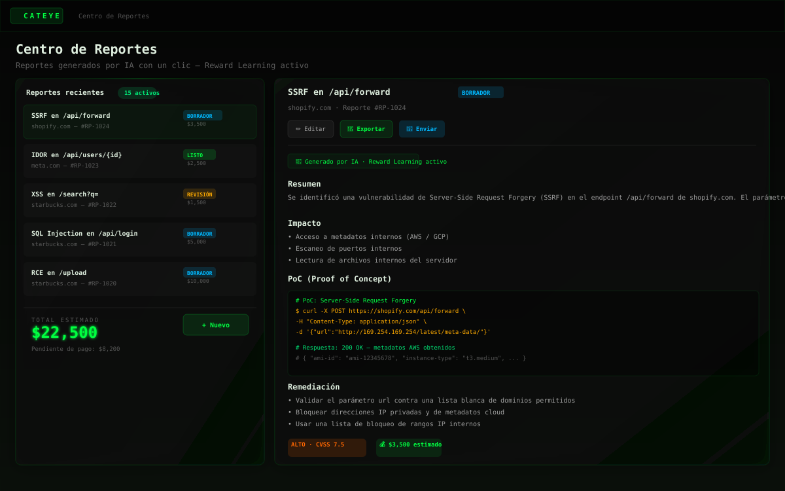
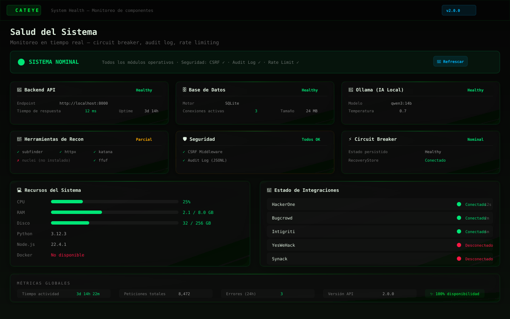

<div align="center">
  <br/>
  
  <br/>
  <br/>

  <h1>🐾 Rastro / ORION</h1>
  <h3>AI-Powered Bug Bounty Intelligence OS</h3>

  <p>
    <em>Autonomous · Economic-First · Privacy-Focused · Open Source</em>
  </p>

  <br/>

  <p>
    <a href="https://github.com/AdriDob/rastrohunteralpha/blob/main/LICENSE"></a>
    <a href="#"></a>
    <a href="#"></a>
    <a href="#"></a>
    <a href="#"></a>
    <a href="#"></a>
    <a href="#"></a>
  </p>

  <br/>
</div>

---

**Rastro / ORION** es una plataforma de inteligencia artificial autónoma para bug bounty hunters. Automatiza todo el ciclo de vida de la cacería de vulnerabilidades — desde el descubrimiento de programas y reconocimiento, hasta la generación de hipótesis, validación y redacción de informes profesionales — mientras maximiza tu retorno económico por hora de investigación.

> 🎯 **Cada decisión se mide en USD/hora, probabilidad de éxito y ROI esperado.**

---

## ✨ Features

<table>
<tr>
<td width="50%">

### 🎯 Economic Intelligence
- **ORION Score** (0.0–1.0) — algoritmo de ranking de programas con 6 factores (potencial de recompensa, éxito histórico, competencia, eficiencia temporal, experiencia, diversidad tecnológica)
- **EVH** (Expected Value per Hour) — cálculo monetario de ROI por programa
- **Money Radar** — programas ordenados por valor esperado
- **Pattern Learning** — "Los fintechs pagan mejor por IDOR", "GraphQL da mejores resultados"; la confianza aumenta con cada acierto

### 🧠 AI Multi-Agent System
- 8 agentes autónomos: Coordinator, Research, Validator, Exploit, Documentation, Strategy, Memory, Financial
- Comunicación vía bus de eventos interno (pub/sub)
- Pipeline de 11 estados: `PENDING → DISCOVERY → VALIDATION → EVIDENCE → AI_REVIEW → READY → SUBMITTED → TRIAGED → PAID → CLOSED | FAILED | CANCELLED`
- 4 proveedores AI: Ollama (local), OpenAI, OpenRouter, Gemini

### 🔍 Autonomous Reconnaissance
- Orquestación de 15+ herramientas externas: Subfinder, Amass, httpx, Katana, nuclei (pasivo), ffuf, gau, waybackurls, dnsx, naabu, assetfinder, crt.sh, whois
- Integración OWASP ZAP (spider + escaneo pasivo)
- 16 clientes OSINT: Shodan, Censys, VirusTotal, SecurityTrails, AlienVault OTX, URLScan.io, Hunter.io, BuiltWith, HIBP, GreyNoise, IntelX, Pulsedive, ThreatFox, IPInfo, SpoofCheck

</td>
<td width="50%">

### 📊 Professional Reporting
- Generación automática de informes con AI
- Exportación a Markdown, PDF, HTML, TXT
- Envío directo a plataformas via API keys
- Reward learning desde respuestas de plataformas
- Historial completo de submissions y earnings

### 🔐 Security & Privacy
- 100% local y privacy-first
- Vault cifrado con AES-256-GCM
- Nunca auto-explota ni auto-envía sin aprobación humana
- Licencia MIT — Open Source

### 🔌 Platform Integrations
- HackerOne · Bugcrowd · Intigriti · Synack · YesWeHack
- Webhook receivers para actualizaciones de estado
- Vault de credenciales cifrado
- **Nunca auto-submite** — siempre requiere aprobación humana

### 🖥️ Desktop & Mobile
- Aplicación de escritorio nativa (PyWebView + system tray)
- Instalador Windows (NSIS)
- Auto-updater con rollback
- Watchdog interno con auto-healing (exponential backoff)
- App Android con Capacitor

</td>
</tr>
</table>

---

## 🖼️ Screenshots

<div align="center">
  <table>
    <tr>
      <td></td>
      <td></td>
    </tr>
    <tr>
      <td align="center"><b>Dashboard Principal</b></td>
      <td align="center"><b>Pipeline Monitor</b></td>
    </tr>
    <tr>
      <td></td>
      <td></td>
    </tr>
    <tr>
      <td align="center"><b>Identity Center</b></td>
      <td align="center"><b>Report Detail</b></td>
    </tr>
    <tr>
      <td colspan="2"></td>
    </tr>
    <tr>
      <td colspan="2" align="center"><b>System Health Dashboard</b></td>
    </tr>
  </table>
</div>

---

## 🏗️ Architecture

```
┌─────────────────────────────────────────────────────────────────────┐
│                         DESKTOP LAYER                               │
│  run.py (State Machine) → PyWebView + Uvicorn + System Tray         │
└──────────────────────────────┬──────────────────────────────────────┘
                               │
┌──────────────────────────────▼──────────────────────────────────────┐
│                         API LAYER (FastAPI)                         │
│  55+ routers · CORS · Auth · Rate Limiting · Scheduler · WebSocket  │
└──────┬──────────────────────────────────────────────────┬───────────┘
       │                                                  │
┌──────▼──────────────────┐            ┌──────────────────▼───────────┐
│    CORE ENGINES (cores/) │            │      FRONTEND (Vue 3 SPA)   │
│                          │            │                              │
│  ├─ ai/        (LLM)     │            │  50+ pages                  │
│  ├─ agents/    (8 agents)│            │  Pinia stores               │
│  ├─ recon/     (15+tools)│            │  Glassmorphism dark theme   │
│  ├─ engine/    (hypoth.) │            │  Chart.js + vue-chartjs     │
│  ├─ intelligence/ (ML)   │            │  Radix Vue / Reka UI        │
│  ├─ platforms/ (5 sites) │            │  Tailwind CSS 4             │
│  ├─ validation/          │            │  WebSocket bridge           │
│  ├─ events/    (pub/sub) │            │                              │
│  ├─ memory/    (LTM)     │            │                              │
│  ├─ identity_vault (AES) │            │                              │
│  └─ 30+ more modules     │            │                              │
└──────┬──────────────────┘            └──────────────────────────────┘
       │
┌──────▼──────────────────────────────────────────────────────────────┐
│                     DATABASE (SQLAlchemy)                           │
│  models.py (30+ ORM) · models_economic.py (8) · SQLite/PostgreSQL   │
└─────────────────────────────────────────────────────────────────────┘
```

---

## 🚀 Quick Start

### Prerequisites

- Python 3.10+
- Node.js 18+ (para frontend)
- Git

### Installation

```bash
# Clonar el repositorio
git clone https://github.com/AdriDob/rastrohunteralpha.git
cd rastrohunteralpha

# Instalar backend
pip install -r requirements.txt

# Instalar frontend
cd frontend
npm install
cd ..

# Configurar entorno
cp .env.example .env
# Editar .env con tus API keys

# Inicializar base de datos
python run.py --setup
```

### Development

```bash
# Iniciar backend (API en :8000)
python run.py --dev

# En otra terminal — iniciar frontend (Vite dev server en :5173)
cd frontend && npm run dev
```

### Desktop Build

```bash
# Build PyInstaller bundle
python run.py --build

# Windows installer
makensis installer/orion.nsi
```

---

## 🧩 Tech Stack

| Layer | Technology | Version |
|-------|-----------|---------|
| **Backend** | Python + FastAPI | 3.10+ / 0.95+ |
| **ASGI** | Uvicorn | 0.22+ |
| **ORM** | SQLAlchemy + Pydantic v2 | 2.0+ |
| **Database** | SQLite (dev) / PostgreSQL (prod) | — |
| **Frontend** | Vue 3 + TypeScript + Vite | 3.5+ / 5.8+ / 6.3+ |
| **CSS** | Tailwind CSS 4 | 4.1+ |
| **State** | Pinia | 3.0+ |
| **Charts** | Chart.js + vue-chartjs | 4.5+ / 5.3+ |
| **UI** | Radix Vue / Reka UI + Lucide Vue | — |
| **AI** | Ollama · OpenAI · OpenRouter · Gemini | — |
| **Desktop** | PyInstaller + PyWebView + Pystray | — |
| **Mobile** | Capacitor (Android) | 8.x |
| **Security** | Cryptography (AES-256-GCM) + Fernet | — |
| **Linting** | Ruff + mypy | — |
| **Testing** | pytest + pytest-cov + Playwright | — |
| **CI/CD** | GitHub Actions | — |

---

## 📚 Documentation

| Document | Description |
|----------|-------------|
| [`SYSTEM.md`](SYSTEM.md) | Documentación completa del sistema (backend, frontend, API, datos, ciclo bug bounty, AI, seguridad, deploy) |
| [`SISTEMA.md`](SISTEMA.md) | Visión general del sistema: filosofía, arquitectura, componentes, frontend |
| [`SYSTEM_INVENTORY.md`](SYSTEM_INVENTORY.md) | Inventario técnico exhaustivo: componentes, dependencias, scripts, tests, assets, build |
| [`PLAN.md`](PLAN.md) | Plan de desarrollo del frontend (migración Vue 3) |
| [`ROADMAP.md`](ROADMAP.md) | Roadmap de versiones v1.0 → v1.5 |
| [`CHANGELOG.md`](CHANGELOG.md) | Historial de versiones |
| [`AGENT_CONTEXT.md`](AGENT_CONTEXT.md) | Protocolo de coordinación multi-AI |

---

## 🤝 Contributing

Las contribuciones son bienvenidas. Por favor:

1. Haz fork del repo
2. Crea una rama: `git checkout -b feature/algo-increible`
3. Haz tus cambios
4. Pasa los checks: `make lint && make test`
5. Abre un Pull Request

---

## 📄 License

MIT License — ver [LICENSE](LICENSE) para detalles.

---

<div align="center">
  <sub>Built with 🧠 by bug bounty hunters, for bug bounty hunters.</sub>
  <br/>
  <sub>Hecho en 🇦🇷</sub>
</div>
