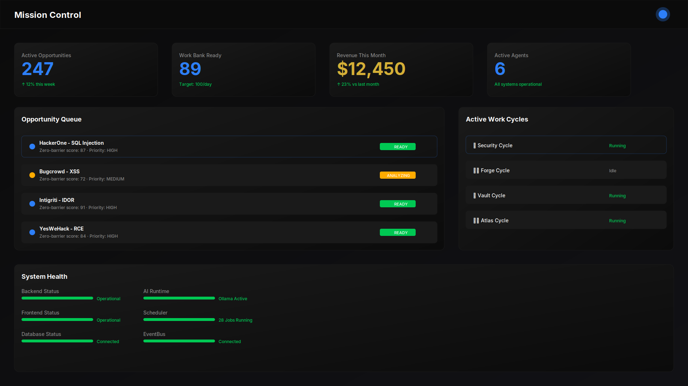
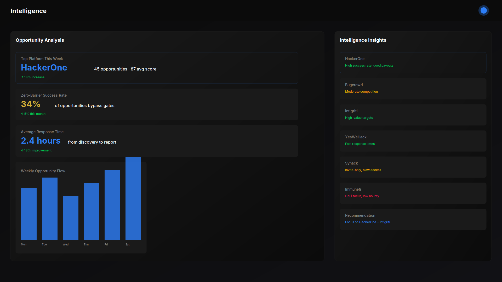
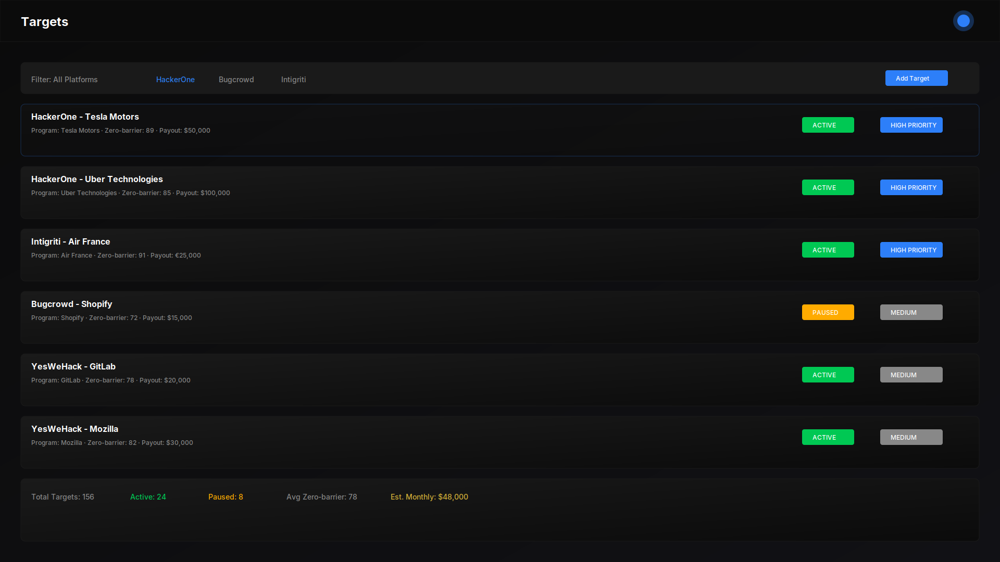
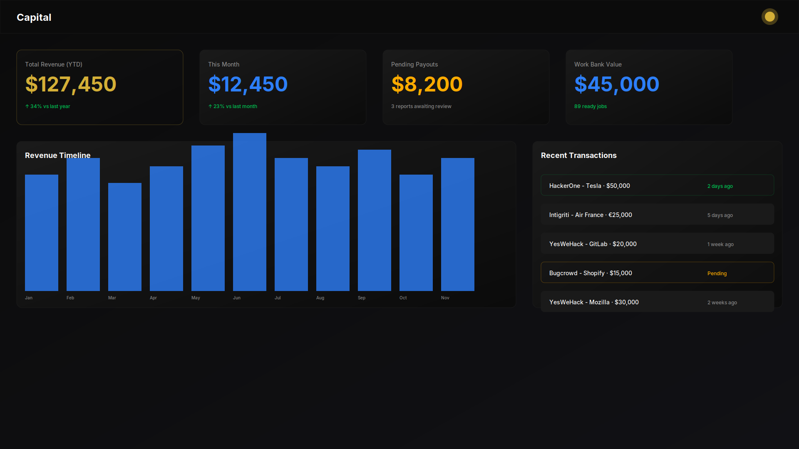
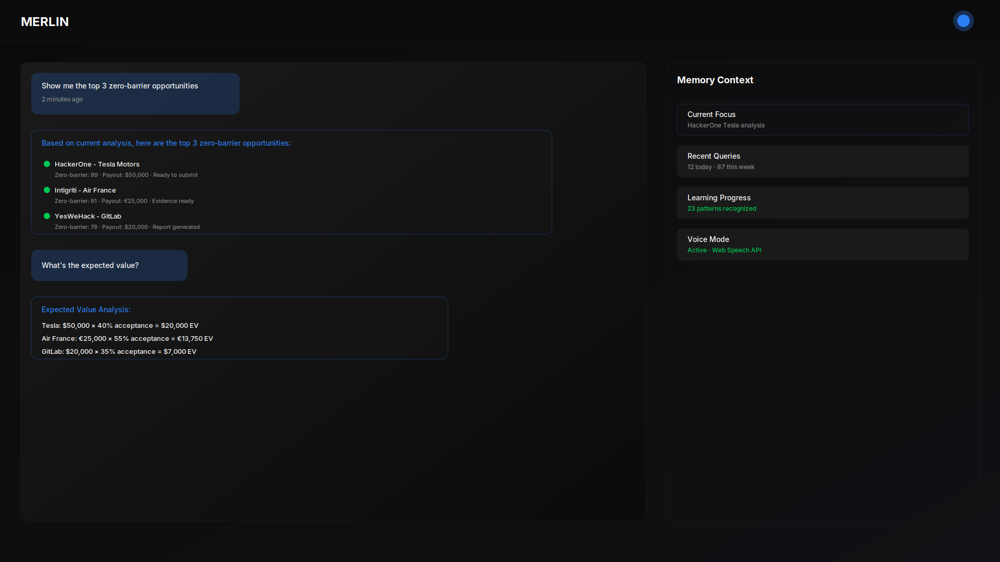
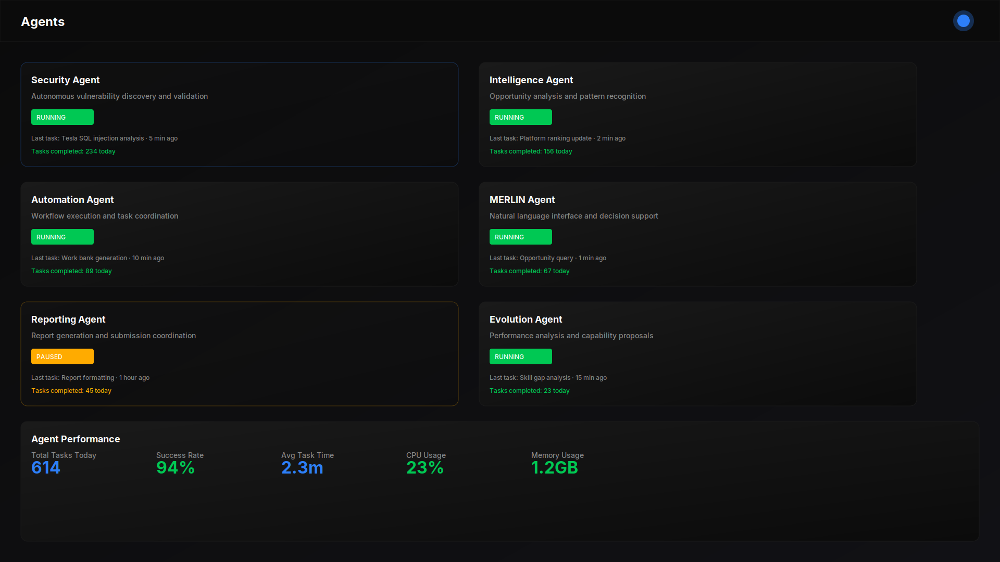
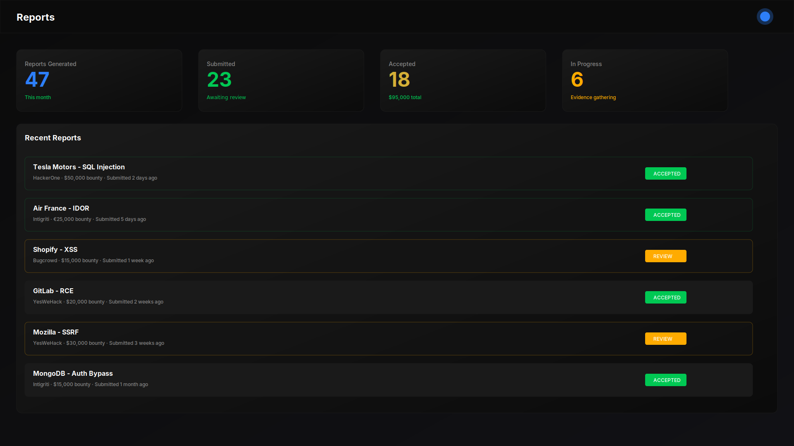
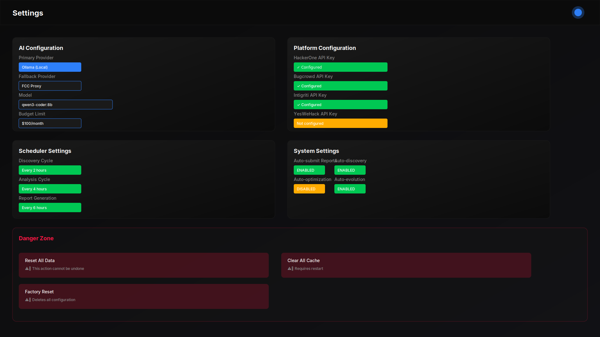
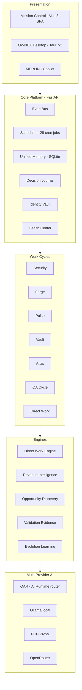

<p align="center">
  
</p>

<p align="center">
  <picture>
    <source media="(prefers-color-scheme: dark)" srcset="docs/assets/branding/logo/ownex-symbol-wordmark.svg"/>
    
  </picture>
</p>

<p align="center">
  <strong>Autonomous Work Operating System</strong>
</p>

<p align="center">
  
  
  
  
  
  
</p>

---

**[Overview](#overview) · [Product](#product) · [Architecture](#architecture) · [Quick Start](#quick-start) · [Roadmap](#roadmap) · [Security](#security)**

---

## Overview 🚀

OWNEX is an autonomous work operating system that continuously discovers, understands, evaluates, organizes and prepares digital work opportunities while coordinating tools, agents, models and information.

**The concept:** OWNEX is not merely an AI chatbot, dashboard, or collection of scripts. It is an intelligent operating system that navigates the universe of work opportunities, orchestrates multiple AI providers, and executes complex workflows with minimal human intervention.

**The approach:** Every opportunity is scored against a **zero-barrier spectrum** (0–100): how far is it from *finding* to *getting paid*, with no interview, no portfolio gate, no unpaid trial. The engine rank-orders thousands of candidates and surfaces the ones most likely to become money this week.

**The human role:** The human sits at the **decision gate**. The system does everything before and after.

<p align="center">
  <sub>The Revenue Rule: no feature enters the roadmap unless it increases vulnerability detection, evidence quality, acceptance probability, or system learning. No exceptions.</sub>
</p>

---

## Product 🎯

### Mission Control 🎛️
> Central operational surface for monitoring opportunities, agents and active work.

<p align="center">
  
</p>

### Intelligence 🧠
> Information processing and opportunity analysis surfaces.

<p align="center">
  
</p>

### Targets 📍
> Target intelligence and opportunity prioritization.

<p align="center">
  
</p>

### Capital 💰
> Revenue tracking and financial intelligence dashboard.

<p align="center">
  
</p>

### MERLIN 🤖
> AI assistant with persistent memory and intent analysis.

<p align="center">
  
</p>

### Agents 🤖
> Autonomous agents for specialized tasks: Security, Intelligence, Automation, MERLIN, Reporting, Evolution.

<p align="center">
  
</p>

### Reports 📊
> Report generation, submission tracking, and bounty management.

<p align="center">
  
</p>

### Settings ⚙️
> System configuration, AI providers, platform credentials, and scheduler settings.

<p align="center">
  
</p>

---

## Architecture

A modular monolith: one FastAPI process, EventBus-driven, single database. No microservices, no external queue, no lock-in.



**Stack (real, no smoke):**

| Layer | Tech |
|---|---|
| Backend | Python 3.11+, FastAPI, SQLAlchemy 2.0 |
| Frontend | Vue 3 + TypeScript, Tailwind CSS v4, Vite |
| Desktop | Tauri v2 (Rust + WebView2) + PyInstaller sidecar |
| Mobile | Capacitor (Android) + Expo/React Native (OMEGA) |
| AI | Local-first failover chain: Ollama → FCC proxy → OpenRouter |
| DB | SQLite (dev) / PostgreSQL (production) |
| Tests | 3,179+ pytest · Ruff · Biome · Mypy strict |

---

## How a day runs

| Time | What happens |
|---|---|
| **06:15** | Work Bank daily cycle: discover, filter zero-barrier, rank by EV, prepare packages |
| **06:30** | `daily-companion` → MERLIN gives the consolidated briefing (system + personal + market + focus) |
| **07:00** | Mission Control: top pick of the day + skill gap + learning plan |
| **08:00** | Market report: platforms, friction S/A/B/C, retired sources, emerging categories |
| **09:00** | Revenue dashboard: earned / pending / ROI per platform, projection to target |
| **14:00** | Security cycle: findings → evidence → report → auto-submit |
| **18:00** | Executive view: "did we make money this week?" USD/hour per platform |
| **22:00** | Version backup + health snapshot persisted |

---

## Quick start

```bash
# 1. Clone
git clone https://github.com/AdriDob/OWNEX.git
cd OWNEX

# 2. Environment
python -m venv .venv
source .venv/bin/activate
pip install -r requirements.txt

# 3. Run the system
python run.py
# → FastAPI on http://localhost:8000
# → Mission Control on http://localhost:5173 (cd frontend && npm run dev)

# 4. Health check
curl http://localhost:8000/api/health

# 5. Add a target (bug bounty pipeline)
python run.py --add-target "example" --domain "example.com"

# 6. Quality gate
make check   # ruff + mypy scoped + fast tests
```

---

## Configuration & docs

The project runs on a **single source of truth**: everything operational lives in `.ai/`.

```
.ai/
├── AGENT_CHARTER.md         # Constitution, Agent Loop, Golden Rule
├── PRODUCTION_RULES.md      # Production rules (extend, never break stable)
├── CURRENT_STATE.md         # Verified per-feature state
├── TASK_QUEUE.md            # Untracked priorities with completion criteria
├── ROADMAP.md               # General roadmap
├── DECISIONS.md             # Architecture decisions with evidence
├── KNOWN_DEBT.md            # Known debt, documented
├── DO_NOT_TOUCH.md          # Stable components — do not touch without justification
└── STRATEGIC_AUDIT.md       # Permanent audit framework (10 questions, 18 dimensions)
```

**Golden rule:** when code, docs, or agent memory conflict — `.ai/` wins.

Secrets never live in the repository. API keys go to `IdentityVault` (AES-256-GCM, random key, chmod 600) or environment variables.

---

## Development

```bash
# Tests (fast smoke)
python scripts/dev test

# Lint + typecheck + fast tests
make check

# Fixed lints
make fmt

# Backend single source
python scripts/dev typecheck-fast
```

Stack: pytest + pytest-cov · Ruff · Biome · Mypy (strict on core)

---

## Security

- 100% local by default — nothing leaves the machine, no telemetry
- AES-256-GCM credential vault (random key, chmod 600)
- Ed25519 asymmetric license validation
- Double-submit-cookie CSRF on all state-changing routes
- Identity-based rate limiting with IP fallback
- Append-only audit log (JSONL, 10 MB rotation)

---

## Roadmap

| Status | Item |
|---|---|
| ✅ **DONE** | Security pipeline (7 stages) — auto-submit to finders/all-named report queues |
| ✅ **DONE** | Direct Work Engine + Work Bank + Daily Companion + Evolution |
| ✅ **DONE** | 7 Work Cycles, 28 scheduled jobs, Mission Control, Executive Dashboard |
| ✅ **DONE** | Desktop (Tauri v2 + PyInstaller sidecar), mobile companion, MERLIN |
| ✅ **DONE** | OAR AI Runtime — engine + tests + API mounted (`/oar/*`, `/career/*`) |
| 🟡 **IN PROGRESS** | OMEGA mobile (Expo/React Native) — functional skeleton |
| 🔲 **PLANNED** | OAR smart-routing wired into API decisions · more discovery adapters (Algora, OpenCollective, Superteam) |
| ❌ **NOT INCLUDED** | Wear OS native — evaluated and discarded (AUD-14, negative ROI) |

---

## Branding

OWNEX mark — **The Aperture Nexus**: octagonal ring + X of rays + central node that breaks the ring. Generated by a deterministic pipeline (`scripts/brand/`), zero generative AI, 100% reproducible:

```bash
scripts/brand/regenerate.sh          # logo system + banners (SVG + PNG)
scripts/brand/regenerate.sh --shots  # + real product screenshots (Playwright)
```

Design language: **Tesla dark** — pure black surfaces, white primary accent, deep blue `#1E40FF` as the only saturated accent, no noise, no glow.

```
docs/assets/branding/
├── logo/      # O+X mark (white/black/mono/omega), wordmark, lockup, favicon
├── banners/   # hero-banner 2400×900
├── social/    # open-graph preview 1200×630
└── themes/    # design tokens SSOT (assets/branding/themes/tesla.json)
```

---

## License

**Proprietary.** All rights reserved.

---

<p align="center">
  <strong>OWNEX does not sell a service to a customer. OWNEX works for me.</strong>
</p>

<p align="center">
  <sub>🔮 Personal Autonomous Work Operating System · v7.0.0 · The Aperture Nexus</sub>
</p>

<p align="center">
  <sub>🚀 Security · 🛠️ Forge · 💰 Vault · 🗺️ Atlas · 🧠 Intelligence · ⚙️ Automation</sub>
</p>