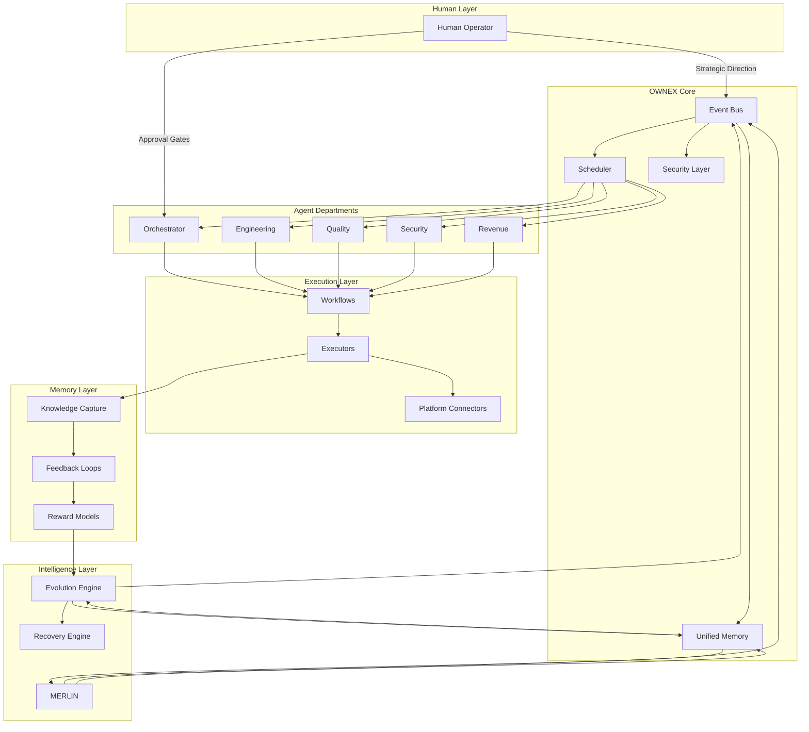
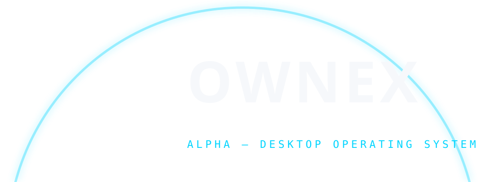
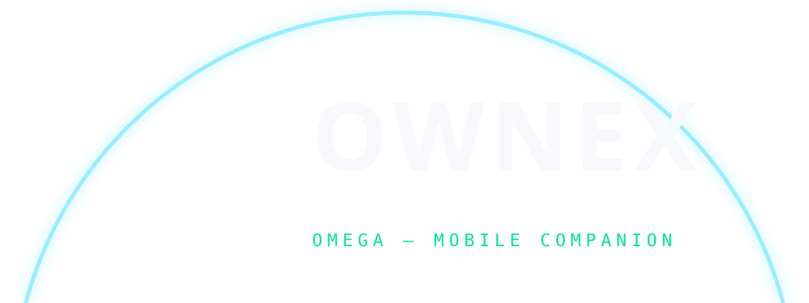
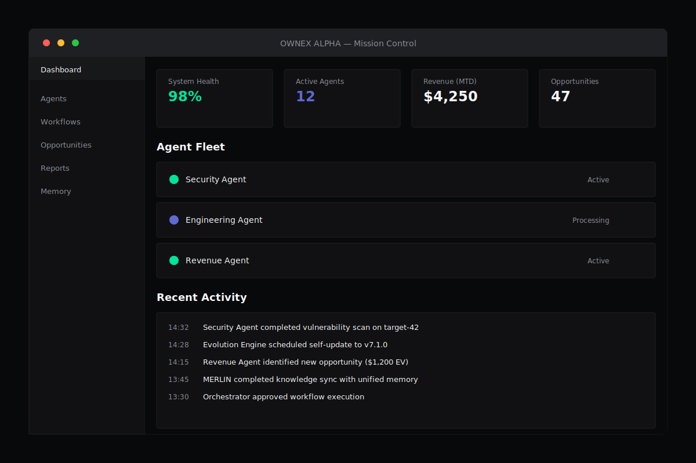
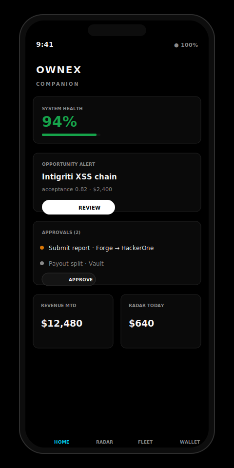
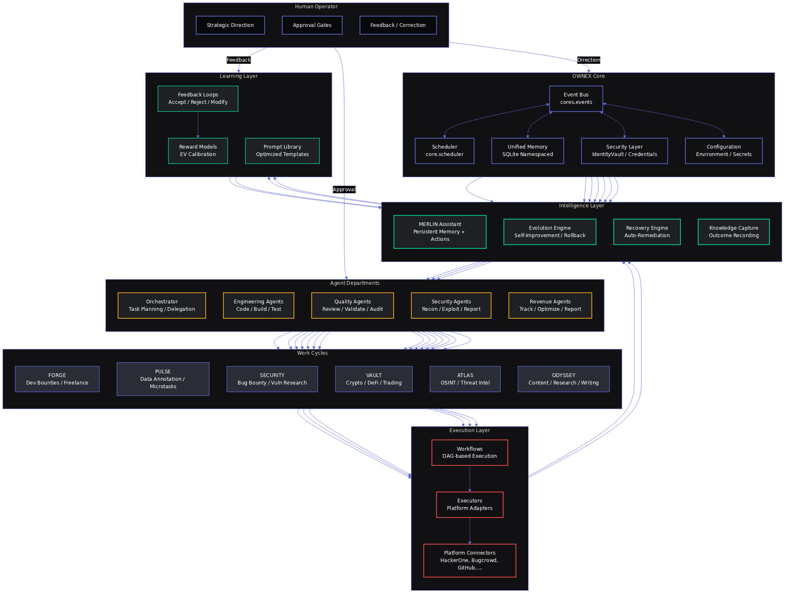
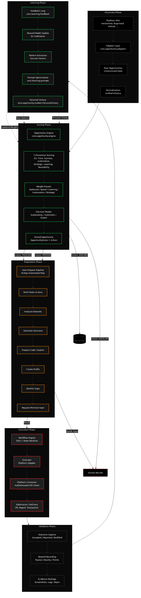
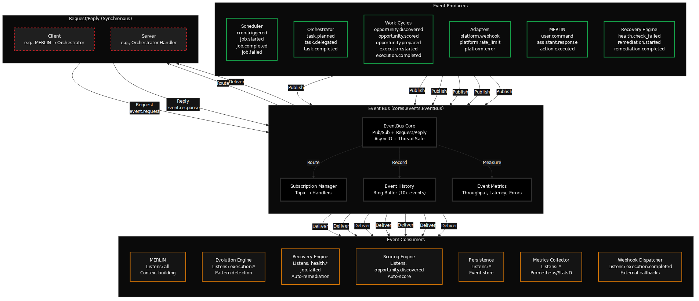

# OWNEX — Autonomous Operating System

<!-- HERO BANNER -->
<div align="center">


<h1>OWNEX</h1>
<h3>Autonomous Bug Bounty Operating System</h3>

<p>
<strong>Automation · Intelligence · Rewards</strong>
</p>

<p>


</p>

<p>
<em>Sistema operativo privado de investigación para bug bounty y<br/>
attack surface intelligence. Corre 100% local, sin dependencia cloud.</em>
</p>

</div>

<!-- END HERO BANNER -->

## Overview

**OWNEX** is the **Personalized Autonomous Operating System** that discovers opportunities, executes technical work, learns from outcomes, and evolves its own operation — from a desktop command center to your phone and wrist.

Built around the closed loop: **observe → decide → execute → learn → evolve**. The human stays at the decision gate; the system handles the rest.

## Concise Explanation

OWNEX transforms technical workflows across security research, development, data analysis, and revenue generation through autonomous agents and persistent memory. Unlike task-specific tools, OWNEX adapts and evolves based on outcomes, creating increasingly efficient workflows over time.

## Problem Solved

Technical professionals face:

- **Fragmented automation tools** requiring manual coordination across platforms
- **Lost knowledge** between project sessions and team members
- **Manual security research** processes that are slow and error-prone
- **Disconnected workflow systems** lacking cross-domain intelligence
- **No persistent learning** from past operations and outcomes

OWNEX solves these through autonomous operation, persistent memory, and continuous self-improvement.

## Architecture Overview



||**Layers & Responsibilities:**|

|| Layer | Responsibility |
||-------|----------------|
|| **OWNEX Core** | Event bus, scheduler, unified memory, security layer |
|| **Departments** | Orchestrator · Engineering · Quality · Security · Revenue |
|| **Agents** | Autonomous specialists coordinated per department |
|| **Execution** | Workflows, executors, platform connectors |
|| **Learning** | Feedback loops, knowledge capture, reward models |
|| **Evolution** | Self-improvement, version rollback, recovery |

## Available Editions

OWNEX ships as two connected identities sharing a single core.

<div align="center">
  <table>
    <tr>
      <td width="50%" align="center">
        
        <br/><br/>
        <b>ALPHA — Desktop Operating System</b>
        <br/>
        The command center: agents, workflows, terminal, memory,
        evolution engine, and the full mission-control dashboard.
      </td>
      <td width="50%" align="center">
        
        <br/><br/>
        <b>OMEGA — Android & Wear OS Companion</b>
        <br/>
        Permanent connection: approvals, notifications, MERLIN chat,
        system health — on your phone and on your wrist.
      </td>
    </tr>
  </table>
</div>

## Core Capabilities

|| Capability | Status |
||------------|--------|
|| 🔍 Autonomous opportunity discovery and execution | Production |
|| 📊 EV/EBITDA scoring and prioritization | Production |
|| 🤖 Autonomous workflows and agent coordination | Production |
|| 🧠 MERLIN assistant with persistent memory | Production |
|| 🔒 Security vulnerability research and validation | Production |
|| 💰 Executive dashboard with revenue tracking | Production |
|| 📱 ALPHA + OMEGA + Wear OS companions | Production |
|| 🔄 Self-update, version backup, recovery engine | Production |
|| 🌍 Multi-language interface (EN, ES, FR, DE, JA, ZH) | Production |

## Quick Start

```bash
# Clone the repository
git clone https://github.com/AdriDob/rastrohunteralpha.git
cd rastrohunteralpha
```

```bash
# Install Python dependencies
pip install -r requirements.txt

# Install frontend dependencies
cd frontend && npm install

# Copy environment file
cp .env.example .env
# Add your platform API keys and configuration to .env

# Start the backend server
uvicorn api.main:app --host 127.0.0.1 --port 8000
# → http://127.0.0.1:8000

# Start the frontend
npm run dev -- --port 5173
# → http://localhost:5173
```

```bash
# Verify system health
curl http://127.0.0.1:8000/api/health

# Create a backup before changes
python run.py --backup
```

## Installation Details

### System Requirements

|- **OS:** Linux, macOS, or Windows 10+
|- **Python:** 3.11+
|- **RAM:** 4GB minimum
|- **Storage:** 10GB free space

### Platform-Specific Notes

#### Linux/macOS
```bash
# Ensure dependencies are installed
# Ubuntu/Debian:
apt update && apt install -y python3-venv python3-pip

# Then run the Quick Start commands above
```

#### Windows
```powershell
# Open PowerShell as Administrator
# Install virtual environment build tools
# apt install python3-venv python3-pip (if using WSL)

# Run installation script
python scripts/install.py

# Or follow the manual steps above
```

### Development Setup

#### Virtual Environment Setup
```bash
# Create dedicated environment for development
python -m venv dev_env
# On Unix: source dev_env/bin/activate
# On Windows: dev_env\Scripts\activate

# Install development dependencies
pip install -r requirements-dev.txt

# Install frontend tools
cd frontend && npm ci

# Run development with hot reload
uvicorn api.main:app --reload --host 127.0.0.1 --port 8000
cd frontend && npm run dev -- --port 5173
```

## Installation Troubleshooting

### Common Issues

#### "python: command not found"
```bash
# Install Python 3.11+
# On Ubuntu: sudo apt install python3.11 python3-pip
# On macOS: brew install python@3.11
# On Windows: Download from https://www.python.org/downloads/
```

#### "pip: command not found"
```bash
# pip is included with Python 3.10+
# If missing, reinstall Python
```

#### Permission Denied
```bash
# For global installs, use sudo or virtual environments
python -m venv ~/.ownex
```

#### Frontend Dependencies Missing
```bash
# Clear npm cache and reinstall
cd frontend && rm -rf node_modules package-lock.json
npm install
```

### Development Server Ports

|| Service | Port | Description |
||---------|------|-------------|
|| Backend | 8000 | OWNEX API server |
|| Frontend | 5173 | Vue.js development server |
|| Database | 5432 (PostgreSQL) | Production database |

### Service Commands

```bash
# Start all services (backend + frontend)
make dev

# Run tests
make test

# Format code
make fmt

# Type check
make typecheck

# Build production version
make build

# View help
make help
```

## Installation

### Desktop (ALPHA)

**System Requirements:**
|- **OS:** Linux, macOS, or Windows 10+
|- **Python:** 3.11+
|- **RAM:** 4GB minimum
|- **Storage:** 10GB free space

**Installation Steps:**

1. **Clone the repository**
2. **Create virtual environment**
3. **Install dependencies**
4. **Configure environment**
5. **Run backend**
6. **Run frontend**

### Mobile (OMEGA)

OWNEX OMEGA is available for Android and Wear OS with native Kotlin applications.

## Usage Examples

### Security Research Workflow

OWNEX automates bug bounty processes:

1. **Target Discovery:** Autonomous scanning of potential targets
2. **Vulnerability Detection:** Smart enumeration and detection
3. **Hypothesis Generation:** MERLIN proposes attack vectors
4. **Validation:** Automated exploitation and verification
5. **Reporting:** Structured report generation

### Development Automation

OWNEX streamlines development workflows:

1. **Issue Analysis:** MERLIN understands requirements
2. **Solution Design:** Architecture recommendations
3. **Code Generation:** Automated implementation
4. **Testing:** Comprehensive test suite execution
5. **Deployment:** CI/CD integration

### Data Analysis

OWNEX processes and analyzes data:

1. **Data Ingestion:** Automated data collection
2. **Processing:** Stream processing and transformation
3. **Analysis:** Statistical analysis and insights
4. **Visualization:** Dashboard generation
5. **Reporting:** Executive summaries

## Architecture

### System Components

|- **💻 ALPHA Desktop:** Command center — core operations
|- **📱 OMEGA Mobile:** Android companion — approvals, chat, sync
|- **⌚ Wear OS:** Wrist alerts — critical decisions on the move
|- **🧠 MERLIN:** Intelligent assistant with persistent memory
|- **🤖 Agents:** Autonomous departments working in parallel
|- **💾 Memory:** Persistent knowledge store (SQLite, namespaced)
|- **🔄 Evolution Engine:** Continuous self-improvement with recovery

### Technology Stack

|| Layer | Technology |
||-------|------------|
|| **Backend** | Python 3.11+ · FastAPI · SQLAlchemy · Pydantic |
|| **Data** | SQLite (dev) · PostgreSQL (prod) · Unified Memory (SQLite) |
|| **Frontend** | Vue 3 · TypeScript · Tailwind v4 · Vite · ShadCN Vue |
|| **Mobile** | Kotlin · Jetpack Compose · Wear OS 3+ |
|| **AI** | Ollama (local) · OpenRouter · Free providers · MERLIN |
|| **Automation** | Scheduler · EventBus · AgentBus · RecoveryEngine |
|| **Quality** | pytest (1,400+ tests) · Ruff · mypy · Biome · Vitest |

## Repository Structure

```
api/              FastAPI application and routers
core/ cores/      Domain engines (cycles, opportunities, execution, learning)
apps/             Optional applications and extensions
frontend/         Vue 3 single-page application
android/ wearos/  OMEGA companions
scripts/brand/    Deterministic brand pipeline (SVG → PNG)
assets/           Brand system, banners, concept art, architecture diagrams
examples/         Usage examples and documentation
```

## Product Screens

Interface renders generated from the deterministic SVG pipeline (`scripts/brand/generate_tesla_visuals.py`) — faithful to the real frontend (tokens from `frontend/src/design/tokens.css`):

<p align="center">
  
  <br/>
  <em>Mission Control — Next Best Action, Opportunity Radar, Cashflow Radar, Agent Fleet</em>
</p>

<p align="center">
  
  <br/>
  <em>OWNEX Companion — health, approvals, radar on the go</em>
</p>

## Usage Examples

See [examples/](examples/) directory for practical usage scenarios and code samples.

## Documentation

- 🎨 [Brand identity](assets/branding/OWNEX_BRAND_IDENTITY.md) — marks, colors, type, usage rules
- 📋 [Brand usage guide](BRAND_USAGE_GUIDE.md) — comprehensive brand guidelines
- 🔧 [Design tokens](assets/branding/design-tokens.json) — machine-readable brand tokens
- 🏗️ [Architecture diagrams](assets/diagrams/) — system architecture, data flow, event bus, agent departments (Mermaid source + rendered PNGs)
- ⚖️ [Agent Charter](.ai/AGENT_CHARTER.md) — constitution and operating rules
- 📐 [Architecture decisions](.ai/ARCHITECTURE_FINAL.md) — full architectural decisions
- 🚀 [Quick Start](#quick-start) — get up and running in minutes
- 💡 [Use Cases](#use-cases) — practical applications and examples

### System Diagrams

Rendered from the Mermaid sources in [`assets/diagrams/`](assets/diagrams/):

<p align="center">
  
  <br/>
  <em>System architecture — human layer, OWNEX core, intelligence, agent departments</em>
</p>

<p align="center">
  
  <br/>
  <em>Opportunity data flow — discovery → scoring → preparation → execution → learning</em>
</p>

<p align="center">
  
  <br/>
  <em>Event bus topology — producers, consumers, pub/sub flows</em>
</p>

## Roadmap

### Current Focus (Phase 5)

- 🎯 Enhanced agent coordination and optimization
- 🧠 Improved learning algorithms and memory management
- 🔒 Expanded security research capabilities
- 📱 Enhanced OMEGA mobile experience

### Planned Features (Phases 6-8)

- 🌐 Multi-platform support expansion
- 🤖 Advanced MERLIN capabilities with context awareness
- 📊 Real-time collaboration features
- 🔧 Plugin system for custom integrations
- 🎨 Customizable UI themes and layouts

See [CHANGELOG.md](CHANGELOG.md) for detailed release history.

## Frequently Asked Questions

|**What is OWNEX?**|

|OWNEX is a Personalized Autonomous Operating System: it discovers opportunities, executes technical work, learns from outcomes, and evolves its own operation — across desktop (ALPHA), Android and Wear OS (OMEGA).

|**Is OWNEX open source?|**

|Yes. The core is MIT-licensed; brand fonts are SIL OFL 1.1 (Google Fonts).

|**Does OWNEX run fully offline?|**

|The core (agents, workflows, memory, evolution engine) runs locally. AI inference prefers local models via Ollama, with optional cloud providers (OpenRouter, free providers) for heavier reasoning.

|**What AI models does it use?|**

|Any Ollama model locally, plus OpenRouter and free providers through MERLIN — no vendor lock-in, configurable per task.

|**What platforms are supported?|**

|Linux, macOS and Windows 10+ for ALPHA Desktop; Android 8+ and Wear OS 3+ for OMEGA companions.

|**How is my data stored?|**

|Local-first: SQLite for state and namespaced unified memory. PostgreSQL is supported for production deployments.

|**Do I need API keys?|**

|Only for optional cloud AI inference, platform connectors (HackerOne, Bugcrowd, etc.), and external integrations. The core works offline with local models.

OWNEX is actively pursuing enterprise partnerships and bug bounty contracts to achieve these revenue milestones through autonomous discovery, execution, and learning systems.

## Support & Community

- 🌐 [Official Website](https://ownex.ai)
- 📧 [Contact](mailto:hello@ownex.ai)
- 💬 [Discord Community](https://discord.gg/ownex)
- 🐦 [X/Twitter](https://x.com/ownex_ai)