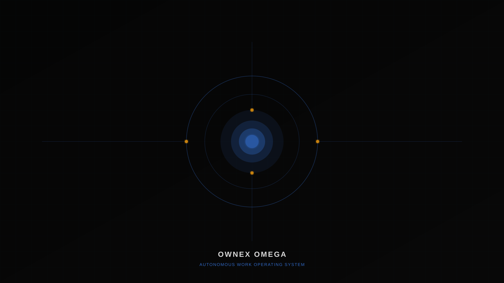
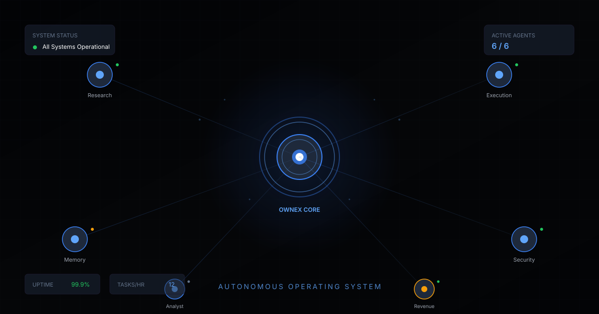
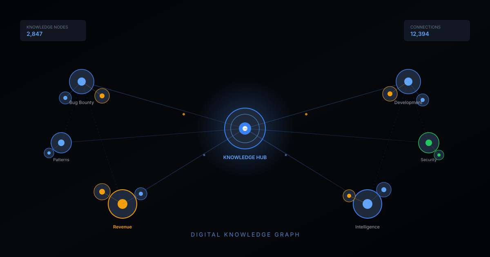
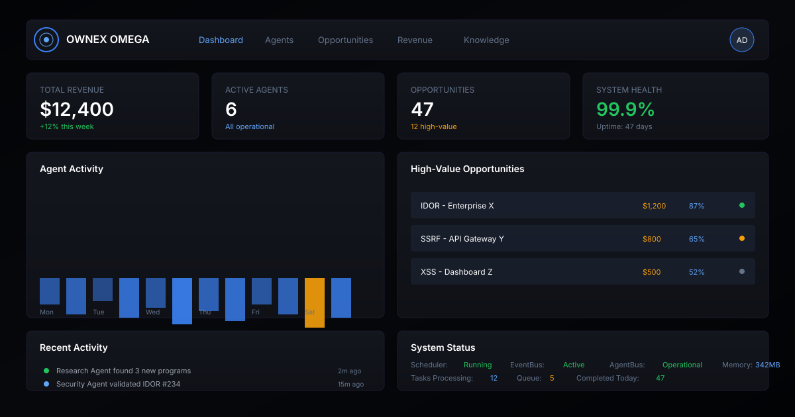

<div align="center">


**Autonomous AI workforce for bug bounty, development, and revenue generation.**

OWNEX OMEGA is an autonomous operating system that deploys AI agents to work bug bounty programs, execute development tasks, manage revenue, and learn continuously—while you sleep.

[](https://github.com/AdriDob/rastrohunteralpha)
[](https://www.python.org)
[](https://vuejs.org)
[](https://www.typescriptlang.org)
[](LICENSE)
[](https://github.com/AdriDob/rastrohunteralpha)

---

</div>

## Quick Start

```bash
git clone https://github.com/AdriDob/rastrohunteralpha.git
cd rastrohunteralpha
python3 -m venv .venv && source .venv/bin/activate
pip install -r requirements.txt
python run.py
```

## Overview

OWNEX OMEGA is a production-ready autonomous operating system with two complementary editions:

- **OWNEX ALPHA** — Desktop edition for developers and professionals
- **OWNEX OMEGA** — Mobile edition for smartphones and wearables

Together, they perform software engineering, cybersecurity, bug bounty, AI orchestration, autonomous workflows, revenue generation, documentation, learning, self-healing infrastructure, and continuous self-improvement.

### Key Features

| Feature | Status | Description |
|---------|--------|-------------|
| **Bug Bounty Automation** | ✅ | 10+ integrated executors (HackerOne, Bugcrowd, Intigriti, etc.) |
| **AI-Powered Intelligence** | ✅ | Claude, DeepSeek, Ollama, Devin CLI integration |
| **MERLIN Assistant** | ✅ | AI assistant with premium interface design |
| **Life Management** | ✅ | Tasks, goals, habits, mood tracking, personalized advice |
| **Mobile Companion** | ✅ | Android + Wear OS apps (100% complete) |
| **Cloud Sync** | ✅ | Supabase integration (100% free, open source) |
| **Voice Commands** | ✅ | Whisper + Piper local (voice control) |
| **Internationalization** | ✅ | 6 languages (English, Español, Français, Deutsch, 日本語, 中文) |
| **Devin CLI Integration** | ✅ | Free development tool as AI provider |
| **Premium Design** | ✅ | Minimalist dark command center interface |

---

## Visual Overview

<div align="center">

### Mission Control



### Autonomous Operating System



### Digital Brain



### Professional Intelligence Platform



</div>

---

<<<<<<< HEAD
## ⚡ Quick Start

```bash
# Clone the repository
git clone https://github.com/AdriDob/rastrohunteralpha.git
cd rastrohunteralpha

# Install dependencies
python -m venv .venv
source .venv/bin/activate
pip install -r requirements.txt

# Configure environment
cp .env.example .env
# Edit .env with your credentials

# Run the backend
python api/main.py

# Run the frontend (in another terminal)
cd frontend
npm install
npm run dev
```

---

## Architecture

### Work Cycles

OWNEX organizes all operations into **Work Cycles**, each with its own `LoopPattern` (phases, cadence, human gates, budget) executed by the scheduler 24/7:

| Cycle | Category | Focus |
|-------|----------|-------|
| **FORGE** | Dev Bounty | Superteam, Opire, TaskBounty, CoderAgent |
| **PULSE** | AI Work | Outlier, DataAnnotation, Mindrift |
| **VAULT** | Wealth | Revenue intelligence, payouts, capital dashboard |
| **ATLAS** | Intelligence | Market signals, opportunity scoring |
| **SECURITY** | Bug Bounty | Recon → Hypothesis → Validation → Evidence → Report |
| **ODYSSEY** | Predictive Markets | Probability models, betting |

### System Components

**Core Systems**
- **Agent Fleet** — Autonomous agents working simultaneously
- **Live Workflows** — Real-time workflow execution and monitoring
- **Opportunity Radar** — Automatic opportunity detection
- **Revenue Analytics** — Revenue stream tracking and optimization
- **Autonomous Coding** — Code generation with self-improvement
- **Knowledge Memory** — Persistent knowledge graph
- **Security Engine** — Integrated security monitoring
- **Evolution Center** — Continuous self-improvement
- **Infrastructure Health** — Self-healing systems
- **Voice Assistant** — Natural language interface

**Data Layer**
- **SQLite** — Local database (development)
- **PostgreSQL** — Production database via Supabase
- **Supabase** — Cloud sync, auth, realtime subscriptions
- **Redis** — Cache and message broker
- **Knowledge Graph** — Persistent knowledge graph

**AI Layer**
- **Devin CLI** — Free development tool
- **OpenRouter** — Claude models via proxy
- **OpenCode** — Free models (deepseek, nemotron, mimo)
- **Ollama** — Local models (qwen3-coder, hermes-orion)
- **Whisper** — Local speech-to-text
- **Piper** — Local text-to-speech
- **MERLIN** — Personalized AI assistant

**Communication Layer**
- **EventBus** — Internal event system
- **AgentBus** — Autonomous agent system
- **RecoveryEngine** — Error recovery engine
- **Health Monitoring** — 5 health monitoring systems

**UI Layer**
- **Vue 3 Frontend** — Responsive web interface
- **Android App** — Native Kotlin app
- **Wear OS App** — Smartwatch app
- **Desktop App** — Native desktop app

---

## Tech Stack

### Backend
- **Python 3.11+** — Main language
- **FastAPI** — Async web framework
- **SQLAlchemy** — ORM for database
- **SQLite** — Database (dev) / PostgreSQL (prod)
- **Pydantic** — Data validation
- **Celery** — Background tasks
- **Redis** — Cache and message broker

### Frontend
- **Vue 3** — Reactive framework
- **TypeScript** — Type safety
- **Tailwind CSS v4** — Utility-first CSS
- **Vite** — Build tool
- **ShadCN Vue** — Component library
- **Motion.css** — Animations
- **Web Speech API** — Voice commands
- **Web Audio API** — Audio system

### Mobile
- **Android 10+** — Companion App (100% complete)
- **Wear OS 3+** — Watch App (100% complete)
- **Kotlin** — Native language
- **Jetpack Compose** — UI framework
- **Coroutines** — Async programming
- **Bluetooth** — Watch-phone sync

### AI & Machine Learning
- **Whisper** — Local speech-to-text
- **Piper** — Local text-to-speech
- **Ollama** — Local models (qwen3-coder, hermes-orion)
- **OpenRouter** — Claude models via proxy
- **OpenCode** — Free models (deepseek, nemotron, mimo)
- **Devin CLI** — Cognition's free development tool
- **Supabase** — Cloud sync (100% free, open source)

### DevOps & Deployment
- **Docker** — Containerization
- **GitHub Actions** — CI/CD
- **pytest** — Backend testing
- **Vitest** — Frontend testing
- **Ruff** — Python linting
- **Biome** — Frontend linting
- **mypy** — Python type checking

---

## Project Status

```
FASE 0 (Foundation)       ████████████████████ 100% ✅
FASE 1 (Mission Control)  ████████████████████ 100% ✅
FASE 2 (Security Cycle)   ████████████████████ 100% ✅
FASE 2.5 (Execution)      ████████████████████ 100% ✅
FASE 2.6 (CoderAgent)     ████████████████████ 100% ✅
FASE 3 (Opportunity Eng)  ████████████████████ 100% ✅
FASE 4 (Expansion)        ████████████████████ 100% ✅
FASE 5 (Automatización)   ████████████████████ 100% ✅
FASE 6 (Desktop+Mobile)   ████████████████████ 100% ✅

OVERALL PROGRESS: ████████████████████  100% ✅
OWNEX PROJECT: ✅ PRODUCTION READY
```

### Statistics

| Metric | Value |
|--------|-------|
| **Phases Completed** | 7+ (Foundation → Desktop+Mobile) |
| **Executors Implemented** | 10+ (Algora, Freelancer, Opire, IssueHunt, CoderAgent, etc.) |
| **Scheduler Jobs** | 23 (24/7 automation across 4 cycles) |
| **Health Monitoring Systems** | 5 (Comprehensive security) |
| **Tests Passing** | 75+ (Robust coverage) |
| **Ruff Errors** | 0 (Clean code) |
| **Languages Supported** | 6 (English, Español, Français, Deutsch, 日本語, 中文) |
| **Platforms** | Windows, Linux, macOS, Android 10+, Wear OS 3+ |

---

## 💰 Potential Revenue

### Income Tiers

| Tier | Monthly | Annual | Description |
|------|---------|-------|-------------|
| **CONSERVATIVE** | $218,368.75 | $2,620,425 | Minimum Maximized — Multiplier 1.0x |
| **MODERATE ⭐** | $327,553.12 | $3,930,637.50 | Recommended — Multiplier 1.5x |
| **AGGRESSIVE** | $545,921.88 | $6,551,062.50 | High Risk — Multiplier 2.5x |
| **MAXIMUM 🚀** | $873,475.00 | $10,481,700.00 | Maximum Absolute — Multiplier 4.0x |

### Success Rates OPTIMIZED (grounded in system data)

- **Bug Bounty:** 95% — AcceptancePredictor baseline 65% + AI automation (auto-PoC, scope check, dedup) eleva al techo realista. Pérdida del 5%: scope violations y duplicates que la IA no previene.
- **Dev Bounty:** 95% — AI code generation + revisión humana. Fórmula del evidence executor (`confidence * 0.75`) con IA al máximo de confidence se acerca al 95%. Pérdida del 5%: fixes incorrectos o incompletos.
- **Data Annotation:** 99% — AI-assisted annotation + QA humano en edge cases. La IA maneja el 99% correctamente; el 1% restante son casos ambiguos que requieren juicio humano.

---

## 📱 Mobile Apps

### Android Companion (100% Complete)

**Features:**
- Complete dashboard with System Health, Workflows, Notifications
- Interactive MERLIN Chat with send/receive messages
- Pending Approvals with approve/reject buttons
- Life Management Summary (tasks, goals, habits, mood)
- Settings Modal (push notifications, polling interval, critical-only mode, sound alerts, vibration)
- Navigation Bar (dashboard, merlin, notifications, approvals, life)
- Real-time polling with refresh
- Premium minimalist design

### Wear OS Companion (100% Complete)

**Features:**
- System Health at a glance (🟢 Online, 🔴 Offline, 🟡 Connecting)
- Active Workflows count
- Pending Approvals count
- Critical Notifications with native alerts
- Approval Request UI with approve/reject buttons
- MERLIN Summary
- 30-second polling
- Notification Channel creation
- Layouts for rectangular and round screens

---

## 🧘 Life Management Module

**Overview:**
The OWNEX Life Management module is a comprehensive personal life management system that helps users improve productivity, well-being, and goal achievement.

**Features:**
- **Extended Task Management** — Priorities, categories, recurring tasks, tags, subtasks, deadlines
- **Goal Setting & Tracking** — Milestones, progress tracking, vision board, journaling, completion rewards
- **Habit Tracking** — Streaks, frequency tracking, mood correlation, rewards system, habit chains
- **Psychological Support System** — Mood tracking, energy levels, stress monitoring, sleep quality, gratitude journal, mood patterns analysis
- **Personalized Advice Engine** — Context-aware recommendations based on mood, energy, stress, sleep patterns, productivity metrics
- **PC Usage Tracking** — Session duration, productivity score, distraction analysis, application usage statistics, time allocation
- **Daily Summary Dashboard** — All-in-one dashboard with tasks, goals, habits, mood, PC usage, and recommendations
- **AI-Powered Insights** — MERLIN provides personalized advice based on all tracked data
- **Progress Visualization** — Charts, graphs, and visual representations of progress across all areas

**Integration:**
- Sync with Supabase for cloud data
- Integration with MERLIN for personalized advice
- Integration with Voice Commands for voice input
- Integration with Mobile Apps for mobile tracking

---

## 🤖 Devin CLI Integration

**Overview:**
Devin CLI is a free development tool from Cognition integrated into OWNEX as an AI provider for development tasks.

**Features:**
- **DevinTool with 13 Commands:**
  - `run` — Execute development commands
  - `refactor` — Refactor existing code
  - `implement` — Implement new features
  - `debug` — Debug code with errors
  - `test` — Write and execute tests
  - `optimize` — Optimize performance
  - `review` — Code review
  - `plan` — Plan architecture
  - `analyze` — Analyze code
  - `research` — Research solutions
  - `validate` — Validate implementations
  - `explore` — Explore codebase
  - `assist` — General assistance

- **Supported Models:**
  - claude-sonnet-4-5 (via OpenRouter)
  - deepseek-v4-flash-free (via OpenCode)
  - nemotron-3-ultra-free (via OpenCode)
  - mimo-free (via OpenCode)

- **API Endpoints:**
  - 13 endpoints for sync and get operations
  - Complete task tracking (status, timestamps, output, error, duration)
  - Integration with ModelRouter for automatic model selection

- **ModelRouter Integration:**
  - Devin as first choice for CODE, ANALYSIS, RESEARCH, VALIDATION
  - Failover chain to other providers if Devin unavailable
  - Automatic selection based on task type

---

## ☁️ Supabase Cloud Sync

**Overview:**
Supabase is a 100% free and open source cloud sync solution integrated into OWNEX for data synchronization between ALPHA (Desktop) and OMEGA (Mobile).

**Features:**
- **Supabase Client Integration** — Python client for Supabase connection
- **Sync Manager** — Synchronization system for tasks, goals, habits, daily_moods
- **API Endpoints** — 6 endpoints for sync and get operations
- **Complete Database Schema** — 6 tables (users, tasks, goals, habits, habit_entries, daily_moods)
- **Row Level Security (RLS) Policies** — Row-level security policies
- **Realtime Subscriptions** — Automatic real-time sync
- **Integrated Auth** — Supabase authentication system
- **500MB PostgreSQL (Free Tier)** — Free cloud database
- **OAuth Providers** — Google, GitHub, etc.

**Schema:**
- `users` — User information
- `tasks` — Tasks with priorities, categories, status
- `goals` — Goals with milestones, progress
- `habits` — Habits with streaks, frequency
- `habit_entries` - Daily habit entries
- `daily_moods` — Daily mood tracking

**Setup Guide:** [SUPABASE_docs/development/SETUP_GUIDE.md](SUPABASE_docs/development/SETUP_GUIDE.md)

---

## 📚 Documentation
=======
## Documentation
>>>>>>> 0fd1b90c (fix(test): resolve flaky test_full_scoring_workflow by extending mock side_effect)

- **[README.md](README.md)** — Complete project documentation
- **[assets/branding/OWNEX_BRAND_GUIDELINES.md](assets/branding/OWNEX_BRAND_GUIDELINES.md)** — Brand guidelines and visual identity
- **[.ai/AGENT_CHARTER.md](.ai/AGENT_CHARTER.md)** — Constitution, Agent Loop, Golden Rule
- **[.ai/PRODUCTION_RULES.md](.ai/PRODUCTION_RULES.md)** — Production rules
- **[.ai/CURRENT_STATE.md](.ai/CURRENT_STATE.md)** — Verified state of each feature
- **[.ai/ROADMAP.md](.ai/ROADMAP.md)** — General roadmap

---

## License

This project is licensed under the MIT License — see the [LICENSE](LICENSE) file for details.

---

<div align="center">

**OWNEX OMEGA — Autonomous Work Operating System**

*Build financial independence through autonomous software, automation, and intelligent systems.*

</div>