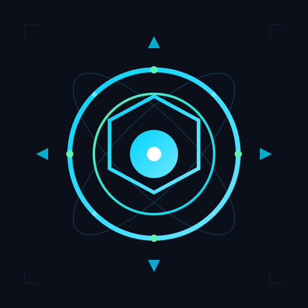

# OWNEX OMEGA

<div align="center">



**Autonomous Personal Operating System**

Build. Learn. Execute. Earn.

---

[](https://github.com/AdriDob/rastrohunteralpha)
[](https://www.python.org)
[](https://vuejs.org)
[](https://www.typescriptlang.org)
[](LICENSE)
[](https://github.com/AdriDob/rastrohunteralpha)

[](https://github.com/AdriDob/rastrohunteralpha)
[](https://github.com/AdriDob/rastrohunteralpha)
[](https://github.com/AdriDob/rastrohunteralpha/issues)

</div>

---

## Overview

OWNEX OMEGA is an autonomous operating system that performs software engineering, cybersecurity, bug bounty, AI orchestration, autonomous workflows, revenue generation, documentation, learning, self-healing infrastructure, and continuous self-improvement.

---

## Features

### Core System

- **Agent Fleet** — Autonomous AI agents working simultaneously
- **Live Workflows** — Real-time workflow execution and monitoring
- **Opportunity Radar** — Automatic detection of opportunities
- **Revenue Analytics** — Track and optimize revenue streams
- **Autonomous Coding** — Self-improving code generation
- **Knowledge Memory** — Persistent knowledge graph
- **Security Engine** — Built-in security monitoring
- **Evolution Center** — Continuous self-improvement
- **Infrastructure Health** — Self-healing systems
- **Voice Assistant** — Natural language interface

### Companion Apps

- **Desktop Companion** — Native desktop application
- **Mobile Companion** — Android app with full dashboard
- **Wear OS Companion** — Smartwatch app for quick actions
- **Cloud Sync** — Supabase-powered synchronization across devices

### AI Integration

- **Devin CLI** — Free AI development tool integration
- **Multiple Providers** — Support for Claude, OpenAI, local models
- **MERLIN** — AI-powered assistant for recommendations
- **Autonomous Workflows** — AI-driven task automation

---

## Quick Start

```bash
# Clone the repository
git clone https://github.com/AdriDob/rastrohunteralpha.git
cd rastrohunteralpha

# Install dependencies
python -m venv .venv
source .venv/bin/activate
pip install -r requirements.txt

# Configure environment
cp .env.example .env
# Edit .env with your credentials

# Run the backend
python api/main.py

# Run the frontend (in another terminal)
cd frontend
npm install
npm run dev
```

---

## Documentation

- [Supabase Setup Guide](SUPABASE_SETUP_GUIDE.md) — Configure cloud sync
- [Deployment Guide](DEPLOYMENT_GUIDE.md) — Deploy to production
- [Architecture](.ai/OWNEX_OMEGA_ARCHITECTURE.md) — System architecture
- [Current State](.ai/CURRENT_STATE.md) — Feature status
- [Devin Integration](.ai/DEVIN_INTEGRATION.md) — AI tool setup

---

## Technology Stack

### Backend

- **Python 3.11+** — Core language
- **FastAPI** — Web framework
- **SQLAlchemy** — ORM
- **Supabase** — Cloud database and auth
- **Pydantic** — Data validation
- **Uvicorn** — ASGI server

### Frontend

- **Vue 3** — UI framework
- **TypeScript** — Type safety
- **Tailwind CSS** — Styling
- **Vite** — Build tool
- **Pinia** — State management
- **Vue Router** — Routing

### Mobile

- **Android** — Kotlin with Supabase sync
- **Wear OS** — Kotlin for smartwatch

---

## Project Status

### Production Ready ✅

- Backend API — Fully functional
- Frontend UI — Complete with all features
- Mobile Apps — Android and Wear OS complete
- Cloud Sync — Supabase integration ready
- AI Integration — Devin CLI integrated
- Documentation — Complete

### Next Steps

1. Set up Supabase project
2. Configure environment variables
3. Deploy to production
4. Test cloud sync
5. Deploy mobile apps

---

## License

MIT License — see [LICENSE](LICENSE) for details.

---

<div align="center">

**OWNEX OMEGA — Autonomous Personal Operating System**

</div>