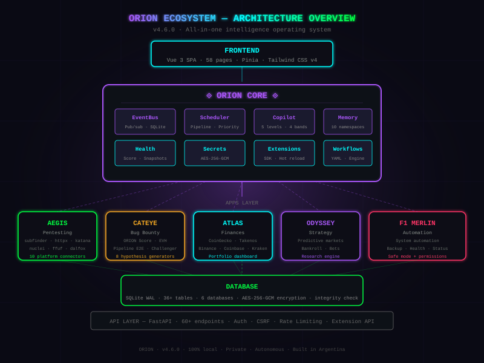
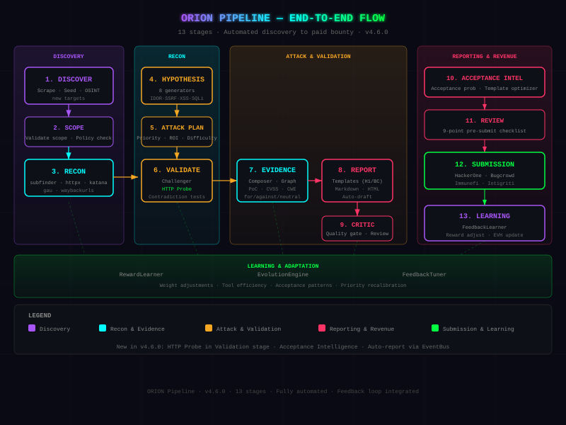
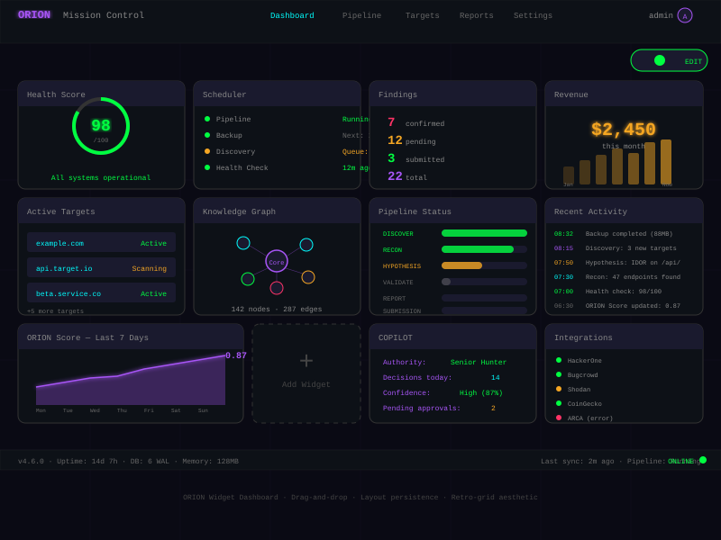
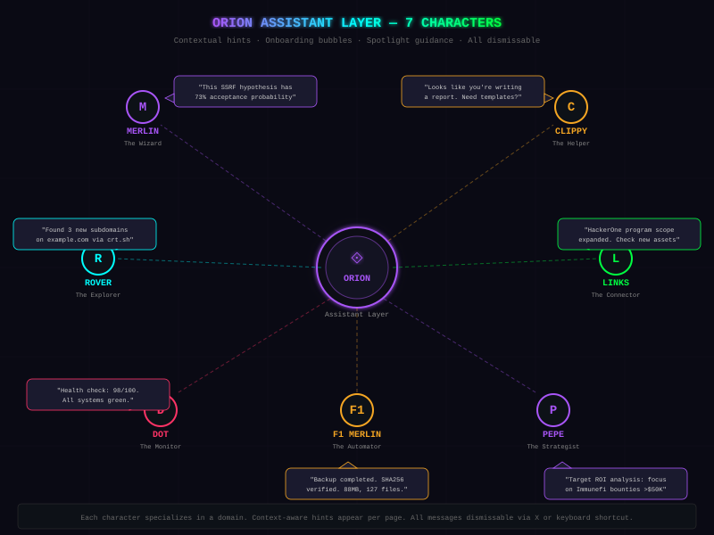
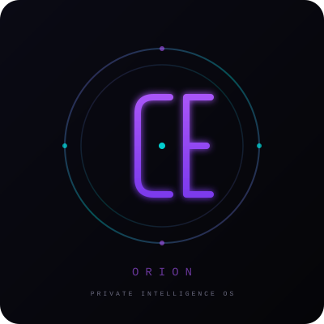

<div align="center">
  <a href="docs/screenshots/github-cover.svg">
    
  </a>
</div>

---

<div align="center">

[](CHANGELOG.md)
[]()
[]()
[]()
[]()
[]()

**Private Intelligence Operating System · 100% Local · No Cloud · Autonomous**

</div>

---

<pre align="center">
   ___  ____   ___  __  __  ___  ____  _____    _    __  __ _____
  / _ \|  _ \ / _ \|  \/  |/ _ \|  _ \| ____|  / \  |  \/  | ____|
 | | | | |_) | | | | |\/| | | | | | | |  _|   / _ \ | |\/| |  _|
 | |_| |  _ <| |_| | |  | | |_| | |_| | |___ / ___ \| |  | | |___
  \___/|_| \_\\___/|_|  |_|\___/|____/|_____/_/   \_\_|  |_|_____|

            Private Intelligence Operating System · v4.6.0
</pre>

---

## Table of Contents

| # | Section |
|---|---------|
| 1 | [What is ORION?](#-what-is-orion) |
| 2 | [Ecosystem](#-ecosystem) |
| 3 | [A Day with ORION](#-a-day-with-orion) |
| 4 | [Apps](#-apps) |
| 5 | [Core Capabilities](#-core-capabilities) |
| 6 | [Security Model](#-security-model) |
| 7 | [Screenshots](#-screenshots) |
| 8 | [Quick Start](#-quick-start) |
| 9 | [Migration](#-migration) |
| 10 | [Tech Stack](#-tech-stack) |
| 11 | [Documentation](#-documentation) |
| 12 | [State of the System](#-state-of-the-system) |

---

## 👁 What is ORION?

**ORION** is not an application. It is an **operating system for work** — a private intelligence platform that runs specialized apps for bug bounty hunting, financial intelligence, security operations, and autonomous decision-making.

| Design Principle | Meaning |
|:---|---|
| **100% Local** | Nothing leaves your machine. No telemetry, no cloud, no datalake. |
| **Autonomous** | Scheduler pipeline runs 24/7: DISCOVER → RECON → HYPOTHESIS → VALIDATE → EVIDENCE → REPORT → SUBMIT |
| **Private** | AES-256-GCM vault. Ed25519 licensing. CSRF protected. Audit logged. |
| **Extensible** | Extension SDK with hooks, capabilities registry, hot reload. |
| **You Decide** | ORION handles the work. You approve the critical decisions. |

```text
=====================================================================
                       ORION CORE v4.6.0
=====================================================================
  EventBus | Scheduler | Copilot | Memory | Secrets | Health
  Knowledge Graph | Execution Runtime | Command System | SDK
  Decision Journal | Evidence Graph | Workflow Engine | Widgets
=====================================================================
         |         |         |         |         |
       AEGIS    CATEYE    ATLAS    ODYSSEY   MERLIN
     Pentest   B.Bounty  Finances  Strategy  Ops/Auto
         |         |         |         |         |
=====================================================================
        API LAYER — FastAPI · 60+ Routers · Auth · CSRF · Rate Limit
=====================================================================
          FRONTEND — Vue 3 SPA · 60+ Pages · Widget Dashboard
=====================================================================
     DATABASE — SQLite WAL · 36+ Tables · AES-256-GCM · Backup
=====================================================================
```

---

## 🌐 Ecosystem

| Diagram | Description |
|:---:|---|
| [](docs/screenshots/ecosystem-overview.svg) | **Full Architecture** — ORION Core, apps, API, frontend, database layers |
| [](docs/screenshots/pipeline-e2e.svg) | **E2E Pipeline** — 13-stage pipeline from Discovery to Learning |
| [](docs/screenshots/widget-dashboard.svg) | **Widget Dashboard** — modular drag-and-drop widget system |
| [](docs/screenshots/assistant-layer.svg) | **Assistant Layer** — 7 AI characters (Merlin, Clippy, Rover, Links, Dot, F1, Pepe) |
| [](docs/screenshots/orion-ce-logo.svg) | **CATEYE Logo** — The CE mark (CATEYE) |

---

## 🚀 A Day with ORION

```text
  🌅 06:00 ──── Auto-backup with WAL checkpoint + SHA256 manifest
  🔄 06:30 ──── Scheduler: DISCOVER → RECON → HYPOTHESIS → PROBE → VALIDATE
  🎯 08:00 ──── ORION scores targets by ROI, picks today's priority
  🩺 09:00 ──── Health Center: all checks green (score: 97/100)
  📊 10:00 ──── Mission Control: 4 findings, 2 evidence-ready, 1 report pending
  🤖 12:00 ──── COPILOT reviews evidence, recommends next action
  💰 14:00 ──── Revenue Pipeline: sync platform payouts
  📱 16:00 ──── Companion: push notification — "Finding confirmed"
  📝 18:00 ──── Report drafted from confirmed finding with evidence
  🧹 23:00 ──── Auto-vacuum + WAL truncate + daily summary
  💤 00:00 ──── System idle. Waiting for tomorrow.
```

> **You don't operate. You decide.** That is the goal.

---

## 🧩 Apps

| App | Logo | Purpose | Status |
|:---|:---:|:---|---|
| **AEGIS** | 🛡️ | Active pentesting — targets, recon pipeline (subfinder → httpx → katana → gau), scanner (nuclei → ffuf → dalfox), 10 platform connectors, Markdown/HTML reports | ✅ Production |
| **CATEYE** | 👁️ | Bug bounty operations — ORION Score, EVH, pipeline E2E, 8 hypothesis generators, Hypothesis Challenger, auto-report, 16 OSINT clients | ✅ Production |
| **ATLAS** | 📈 | Financial intelligence — CoinGecko feed, Takenos connector, exchange APIs (Binance, Coinbase, Kraken), unified dashboard, wealth tracking | ✅ Production |
| **ODYSSEY** | 🎲 | Predictive markets — bankroll management, bet strategies, investigation tools | ✅ Stable |
| **MERLIN** | 🤖 | Automation & Operations — 14 CLI commands, safe mode, EventBus integration, permission system, security layer. *(formerly Hermes)* | ✅ Production |

---

## 🔧 Core Capabilities

| Module | Description |
|:---|---|
| **EventBus** | Pub/sub persistent over SQLite. All modules communicate without direct coupling. |
| **Decision Journal** | Append-only log of every decision. Who, when, why, result. Feedback loop integrated. |
| **Knowledge Graph** | Nodes & edges for findings, reports, decisions. Path discovery, subgraph extraction, stats. Auto-recorded via EventBus bridge. |
| **Unified Memory** | 10 namespaces (cateye, atlas, odyssey, merlin, copilot...). Text search, tags, priority, expiration. Embedding-ready. |
| **Senior Copilot** | 5 authority levels (Observer → Administrator), 4 confidence bands, 6 policy rules. Planner + Analyzer + Reviewer + 4 Auditors. |
| **Evidence Graph** | Evidence for/against/neutral per hypothesis. SQLite persistent, balance scoring. Integrated with Copilot + EventBus. |
| **Integration Center** | 23 integration definitions in 7 categories. Runtime status checks (env vars, vault, health callables). |
| **Secrets Manager** | IdentityVault bridge with AES-256-GCM. In-memory cache, env var fallback. REST API. |
| **Health Center** | Unified checks by category (system / background / integration / extension). Score 0-100, snapshot history, green/yellow/red. |
| **Extension SDK** | Manifest, before/after hooks, capabilities registry, declarative settings, hot reload, failure isolation. Auto-discovery. |
| **Workflow Engine** | YAML automations with 3 pre-built templates (recon-full, scan-quick, report-auto). |
| **HTTP Probe Engine** | Auto-confirms hypotheses via real HTTP requests. 5 probe types: IDOR, SSRF, XSS, SQLi, Auth Bypass. |
| **Execution Runtime** | State machine, journal, rollback, retry policies, checkpoint manager, simulation mode. |
| **Command System** | 107 registered commands across 14 categories. Permission validation, EventBus history, CapabilityRegistry integration. |
| **Widget Dashboard** | Drag-and-drop widget system with layout persistence. 10 widget types. Edit mode + palette. |
| **Assistant Layer** | 7 pixel-art characters with contextual hints per page, bubble tips, onboarding spotlight. All dismissable. |
| **Setup Wizard** | Guided 5-step onboarding. Auto-shows on first launch. |

---

## 🔐 Security Model

```text
+------------------------------------------------------------------+
|  SECURITY MODEL                                                   |
+------------------------------------------------------------------+
|  100% local ........... Nothing leaves your machine. No telemetry.|
|  AES-256-GCM ......... Credential vault encrypted. Random key.    |
|  CSRF ................. Double-submit cookie on all mutant routes. |
|  Rate limiting ........ By identity with IP fallback.             |
|  Audit log ............ JSONL append-only. 10MB rotation. chmod 600|
|  Ed25519 .............. Asymmetric license validation. No HMAC.   |
|  No secrets in repo ... API keys in IdentityVault or env vars.    |
|  Security headers ..... Error handling middleware. No info leaks. |
|  Session encryption .. AES-256-GCM tokens with device binding.   |
+------------------------------------------------------------------+
```

---

## 📸 Screenshots

<div align="center">

| | | |
|:---:|:---:|:---:|
| [](docs/screenshots/ecosystem-overview.svg) | [](docs/screenshots/pipeline-e2e.svg) | [](docs/screenshots/widget-dashboard.svg) |
| **Full Architecture** | **13-Stage Pipeline** | **Widget Dashboard** |
| [](docs/screenshots/assistant-layer.svg) | [](docs/screenshots/github-cover.svg) | [](docs/screenshots/orion-ce-logo.svg) |
| **7 AI Assistants** | **GitHub Cover** | **CATEYE Logo** |

</div>

---

## 📦 Quick Start

```bash
# 1. Clone
git clone https://github.com/AdriDob/Rastro.git
cd Rastro

# 2. Backend
python3 -m venv .venv
source .venv/bin/activate
pip install -r requirements.txt

# 3. Frontend
cd frontend && npm install && npm run build && cd ..

# 4. Run
python run.py
```

Open **http://127.0.0.1:8000** in your browser.

---

## 🔁 Migration

```bash
# PC A — create backup
python run.py --backup

# Copy backup.zip + project to PC B

# PC B — prepare environment
bash scripts/setup.sh

# PC B — restore everything
python run.py --migrate backup.zip

# PC B — verify
python run.py --verify

# PC B — start
python run.py
```

---

## 🛠 Tech Stack

| Layer | Technology |
|:---|---|
| Backend | Python 3.10+ · FastAPI · Uvicorn |
| ORM | SQLAlchemy 2.0+ · Pydantic v2 |
| Database | SQLite WAL · PostgreSQL |
| Frontend | Vue 3.5+ · TypeScript · Vite 6.4+ |
| CSS | Tailwind CSS 4.1+ · Custom retro/retrowave themes |
| State | Pinia 3.0+ · Composables |
| Desktop | PyInstaller · PyWebView · PyStray |
| AI | Gemini · OpenRouter · Ollama · OpenAI |
| Security | Cryptography · AES-256-GCM · Ed25519 |
| Testing | pytest (1400+ tests) · Ruff (strict) |
| Charts | chart.js 4.5 · D3 7.9 |
| CI/CD | GitHub Actions · pre-commit (Ruff + pytest) |

---

## 📊 State of the System

| Indicator | Value |
|:---|---|
| **Version** | `v4.6.0 STABLE` |
| **Tests** | 1400+ pass · 2 xfailed · 0 failures new |
| **Lint** | 0 errors (Ruff) |
| **Pipeline** | 13-stage E2E functional (DISCOVER → LEARNING) |
| **HTTP Probes** | 5 types · 56 tests (IDOR, SSRF, XSS, SQLi, Auth Bypass) |
| **Commands** | 107 registered · 14 categories · 5 permission levels |
| **Widgets** | 10 types · drag-and-drop · layout persistence |
| **Pre-commit** | Ruff + pytest hooks active |
| **Apps** | 🛡️ AEGIS · 👁️ CATEYE · 📈 ATLAS · 🎲 ODYSSEY · 🤖 MERLIN |
| **Integrations** | 23 defined · 10 platform connectors · 16 OSINT clients |
| **Database** | 6 SQLite WAL · 36+ tables · integrity check ✅ |
| **Backup** | Auto WAL checkpoint · SHA256 manifest · rotation |

---

## 📚 Documentation

| Guide | Description |
|:---|---|
| [📘 SYSTEM.md](SYSTEM.md) | Full system architecture |
| [📗 USER_GUIDE.md](USER_GUIDE.md) | Daily operation manual |
| [📙 CONFIGURATION_GUIDE.md](CONFIGURATION_GUIDE.md) | Configuration reference |
| [📕 EXTENSION_SDK.md](EXTENSION_SDK.md) | How to create extensions |
| [📓 CONNECTOR_GUIDE.md](CONNECTOR_GUIDE.md) | How to build connectors |
| [📒 MERLIN_GUIDE.md](docs/HERMES_GUIDE.md) | MERLIN Operations Agent guide |
| [📄 ARCHITECTURE_DECISIONS.md](ARCHITECTURE_DECISIONS.md) | Architectural Decision Records |
| [📑 CHANGELOG.md](CHANGELOG.md) | Release history |
| [📊 FUNCTIONAL_SPEC.md](FUNCTIONAL_SPEC.md) | Functional specification |
| [🔐 SECURITY_POLICY.md](.ai/SECURITY_POLICY.md) | Security policy and CVEs |
| [📋 AGENTS.md](AGENTS.md) | CATEYE/OpenCode workflow rules |

---

<div align="center">
  <a href="docs/screenshots/orion-ce-logo.svg">
    
  </a>
  <br/>
  <sub>
    <strong>ORION</strong> · Private Intelligence OS · v4.6.0 STABLE<br/>
    Hecho en 🇦🇷 · 100% local · No cloud · Autonomous<br/>
    <a href="docs/screenshots/github-cover.svg">GitHub Cover</a> ·
    <a href="docs/screenshots/ecosystem-overview.svg">Architecture</a> ·
    <a href="docs/screenshots/pipeline-e2e.svg">Pipeline</a> ·
    <a href="docs/screenshots/widget-dashboard.svg">Widgets</a> ·
    <a href="docs/screenshots/assistant-layer.svg">Assistants</a>
  </sub>
  <br/><br/>
  <sub><code>Julio 2026 · This is fine 🔥</code></sub>
</div>
