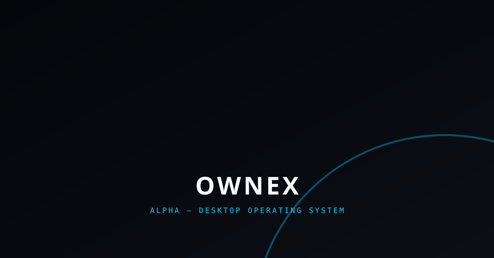
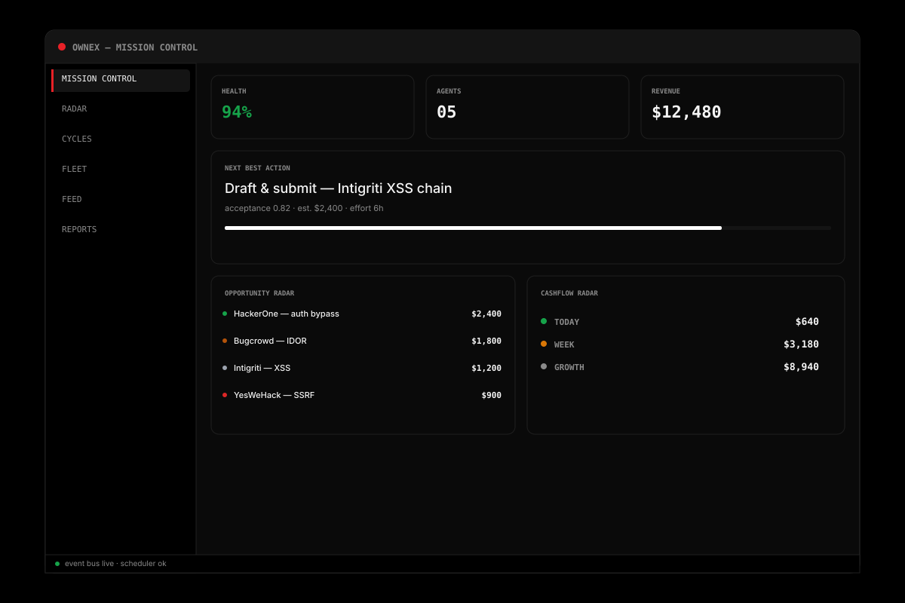
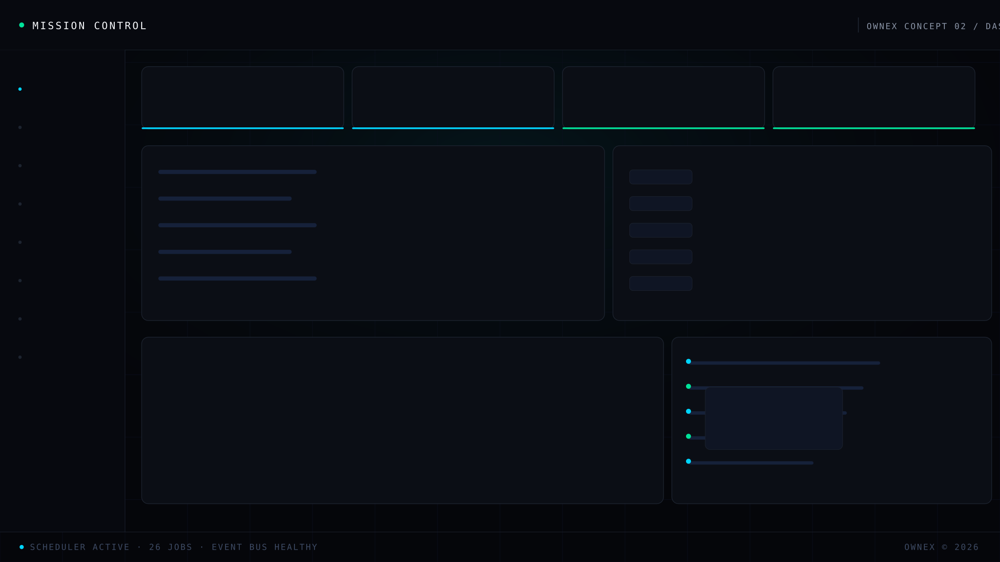
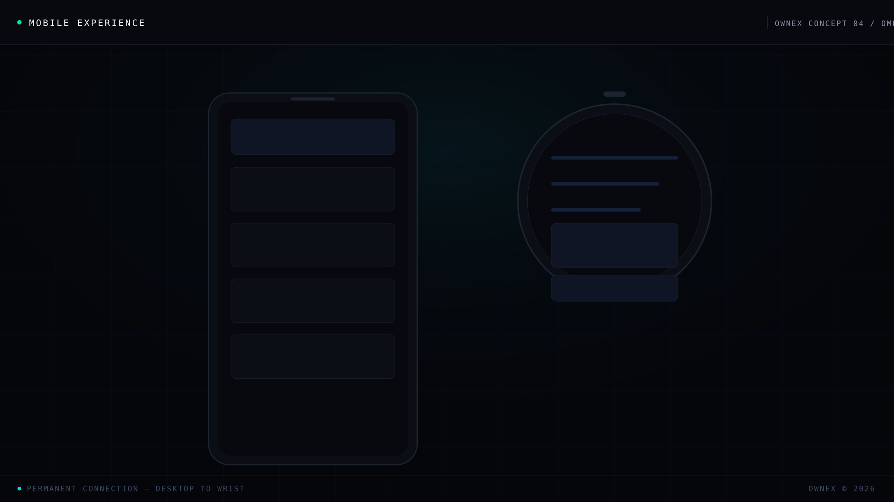

<p align="center">
  
</p>

<h1 align="center">OWNEX</h1>

<p align="center">
  <strong>Personal Autonomous Work Operating System</strong>
</p>

<p align="center">
  
  
  
  
  
  
</p>

---

<p align="center">
  
</p>

---

## Qué es OWNEX (de verdad)

**OWNEX no es una herramienta de bug bounty.**  
Es un **sistema operativo personal de trabajo autónomo** que descubre oportunidades, ejecuta trabajo técnico, aprende de los resultados y evoluciona su propia operación — desde el escritorio hasta tu muñeca.

El humano está en la **puerta de decisión**. El sistema hace el resto.

```text
┌─────────────────────────────────────────────────────────────┐
│  GOOD MORNING (06:30) — MERLIN te saluda en modo modern_retro │
│  ████████████████████████████████████████████████████████████ │
│  Sistema: Online · Score 94/100                               │
│  Memoria: 247 entradas · 10 namespaces                        │
│  Trabajo: 3 listos para entregar · 1 pide acceso              │
│  Oportunidades: 12 fuentes DISCOVER hoy · Top: HackerOne      │
│  Enfoque: Detener 2 · Automatizar 3 · Delegar 1 · Mejorar 2   │
│  ████████████████████████████████████████████████████████████ │
│  → "Buenos días, Operador. Hoy hay 3 items listos para cobrar."│
└─────────────────────────────────────────────────────────────┘
```

---

## El norte: **Revenue Rule**

> **Ninguna feature entra al roadmap si no aumenta al menos uno de:**
> - Detección de vulnerabilidades reales
> - Calidad de evidencia
> - Probabilidad de aceptación
> - Aprendizaje del sistema
>
> *No hay excepciones.*

Esto no es una frase en un doc. Es un **filtro duro** que elimina ruido antes de que se escriba código.

---

## MERLIN — Tu copiloto con personalidad

No es un chatbot genérico. Es **MERLIN** (antes COPILOT), un mago office-retro que vive en tu Mission Control.

```python
# cores/merlin/config.py — configuración real
MerlinConfig(
    personality=OfficeRetroMode(theme="modern_retro", retro_animations=True, typing_effect=True, avatar="🧙"),
    detail_level="normal",
    response_tone="friendly",
    memory_limit=10000,
    learning_enabled=True,
)
```

- **Avatar:** 🧙 con anillos pulsantes (pulseGlow, retroBorder)
- **Modos:** `classic_97` | `modern_retro` | `cyber_retro`
- **Memoria persistente:** `MerlinMemory` sobre SQLite (sobrevive reinicios)
- **Intent analysis:** Detecta si pides análisis de target, generación de reporte, planificación estratégica, asistencia técnica
- **Habla tu idioma:** Español nativo, tono configurable

<p align="center">
  
</p>

---

## Un día real con OWNEX

| Hora | Qué pasa |
|------|----------|
| **06:30** | `POST /direct-work/daily-companion` → MERLIN te da el briefing consolidado (sistema + personal + mercado + foco) |
| **07:00** | `GoodMorning` en Mission Control: 3 items `ready_to_deliver`, 1 `needs_access`, 12 fuentes DISCOVER |
| **07:15** | `HUNT` button → `POST /direct-work/workbank/cycle` → descubre, filtra cero-barrera, rankea por EV real, prepara paquetes de entrega |
| **08:00** | `DailyIncomePlan` muestra: Optimistic $2,400 | Realistic $1,100 | Conservative $400 |
| **09:30** | `DirectWorkRadar`: top pick del día + skill gap + plan de aprendizaje automático |
| **12:00** | `NotificationCenter`: alerta de approval en Wear OS → one-tap approve desde muñeca |
| **14:00** | `ReportPipeline`: findings → evidencia → reporte → auto-submit a HackerOne/Intigriti |
| **18:00** | `ExecutiveDashboard` (CEO view): ¿ganamos plata esta semana? USD/hr real por plataforma |
| **22:00** | `VersionBackup` snapshot automático + `HealthCenter` persiste snapshot en SQLite |

<p align="center">
  
</p>

---

## Arquitectura: Monolito modular + EventBus

```text
                    ┌─────────────────────┐
                    │   FastAPI Process   │
                    │  (single binary)    │
                    └──────────┬──────────┘
                               │
        ┌──────────────────────┼──────────────────────┐
        ▼                      ▼                      ▼
┌───────────────┐     ┌───────────────┐     ┌───────────────┐
│   CORES/      │     │    CORE/      │     │    APPS/      │
│  (inteligencia)│     │  (plataforma) │     │  (dominios)   │
│               │     │               │     │               │
│ financial_    │     │ EventBus      │     │ security/     │
│ intelligence  │     │ Scheduler     │     │ forge/        │
│ merlin/       │     │ HealthCenter  │     │ pulse/        │
│ auto_submit/  │     │ UnifiedMemory │     │ wealth/       │
│ evidence/     │     │ DecisionJournal│    │ atlas/        │
│ opportunity/  │     │ WidgetEngine  │     │ direct_work/  │
│ direct_work/  │     │ IdentityVault │     │               │
└───────────────┘     └───────────────┘     └───────────────┘
        │                      │                      │
        └──────────────────────┼──────────────────────┘
                               ▼
                    ┌─────────────────────┐
                    │   SQLite / Postgres │
                    │   (single source)   │
                    └─────────────────────┘
```

**Stack real (sin humo):**
| Capa | Tech |
|------|------|
| Backend | Python 3.11+, FastAPI, SQLAlchemy 2.0 |
| Frontend | Vue 3 + TypeScript, Tailwind CSS v4, Vite |
| Desktop | Tauri v2 (Rust + WebView2) + PyInstaller sidecar |
| Mobile | Capacitor v6 (Android) + Expo/React Native (OMEGA) |
| Smartwatch | Wear OS companion (Kotlin) — **en desarrollo** |
| AI | Multi-provider router: OmniRoute (free) → FCC Proxy → OpenRouter → Ollama local |
| DB | SQLite (dev) / PostgreSQL (prod) |
| Tests | 1,400+ (pytest + Vitest) · Ruff · Biome · Mypy strict |

---

## El cerebro: `.ai/` — Single Source of Truth

Todo lo que importa vive en `.ai/`. El código es derivado.

```
.ai/
├── AGENT_CHARTER.md         # Constitución, Agent Loop, Regla de Oro
├── PRODUCTION_RULES.md      # Reglas de producción (NO modificar)
├── CURRENT_STATE.md         # Estado verificado de cada feature
├── TASK_QUEUE.md            # Cola priorizada con criterios de done
├── ROADMAP.md               # Roadmap general
├── DECISIONS.md             # Decisiones arquitectónicas con evidencia
├── COMPLETED_FEATURES.json  # Registro de features completadas + evidencia
├── KNOWN_DEBT.md            # Deuda técnica conocida con evidencia
├── DO_NOT_TOUCH.md          # Componentes estables (no tocar sin justificación)
├── STRATEGIC_AUDIT.md       # Marco de auditoría permanente (10 preguntas, 18 dimensiones)
└── MEMORY.md                # UnifiedMemory spec + MerlinMemory
```

**Regla:** Si hay conflicto entre código, docs o memoria del agente → gana `.ai/`.

---

## Work Cycles (6 ciclos autónomos)

| Ciclo | Dominio | Estado | Jobs |
|-------|---------|--------|------|
| **SECURITY** | Bug bounty → auto-submit | ✅ Operativo | 4 |
| **FORGE** | Dev bounties → PR → merge | ✅ Operativo | 6 |
| **PULSE** | AI work / data tasks | ✅ Operativo | 5 |
| **WEALTH** | Investment + allocation | ✅ Operativo | 3 |
| **ATLAS** | Monitoring + self-healing | ✅ Operativo | 3 |
| **DIRECT WORK** | Freelance platforms (Opire, IssueHunt, Freelancer, OpenCollective) | ✅ Operativo | 3 |

**Scheduler:** 26 jobs cron-aware con self-healing, cooldown por target, priorización por USD/hr real.

---

## Smartwatch (Wear OS) — En desarrollo

<p align="center">
  
</p>

**Objetivo:** Panel táctil sincronizado, no app standalone.

| Feature | Estado |
|---------|--------|
| Notificaciones críticas (findings, approvals, system alerts) | 🟡 Protocolo definido |
| MERLIN Mini (resumen decisiones + approve/skip) | 🟡 Diseño listo |
| Health check en un vistazo (🟢 ORION Online · N workflows · M approvals) | 🟡 Diseño listo |
| Transferencia Companion → Watch (Bluetooth/Wear OS) | 🟢 Documentado en `ORION_SETUP_GUIDE.md` |
| Modo critical-only (batería) | 🟡 Pendiente |

> El desarrollo de smartwatch es **élite y extenso**: requiere sync bidireccional, crypto local, offline-first, battery-aware rendering. No es un "port" — es una extensión nativa del sistema nervioso de OWNEX.

---

## Brand: The Aperture Nexus (v3)

Identidad generada por **pipeline determinista** (`scripts/brand/` — Python + cairosvg + PIL + fontTools). Cero IA generativa, 100% reproducible.

| Edición | Uso | Colores |
|---------|-----|---------|
| **ALPHA** | Desktop / Tauri | `cyber_cyan` → `deep_blue` |
| **OMEGA** | Mobile / Wear / Expo | `emerald` → `cyber_cyan` |

**Geometría compartida:** Anillo octagonal + X de rayos cónicos desde nodo cuadrado central + rayo que rompe el anillo (evolución núcleo→edge).

<p align="center">
  
  &nbsp;&nbsp;&nbsp;&nbsp;
  
</p>

**Assets reales en repo:**
```
assets/
├── logos/           # 37 archivos (mark, lockup, icon, favicon, mono) — SVG + PNG
├── banners/         # hero-banner (2400×1260), og-cover (1200×630) — ALPHA + OMEGA
├── concepts/        # 5 conceptos 2400×1350 (product-overview, mission-control, architecture, mobile-omega, boot-sequence)
├── desktop/         # Wallpaper ALPHA 2560×1440
├── mobile/          # Splash OMEGA 1080×2400
└── branding/design-tokens.json  # SSOT (space_black, cyber_cyan, deep_blue, emerald, decision_orange)
```

---

## Quick Start (real)

```bash
# 1. Clona
git clone https://github.com/AdriDob/rastrohunteralpha.git
cd rastrohunteralpha

# 2. Entorno Python
python -m venv .venv
source .venv/bin/activate
pip install -r requirements.txt

# 3. Arranca el sistema autónomo
python run.py
# → FastAPI en http://localhost:8000
# → Mission Control en http://localhost:5173 (npm run dev en frontend/)

# 4. Health check
curl http://localhost:8000/api/health
# {"status":"ok","score":94,"version":"7.0.0",...}

# 5. Añade un target
python run.py --add-target "example" --domain "example.com"

# 6. Tests + quality gate
make check
# ruff + mypy + pytest (fast: scoring + opportunity + scheduler-jobs)
```

---

## Estado actual (v7.0.0)

| Sistema | Estado | Evidencia |
|---------|--------|-----------|
| Pipeline autónomo (7 stages) | ✅ | `tests/test_e2e_security_pipeline.py` 8 passed |
| Progressive Scaling (4 fases) | ✅ | `cores/financial_intelligence/` + tests |
| Risk Guardian + Smart Allocator | ✅ | `cores/financial_intelligence/risk_monitor.py` |
| 6 Work Cycles operativos | ✅ | `core/cycles/*.py` + `core/scheduler/jobs.py` |
| Desktop Tauri v2 | ✅ | `src-tauri/` + `cargo check` OK |
| Mobile Companion (Android) | ✅ | `android/` APK debug compila |
| OMEGA (Expo/React Native) | 🟡 | `omega/` esqueleto funcional |
| **Smartwatch (Wear OS)** | 🟡 | **En desarrollo — élite/extenso** |
| AI Worker (autonomous agents) | ✅ | `core/autonomy/coder_agent.py` 5 componentes |
| MERLIN (office retro) | ✅ | `cores/merlin/` + `MerlinInterface.vue` |
| UnifiedMemory + DecisionJournal | ✅ | `core/memory/` + `core/decision_journal/` |
| Auto-submit (H1/BC/Intigriti) | ✅ | `cores/auto_submit/pipeline.py` |
| Infinite Sources + Auto-apply | ✅ | `cores/financial_intelligence/infinite_source_discovery.py` |

---

## Documentación viva

| Doc | Qué encontrarás |
|-----|-----------------|
| `.ai/AGENT_CHARTER.md` | Constitución + Agent Loop obligatorio |
| `.ai/PRODUCTION_RULES.md` | Reglas de producción (no refactor estético, solo extender) |
| `.ai/CURRENT_STATE.md` | Estado verificado sesión a sesión |
| `.ai/TASK_QUEUE.md` | Próximas tareas con criterios de done |
| `.ai/STRATEGIC_AUDIT.md` | 10 preguntas obligatorias antes de construir |
| `.ai/MEMORY.md` | Espec de UnifiedMemory + MerlinMemory |
| `ORION_SETUP_GUIDE.md` | Onboarding nivel producto comercial (Identity → Desktop → Companion → Watch → Test) |
| `OWNEX_BRAND_IDENTITY.md` | Guía completa de marca v3 |

---

## Licencia

**Propietaria. Todos los derechos reservados.**

---

<p align="center">
  <strong>OWNEX no vende un servicio al cliente. OWNEX trabaja para mí.</strong>
</p>

<p align="center">
  <sub>Personal Autonomous Work Operating System · v7.0.0 · The Aperture Nexus</sub>
</p>

<p align="center">
  
</p>