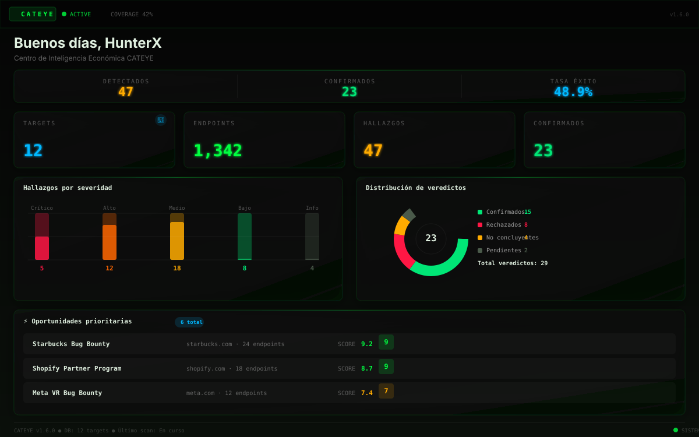

    <div align="center">
    <br/>
    
    <br/>
    <br/>
   <p>
     <em>Autonomous · Economic-First · Privacy-Focused · Open Source</em>
   </p>

   <br/>

   <p>
      <a href="LICENSE"></a>
     <a href="https://www.python.org/"></a>
      <a href="https://github.com/AdriDob/Rastro/releases"></a>
     <a href="https://vuejs.org/"></a>
     <a href="https://fastapi.tiangolo.com/"></a>
     <a href="https://docs.astral.sh/ruff/"></a>
     <a href="https://github.com/AdriDob/Rastro/pulls"></a>
   </p>

   <br/>
   <br/>
   <p>
        **CATEYE v2.0.0** — un sistema de inteligencia artificial autónomo para bug bounty hunters que automatiza todo el ciclo de vida de la cacería de vulnerabilidades — desde el descubrimiento de programas y reconocimiento, hasta la generación de hipótesis, validación, reportes, y tracking financiero completo.
     <br/>
     Cada decisión se mide en <strong>USD/hora</strong>, probabilidad de éxito y ROI esperado.
   </p>

   <div align="right">
     <sub>Hecho en 🇦🇷</sub>
   </div>

   <br/>

   <p align="center">
     
     <br/>
     <em>Panel principal — inteligencia económica, radar de oportunidades y decisión autónoma</em>
   </p>

   <br/>

   ---

   ## ✨ Características

   <table>
   <tr>
   <td width="50%">

   ### 🎯 Inteligencia Económica
   - **ORION Score** (0.0–1.0) — algoritmo de ranking con 6 factores (potencial de recompensa, éxito histórico, competencia, eficiencia temporal, experiencia, diversidad tecnológica)
   - **EVH** (Expected Value per Hour) — cálculo monetario de ROI por programa
   - **Money Radar** — programas ordenados por valor esperado
   - **Pattern Learning** — aprende automáticamente de patrones de earnings (ejemplo: "Los fintechs pagan mejor por IDOR")

   ### 🧠 Sistema Multi-Agente
   - 8 agentes especializados: Coordinator, Research, Validator, Exploit, Documentation, Strategy, Memory, Financial
   - Comunicación vía bus de eventos interno (pub/sub)
   - Pipeline de 11 estados: `PENDING → DISCOVERY → VALIDATION → EVIDENCE → AI_REVIEW → READY → SUBMITTED → TRIAGED → PAID → CLOSED | FAILED | CANCELLED`
   - Soporte multi-IA: Gemini, Ollama, OpenAI, OpenRouter

   ### 🔍 Reconocimiento Autónomo
   - Orquestación de 15+ herramientas: Subfinder, Amass, httpx, Katana, nuclei (pasivo), ffuf, gau, waybackurls, dnsx, naabu
   - Integración OWASP ZAP (spider + escaneo pasivo)
   - 16 clientes OSINT: Shodan, Censys, VirusTotal, SecurityTrails, AlienVault OTX, URLScan.io, Hunter.io, BuiltWith, HIBP, GreyNoise, IntelX, Pulsedive, ThreatFox, IPInfo, SpoofCheck

   </td>
   <td width="50%">

   ### 💰 Financial Truth Layer
    - Financial Truth Layer: clasifica cada valor como VERIFIED_REAL/PENDING/ESTIMATED/MANUAL/UNKNOWN
    - SyncPipeline: rate limiter token-bucket, cache TTL, retry con backoff exponencial, detección de delta
    - WithdrawalTracker: ciclo completo (initiated→pending→completed/failed) con confirmaciones reorg-safe por chain
    - ReconciliationEngine: compara datos externos vs ledger, auto-resuelve discrepancias con confianza ≥0.9
    - 10 eventos financieros enlazados a NotificationHub (payout, withdrawal, sync, dispute)
    - BankPayoutConnector: detección automática de pagos via Plaid API + CSV import + webhooks
    - 10 Micro-Functions: quick_sync_all, sync_source_now, get_sync_health, trace_balance_origin, detect_anomalies, compute_exposure y más

   ### ⛓️ Crypto Sync System
    - EVMConnector: Ethereum, Polygon, BSC, Arbitrum, Optimism via RPC + explorer API
    - ExchangeConnector: Binance, Coinbase, Kraken, Bybit con API firmada HMAC
    - BTCConnector: Blockstream.info API, satoshi→BTC, vin/vout parsing
    - SolanaConnector: JSON-RPC mainnet, lamports→SOL, fee parsing
    - TronConnector: TronGrid API, SUN→TRX, TRC20 tokens
    - WalletConnect: pairing con wallets mobile vía QR (v2 protocol)
    - 9 LedgerEvent crypto (deposit, withdrawal, staking, yield, swap, gas, airdrop, trade, fee)
    - Accounts Hub unificado (plataformas + wallets + conexiones bancarias)
    - Sync Center con historial de sincronización y salud por fuente

   ### 📊 Reportes Profesionales
   - Generación de reportes con IA
   - Exportación a Markdown, PDF, HTML, TXT
   - Envío directo a plataformas via API keys
   - Reward learning desde respuestas de plataformas
   - Historial completo de submissions y earnings

   ### 🔐 Seguridad & Privacidad
   - 100% local y privacy-first
   - Bóveda cifrada con AES-256-GCM
   - Nunca auto-explota ni auto-envía sin aprobación humana
   - Licencia MIT — Open Source

   ### 🔌 Plataformas
    - **Bug Bounty:** HackerOne, Bugcrowd, Intigriti, Synack, YesWeHack — todas con sync_earnings() funcional
    - **AuthHub:** Gmail OAuth2, WhatsApp Twilio, Telegram Bot — token storage en Identity Vault
    - **OSINT:** 16 APIs (Shodan, Censys, VirusTotal, etc.)
    - **Recon Tools:** 15+ externas (Subfinder, nuclei, ffuf, etc.)

   ### ⚡ Micro-Functions & Micro-Interactions
    - **10 Micro-Functions backend**: quick_sync_all, sync_source_now, get_sync_health, trace_balance_origin, detect_sync_anomalies, get_pending_actions, compute_real_exposure, export_account_snapshot, retry_failed_syncs, get_minimal_dashboard_state
    - **20 Micro-Interactions frontend**: ContextMenu global, Inspector lateral, MiniPreview hover, MultiSelect batch, CompareView, Timeline, CopyHelper, EmptyState, ErrorRecoveryUI, Command Palette, Search Everywhere, Keyboard Shortcuts, Status Chips, Cards Expandibles y más

   ### 🖥️ Escritorio
    - Aplicación de escritorio nativa (PyWebView + system tray)
    - Instalador Windows (NSIS)
    - Auto-updater con rollback
    - Watchdog interno con auto-healing (exponential backoff)

   </td>
   </tr>
   </table>

   ---

   ## 🏗️ Arquitectura

   ```
   ┌─────────────────────────────────────────────────────────────────────┐
   │                         CAPA DE ESCRITORIO                          │
   │  run.py (State Machine) → PyWebView + Uvicorn + System Tray         │
   └──────────────────────────────┬──────────────────────────────────────┘
                                 │
   ┌──────────────────────────────▼──────────────────────────────────────┐
   │                         API LAYER (FastAPI)                         │
   │  60+ routers · CORS · Auth · Rate Limiting · Scheduler · WebSocket  │
   └──────┬──────────────────────────────────────────────────┬───────────┘
           │                                                  │
   ┌──────▼──────────────────┐            ┌──────────────────▼───────────┐
   │    CORE ENGINES (cores/) │            │       UI (Vue 3 SPA)           │
   │                          │            │                           │
   │  ├─ ai/        (LLM)     │            │  50+ páginas               │
   │  ├─ agents/    (8 agents)│            │  Pinia stores               │
   │  ├─ recon/     (15+tools)│            │  Cyber theme glassmorphism │
   │  ├─ engine/    (hypoth.) │            │  Tailwind CSS + Radix UI    │
   │  ├─ intelligence/ (ML)   │            │  Chart.js + vue-chartjs     │
   │  ├─ platforms/ (5 sites) │            │  WebSocket bridge           │
   │  ├─ validation/          │            │                           │
   │  ├─ events/    (pub/sub) │            │                           │
   │  ├─ memory/    (LTM)     │            │                           │
   │  ├─ identity_vault (AES) │            │                           │
   │  ├─ financial/ (truth)   │            │                           │
   │  ├─ crypto/ (wallets)    │            │                           │
   │  └─ 30+ more modules     │            │                           │
   └──────┬──────────────────┘            └──────────────────────────────┘
           │
   ┌──────▼──────────────────────────────────────────────────────────────┐
   │                     DATABASE (SQLAlchemy)                           │
   │  models.py (30+ ORM) · models_economic.py (8) · SQLite/PostgreSQL   │
   └─────────────────────────────────────────────────────────────────────┘
   ```

   ---

   ## 🚀 Inicio Rápido

   ### Prerrequisitos

   - Python 3.10+
   - Node.js 18+ (para frontend)
   - Git

   ### Instalación

    ```bash
    # Clonar el repositorio
    git clone https://github.com/AdriDob/Rastro.git
    cd Rastro

   # Instalar backend
   pip install -r requirements.txt

   # Instalar frontend
   cd frontend
   npm install
   cd ..

   # Configurar entorno
   cp .env.example .env
   # Editar .env con tus API keys

   # Inicializar base de datos
   python run.py --setup
   ```

   ### Desarrollo

   ```bash
   # Iniciar backend (API en :8000)
   python run.py --dev

   # En otra terminal — iniciar frontend (Vite dev server en :5173)
   cd frontend && npm run dev
   ```

   ### Build Desktop

   ```bash
   # Build PyInstaller bundle
   python run.py --build

   # Windows installer (opcional)
    makensis installer/cateye.nsi
   ```

   ---

   ## 🧩 Tech Stack

   | Capa | Tecnología | Versión |
   |-------|-----------|---------|
   | **Backend** | Python + FastAPI | 3.10+ / 0.95+ |
   | **ASGI** | Uvicorn | 0.22+ |
   | **ORM** | SQLAlchemy + Pydantic v2 | 2.0+ |
   | **Database** | SQLite (dev) / PostgreSQL (prod) | — |
   | **Frontend** | Vue 3 + TypeScript + Vite | 3.5+ / 5.8+ / 6.4+ |
   | **CSS** | Tailwind CSS | 4.1+ |
   | **State** | Pinia | 3.0+ |
   | **Charts** | Chart.js + vue-chartjs | 4.5+ / 5.3+ |
   | **UI** | Radix Vue / Reka UI + Lucide Vue | — |
   | **AI** | Gemini · OpenRouter · Ollama · OpenAI | — |
   | **Desktop** | PyInstaller + PyWebView + Pystray + Plyer | — |
   | **Mobile** | Capacitor (Android) | 8.x |
   | **Security** | Cryptography (AES-256-GCM) | — |
   | **Linting** | Ruff + mypy | — |
   | **Testing** | pytest + pytest-cov + Playwright | — |
   | **CI/CD** | GitHub Actions | — |

   ---

   ## 📚 Documentación

   | Documento | Descripción |
   |-------------|-------------|
    | [`SYSTEM.md`](SYSTEM.md) | Documentación completa del sistema |
    | [`docs/SISTEMA.md`](docs/SISTEMA.md) | Visión general del sistema: arquitectura, stack, componentes |
    | [`SYSTEM_INVENTORY.md`](SYSTEM_INVENTORY.md) | Inventario técnico exhaustivo |
    | [`PLAN.md`](PLAN.md) | Plan histórico de migración React → Vue 3 |
    | [`ROADMAP.md`](ROADMAP.md) | Roadmap de versiones |
    | [`CHANGELOG.md`](CHANGELOG.md) | Historial de versiones |
    | [`AGENT_CONTEXT.md`](AGENT_CONTEXT.md) | Protocolo de coordinación multi-AI |
    | [`CLINE_SETUP.md`](CLINE_SETUP.md) | Configuración de Cline para desarrollo |
    | [`docs/tutorial.md`](docs/tutorial.md) | Tutorial paso a paso de uso del sistema |
    | [`docs/monetización.md`](docs/monetización.md) | Modelo de monetización y estrategia de ingresos |

   ---

   ## 🤝 Contribuir

   Las contribuciones son bienvenidas. Por favor:

   1. Haz fork del repo
   2. Crea una rama: `git checkout -b feature/algo-increible`
   3. Haz tus cambios
   4. Pasa los checks: `make lint && make test`
   5. Abre un Pull Request

   ---

   ## 📄 Licencia

   MIT License — ver [LICENSE](LICENSE) para detalles.

   ---

   <div align="center">
     <sub>Built with 🧠 by bug bounty hunters, for bug bounty hunters.</sub>
   </div>
</div>
