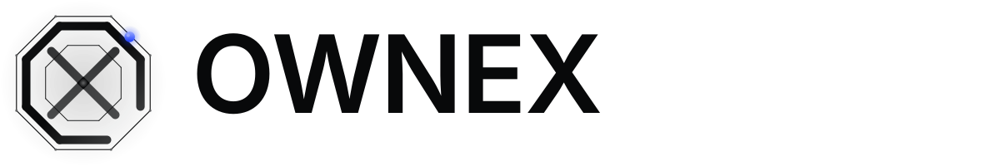
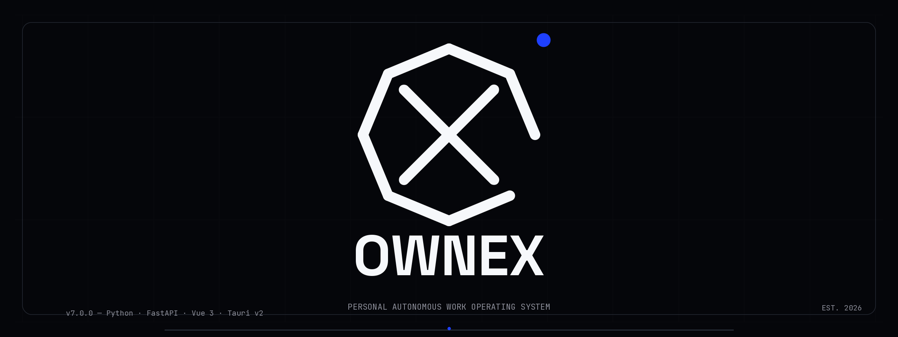
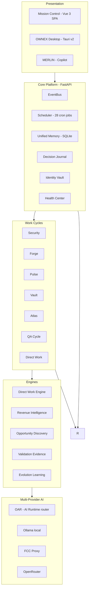
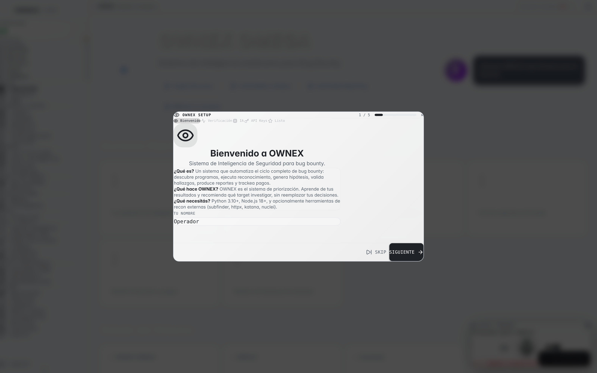
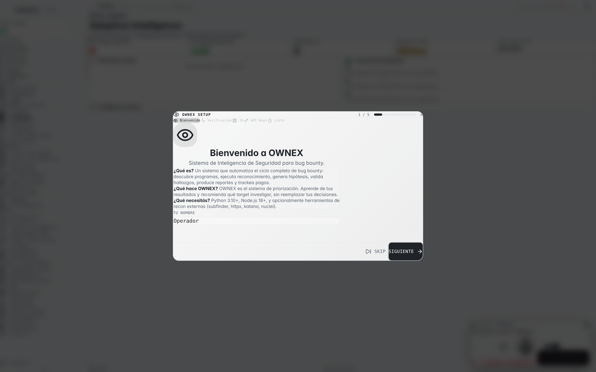
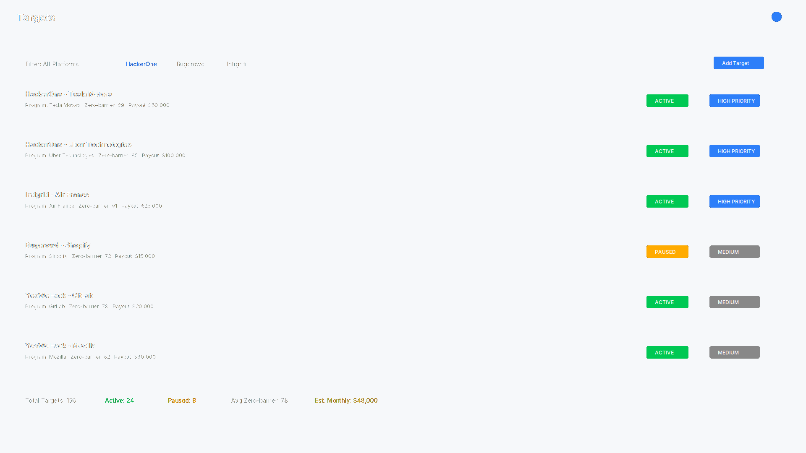
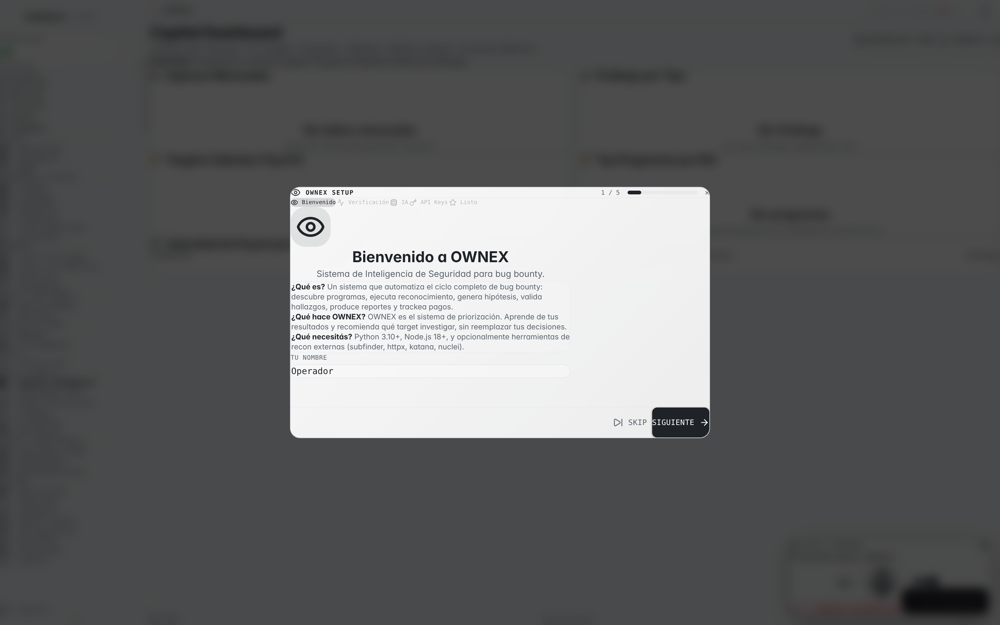
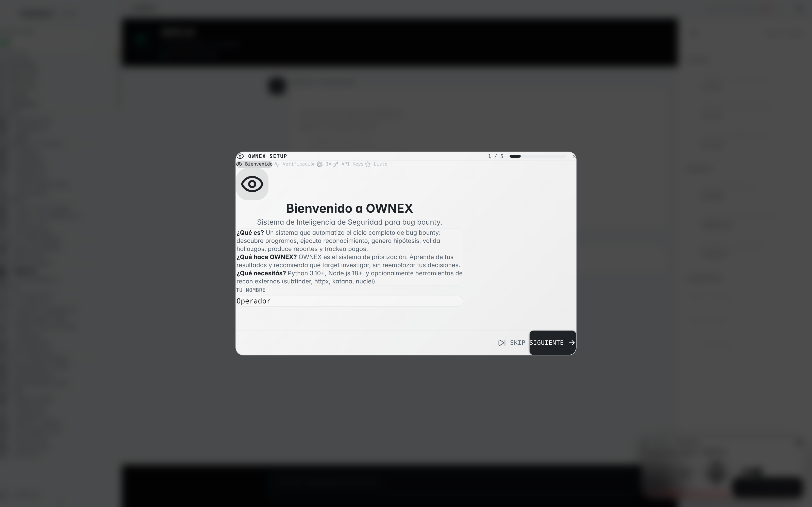
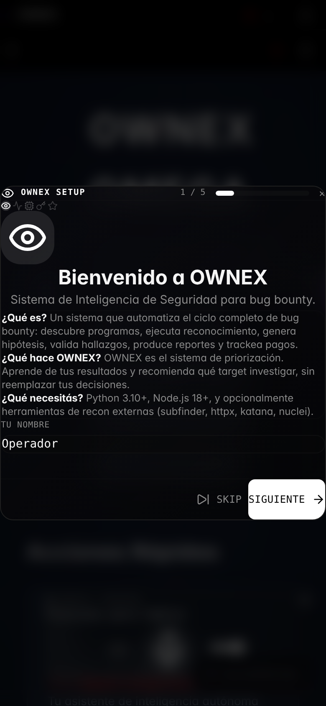

<p align="center">
  <picture>
    <source media="(prefers-color-scheme: dark)" srcset="docs/assets/branding/logo/ownex-lockup-white.svg"/>
    
  </picture>
</p>

<p align="center">
  <strong>Personal Autonomous Work Operating System</strong>
</p>

<p align="center">
  
  
  
  
  
  
</p>

---

<p align="center">
  
</p>

---

## What is OWNEX

**OWNEX is not a tool. OWNEX is an operating system for work** — a single platform that discovers remote opportunities, prepares them end-to-end, executes technical work, learns from real outcomes, and evolves its own operation.

Every opportunity is scored against a **zero-barrier spectrum** (0–100): how far is it from *finding* to *getting paid*, with no interview, no portfolio gate, no unpaid trial. The engine rank-orders thousands of candidates and surfaces the ones most likely to become money this week.

The human sits at the **decision gate**. The system does everything before and after.

<p align="center">
  <sub>The Revenue Rule: no feature enters the roadmap unless it increases vulnerability detection, evidence quality, acceptance probability, or system learning. No exceptions.</sub>
</p>

---

## Capabilities

| Capability | What it does | Where |
|---|---|---|
| **Security Cycle** | Full bug-bounty pipeline: discover → recon → hypothesis → validate → evidence → report → auto-submit | `core/cycles/stages/` |
| **Direct Work Engine** | Zero-barrier opportunity discovery, 18-factor scoring, EV-based recommendation, work bank | `cores/direct_work_engine/` |
| **Work Bank** | Autonomous production of ready-to-deliver jobs (target: 100/day → 1000/month) with honest access requirements | `cores/direct_work_engine/workbank.py` |
| **Daily Companion** | One call consolidating system health, personal state, market, focus, and projection | `cores/direct_work_engine/daily_companion.py` |
| **Mission Control** | Single-pane-of-glass dashboard: opportunities, work bank targets, revenue, execution queue | `frontend/src/pages/MissionControl.vue` |
| **MERLIN Copilot** | Office-retro assistant with persistent memory, intent analysis, and live voice (Web Speech) | `cores/merlin/` |
| **7 Work Cycles** | Security, Forge, Pulse, Vault, Atlas, QA, Direct Work — 28 cron-aware scheduled jobs | `core/scheduler/jobs.py` |
| **Evolution layer** | Skill-gap detection, capability proposals, performance analysis, learning from lost opportunities | `cores/direct_work_engine/evolution.py` |
| **AI Runtime (OAR)** | Multi-provider router: local Ollama → FCC proxy → OpenRouter, with budget, failover, caching | `cores/ai/runtime/` |

---

## Architecture

A modular monolith: one FastAPI process, EventBus-driven, single database. No microservices, no external queue, no lock-in.



**Stack (real, no smoke):**

| Layer | Tech |
|---|---|
| Backend | Python 3.11+, FastAPI, SQLAlchemy 2.0 |
| Frontend | Vue 3 + TypeScript, Tailwind CSS v4, Vite |
| Desktop | Tauri v2 (Rust + WebView2) + PyInstaller sidecar |
| Mobile | Capacitor (Android) + Expo/React Native (OMEGA) |
| AI | Local-first failover chain: Ollama → FCC proxy → OpenRouter |
| DB | SQLite (dev) / PostgreSQL (production) |
| Tests | 1,400+ pytest · Ruff · Biome · Mypy strict |

---

## Product walkthrough

### Mission Control
<p align="center">
  <picture>
    <source media="(prefers-color-scheme: dark)" srcset="docs/assets/screenshots/desktop/mission-control.png"/>
    
  </picture>
</p>

### Intelligence
<p align="center">
  <picture>
    <source media="(prefers-color-scheme: dark)" srcset="docs/assets/screenshots/desktop/intelligence.png"/>
    
  </picture>
</p>

### Targets
<p align="center">
  <picture>
    <source media="(prefers-color-scheme: dark)" srcset="docs/assets/screenshots/desktop/targets.png"/>
    
  </picture>
</p>

### Capital
<p align="center">
  <picture>
    <source media="(prefers-color-scheme: dark)" srcset="docs/assets/screenshots/desktop/capital-dashboard.png"/>
    
  </picture>
</p>

### MERLIN
<p align="center">
  <picture>
    <source media="(prefers-color-scheme: dark)" srcset="docs/assets/screenshots/desktop/merlin.png"/>
    
  </picture>
</p>

> More: `Good Morning`, `Executive Dashboard`, `Operations`, `Agent Center` — see `docs/assets/screenshots/desktop/` and `docs/assets/screenshots/desktop-light/` (auto-switched by system theme).

### Mobile
<p align="center">
  <picture>
    <source media="(prefers-color-scheme: dark)" srcset="docs/assets/screenshots/mobile/mission-control.png"/>
    
  </picture>
</p>

> More mobile shots: generate with `node scripts/capture_mobile.mjs` (Playwright, 390×844) — see `docs/assets/screenshots/mobile/`.

---

## How a day runs

| Time | What happens |
|---|---|
| **06:15** | Work Bank daily cycle: discover, filter zero-barrier, rank by EV, prepare packages |
| **06:30** | `daily-companion` → MERLIN gives the consolidated briefing (system + personal + market + focus) |
| **07:00** | Mission Control: top pick of the day + skill gap + learning plan |
| **08:00** | Market report: platforms, friction S/A/B/C, retired sources, emerging categories |
| **09:00** | Revenue dashboard: earned / pending / ROI per platform, projection to target |
| **14:00** | Security cycle: findings → evidence → report → auto-submit |
| **18:00** | Executive view: "did we make money this week?" USD/hour per platform |
| **22:00** | Version backup + health snapshot persisted |

---

## Quick start

```bash
# 1. Clone
git clone https://github.com/AdriDob/rastrohunteralpha.git
cd rastrohunteralpha

# 2. Environment
python -m venv .venv
source .venv/bin/activate
pip install -r requirements.txt

# 3. Run the system
python run.py
# → FastAPI on http://localhost:8000
# → Mission Control on http://localhost:5173 (cd frontend && npm run dev)

# 4. Health check
curl http://localhost:8000/api/health

# 5. Add a target (bug bounty pipeline)
python run.py --add-target "example" --domain "example.com"

# 6. Quality gate
make check   # ruff + mypy scoped + fast tests
```

---

## Configuration & docs

The project runs on a **single source of truth**: everything operational lives in `.ai/`.

```
.ai/
├── AGENT_CHARTER.md         # Constitution, Agent Loop, Golden Rule
├── PRODUCTION_RULES.md      # Production rules (extend, never break stable)
├── CURRENT_STATE.md         # Verified per-feature state
├── TASK_QUEUE.md            # Untracked priorities with completion criteria
├── ROADMAP.md               # General roadmap
├── DECISIONS.md             # Architecture decisions with evidence
├── KNOWN_DEBT.md            # Known debt, documented
├── DO_NOT_TOUCH.md          # Stable components — do not touch without justification
└── STRATEGIC_AUDIT.md       # Permanent audit framework (10 questions, 18 dimensions)
```

**Golden rule:** when code, docs, or agent memory conflict — `.ai/` wins.

Secrets never live in the repository. API keys go to `IdentityVault` (AES-256-GCM, random key, chmod 600) or environment variables.

---

## Development

```bash
# Tests (fast smoke)
python scripts/dev test

# Lint + typecheck + fast tests
make check

# Fixed lints
make fmt

# Backend single source
python scripts/dev typecheck-fast
```

Stack: pytest + pytest-cov · Ruff · Biome · Mypy (strict on core)

---

## Security

- 100% local by default — nothing leaves the machine, no telemetry
- AES-256-GCM credential vault (random key, chmod 600)
- Ed25519 asymmetric license validation
- Double-submit-cookie CSRF on all state-changing routes
- Identity-based rate limiting with IP fallback
- Append-only audit log (JSONL, 10 MB rotation)

---

## Roadmap

| Status | Item |
|---|---|
| ✅ **DONE** | Security pipeline (7 stages) — auto-submit to finders/all-named report queues |
| ✅ **DONE** | Direct Work Engine + Work Bank + Daily Companion + Evolution |
| ✅ **DONE** | 7 Work Cycles, 28 scheduled jobs, Mission Control, Executive Dashboard |
| ✅ **DONE** | Desktop (Tauri v2 + PyInstaller sidecar), mobile companion, MERLIN |
| 🟡 **IN PROGRESS** | OMEGA mobile (Expo/React Native) — functional skeleton |
| 🟡 **IN PROGRESS** | Smartwatch (Wear OS) — architecture/protocol defined; no native writeback version yet |
| 🟡 **EXPERIMENTAL** | `cores/ai/runtime` (OAR) — engine + tests, mounted routing not yet in API at runtime |
| 🔲 **PLANNED** | Wear OS native sync · OAR API exposure · more discovery adapters (Algora, OpenCollective, Superteam) |

---

## Branding

OWNEX mark — **The Aperture Nexus**: octagonal ring + X of rays + central node that breaks the ring. Generated by a deterministic pipeline (`scripts/brand/`), zero generative AI, 100% reproducible:

```bash
scripts/brand/regenerate.sh          # logo system + banners (SVG + PNG)
scripts/brand/regenerate.sh --shots  # + real product screenshots (Playwright)
```

Design language: **Tesla dark** — pure black surfaces, white primary accent, deep blue `#1e40ff` as the only saturated accent, no noise, no glow.

```
docs/assets/branding/
├── logo/      # O+X mark (white/black/mono/omega), wordmark, lockup, favicon
├── banners/   # hero-banner 2400×900
├── social/    # open-graph preview 1200×630
└── themes/    # design tokens SSOT (assets/branding/themes/tesla.json)
```

---

## License

**Proprietary.** All rights reserved.

---

<p align="center">
  <strong>OWNEX does not sell a service to a customer. OWNEX works for me.</strong>
</p>

<p align="center">
  <sub>Personal Autonomous Work Operating System · v7.0.0 · The Aperture Nexus</sub>
</p>

<p align="center">
  <picture>
    <source media="(prefers-color-scheme: dark)" srcset="docs/assets/branding/logo/ownex-lockup-white.svg"/>
    
  </picture>
</p>