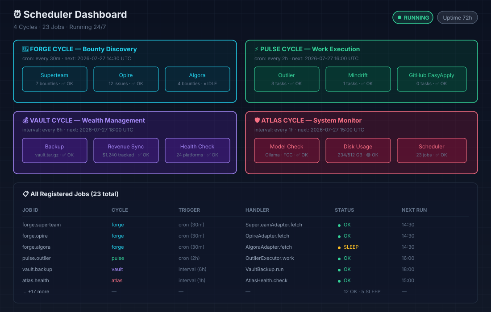
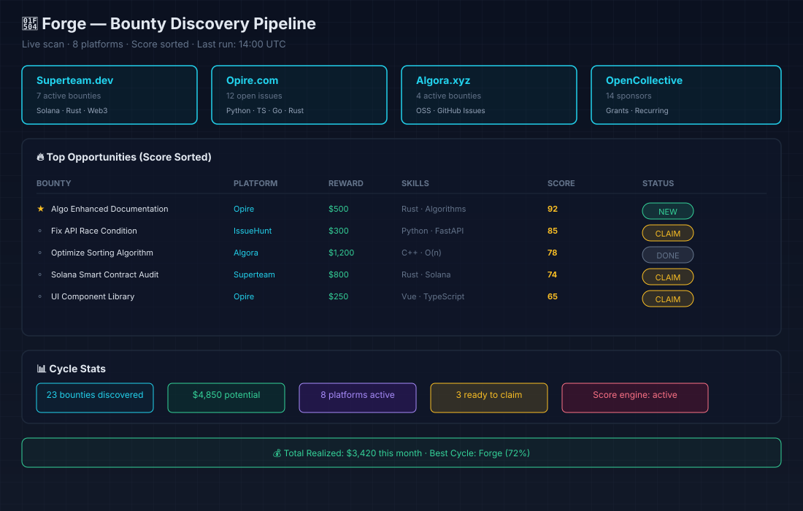
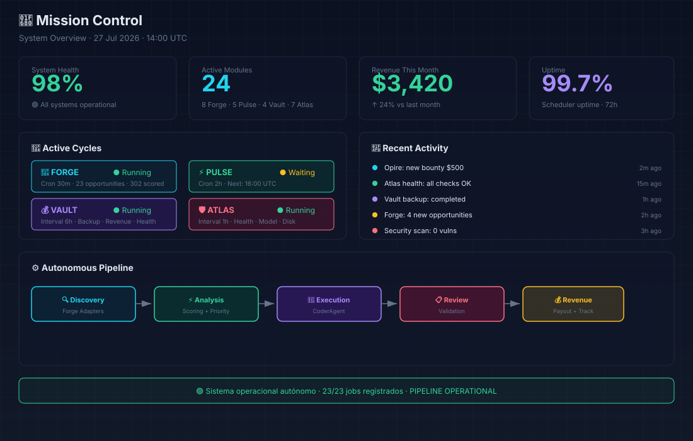
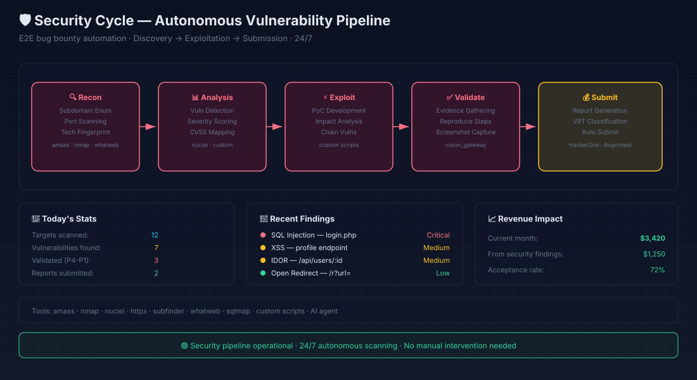
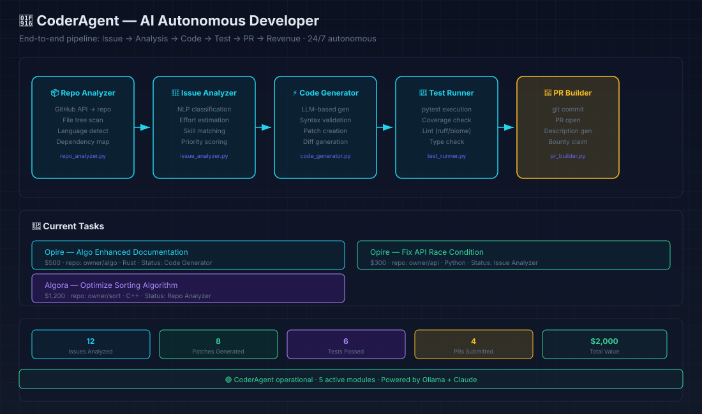

# OWNEX — Autonomous Work Operating Interface

> **"Tengo un sistema operativo personal que trabaja conmigo."**  
> *Not: "Estoy hackeando una nave espacial de 1998."*

---

## ✅ Requirements — What You Need (and Don't)

### You need:
| Requirement | Purpose |
|---|---|
| **Email** | Daily management, notifications, platform contact |
| **Platform accounts** | Where you execute the work (HackerOne, Bugcrowd, freelancer, etc.) — register directly on each platform |
| **DNI / tax ID** | Only for withdrawals and KYC on each platform. OWNEX **does not** store identity documents. |

### You do **NOT** need:
❌ **Portfolio** — Public programs accept any researcher. Your valid findings are your portfolio.  
❌ **Interview** — No selection process. Results over credentials.  
❌ **Prior experience** — Programs have different difficulty levels; OWNEX scoring (EVH, personal factor) guides you to the right opportunities.

> **Model:** Direct public rewarded work. OWNEX connects your accounts, ranks opportunities by expected value, and helps you execute. No gatekeeping.

---

## 🎯 What is OWNEX?

OWNEX is an **Autonomous Work Operating System** — a personal command center that converts scattered opportunities into executable work cycles. It's not a dashboard. It's not a SaaS panel. It's an OS for autonomous work.

Built for bug bounty hunters, security researchers, and autonomous agents who need **outcomes over activity**, **action over information**, **cycles over pages**.

---

## ✨ Core Philosophy

| Principle | OWNEX Approach |
|-----------|----------------|
| **Clarity over Complexity** | One concept = one name. No User/Client/Customer confusion. |
| **Action over Information** | Every screen answers: *"What should I do now?"* |
| **Cycles over Pages** | Work Cycles = apps. Not menu navigation. |
| **Outcomes over Activity** | Revenue, findings, acceptance rate > vanity metrics. |
| **Agents over Tools** | AI invisible. You see capabilities, not model names. |
| **Throughput over Metrics** | Continuous flow > static snapshots. |

---

## 🎨 Design System: "Dark Command Center"

```
Backgrounds:     #050505  #080808  #0F1117     (Near-black depth)
Primary Blue:    #3B82F6                       (Intelligence, action, nav)
White:           #FFFFFF                       (Important info, results)
Gold:            #F59E0B                       (Money, rewards, premium ops)
States:          🟢 #10B981  🔴 #EF4444  🟡 #FBBF24  (Only these 3)
```

**Typography:** Space Grotesk (Display) + Inter (Body) + JetBrains Mono (Code)  
**Materials:** Glassmorphism + Mica + Acrylic (Fluent-inspired)  
**Motion:** 120-350ms spring transitions, respect `prefers-reduced-motion`

---

## 🖥️ Desktop App (Tauri + Vue 3)

```
OWNEX.app / OWNEX.exe
├── Vue 3 + TypeScript + Tailwind CSS v4
├── Rust shell (Tauri v2) — native, low RAM
├── Python sidecar (FastAPI) — business logic, agents
├── SQLite / PostgreSQL — local-first data
├── Ollama integration — local LLMs
└── System tray + global shortcuts (⌘K, ⌘Space)
```

**Why Tauri?** Native performance, small bundle (~15MB), uses system WebView, better security than Electron.

---

## 📱 Android: OWNEX Companion

Not a reduced clone. A **tactile companion** for rapid decisions:

- 🔔 Critical notifications (findings, approvals, errors)
- ✅ One-tap approvals ("Start cycle", "Submit report", "Accept risk")
- 🎯 Mobile Opportunity Radar (top 5, swipe actions)
- 🤖 Compact Agent Fleet status
- 💰 Vault/Wallet: balance, pending payouts
- 📊 System health at a glance

---

## ⌚ Wear OS: OWNEX Watch

Command center on your wrist:

- 🟢 ORION Online / 🔴 Offline at a glance
- ⚡ Quick actions: approve, escalate, snooze
- 📈 N workflows active, M approvals pending
- 🔔 Silent critical alerts (vibration pattern)
- 🔗 Syncs with Companion via Bluetooth

---

## 📦 Core Work Cycles (Built-in Apps)

| Cycle | What It Does | Revenue |
|---|---|---|
| **🔨 Forge** | Bug bounty operations on 8+ platforms | Findings → Bounties |
| **📡 Pulse** | Survey platforms (Outlier, DataAnnotation, etc.) | Task payouts |
| **🏦 Vault** | Crypto, DeFi, portfolio management | Yield, trading |
| **🗺️ Atlas** | Recon, intelligence, opportunity discovery | Data value |
| **🏢 Enterprise** | Freelancer, LinkedIn, Upwork (coming) | Service income |

Each cycle is a self-contained app with its own adapters, scoring, and scheduling.

---

## 🚀 Quick Start

### Prerequisites

- **Node.js 20+**, **Rust 1.75+**, **Python 3.11+**
- **Ollama** (for local LLMs): `curl -fsSL https://ollama.ai/install.sh | sh`

### Development

```bash
# Clone
git clone https://github.com/yourusername/ownex.git
cd ownex

# Frontend
cd frontend
npm install
npm run dev          # http://localhost:5173

# Tauri (in another terminal)
cd src-tauri
cargo tauri dev

# Python backend
cd python
pip install -r requirements.txt
python main.py       # http://localhost:8000
```

### Build Release

```bash
# Frontend build
cd frontend && npm run build

# Tauri build (all platforms)
cd src-tauri && cargo tauri build

# Output: src-tauri/target/release/bundle/
```

---

## 📸 Screenshots

### System Architecture


### Scheduler Dashboard


### Forge — Bounty Discovery


### Mission Control


### Security Cycle


### Vault & Atlas — Wealth & Health


### CoderAgent — AI Autonomous Developer


---

## 📁 Project Structure

```
ownex/
├── .github/                    # CI/CD, workflows
├── brand/ownex/                # Design system assets
│   ├── design-tokens.css       # CSS variables (source of truth)
│   ├── logo-mark.svg           # Isotipo
│   ├── logo-horizontal.svg     # Logotipo
│   └── favicon.svg             # 64x64
├── docs/
│   ├── OWNEX_DESIGN_SYSTEM.md  # Complete design spec
│   └── screenshots/            # Screenshots & demo GIFs
├── frontend/                   # Vue 3 app
│   ├── src/
│   │   ├── components/         # UI primitives + compound
│   │   ├── pages/              # MissionControl, Security, Forge...
│   │   ├── stores/             # Pinia (cycles, agents, vault...)
│   │   ├── services/           # API, Tauri IPC, WebSocket
│   │   ├── composables/        # useAgents, useCycles, useCmd
│   │   └── styles/             # ownex-tokens.css + tailwind
│   ├── index.html
│   ├── vite.config.ts
│   └── package.json
├── python/                     # FastAPI backend
│   ├── main.py                 # Entry point + lifespan
│   ├── api/                    # Routers
│   ├── core/                   # Domain logic (cycles, agents...)
│   │   ├── cycles/             # Forge, Pulse, Vault, Atlas
│   │   ├── agents/             # Agent definitions + executors
│   │   ├── marketplace/        # Opportunity discovery + scoring
│   │   └── scheduler/          # Job scheduling
│   ├── cores/                  # Shared infrastructure (events, config...)
│   └── tests/
├── src-tauri/                  # Tauri shell (Rust)
│   ├── src/main.rs             # System tray, IPC, updater
│   ├── Cargo.toml
│   └── tauri.conf.json
├── .ai/                        # Single source of truth (rules, decisions, state)
├── AGENTS.md                   # Agent rules (for AI coding agents)
├── brand/                      # Brand assets (logos, favicon)
├── docs/                       # Documentation
├── CHANGELOG.md
├── ROADMAP.md
└── README.md                   # ← You are here
```

---

## 🤖 AI Integration

OWNEX is designed for **human + AI collaboration**. The system includes:

- **24/7 autonomous agents** — Forge, Pulse, Vault, Atlas run on schedule
- **COPILOT** — Context-aware assistant that recommends next actions
- **Local LLMs** — Ollama integration for privacy-sensitive tasks
- **Multi-provider** — Fallback chain: Ollama → FCC Proxy → OpenCode free models
- **Agent Fleet** — Monitor and direct AI agents from the dashboard

AI agents follow the same work cycles as humans. They discover, score, execute, and report — you approve and collect.

---

## 🧠 Philosophy: Why OWNEX Exists

Most "productivity tools" are **information graveyards** — they collect data but don't produce outcomes. OWNEX exists because:

1. **Bug bounty is fragmented** — 50+ platforms, each with its own UI, notifications, payout schedule. No unified command center.
2. **Autonomous agents need a home** — AI can work 24/7, but it needs infrastructure: accounts, targets, scopes, reporting.
3. **Work should be measurable** — Revenue per hour, acceptance rate, EVH per session. Not "lines of code" or "hours logged."
4. **Barriers should be low** — No portfolio, no interview, no experience gatekeeping. Direct public rewarded work.

OWNEX is the operating system for this new way of working: **autonomous, measured, and outcome-driven**.

---

## 📜 License

Proprietary — All Rights Reserved.

---

> **OWNEX v4.7.0** — *Autonomous Work Operating Interface*  
> Built with 🔥 by CATEYE Research
