<p align="center">
  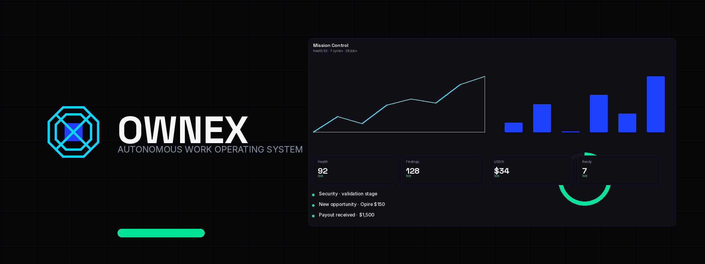
</p>

<p align="center">
  <strong>Autonomous Work Operating System</strong> 📡
</p>

<p align="center">
  
  
  
  
  
  
  
  
  
</p>

<p align="center">
  <b>👁️ Mission Control</b> &bull; <b>🛡️ Security Cycle</b> &bull; <b>💰 Revenue Engine</b> &bull; <b>🤖 MERLIN</b> &bull; <b>⚙️ Automation</b> &bull; <b>🧠 Intelligence</b>
</p>

<p align="center">
  <kbd><a href="#overview">Overview</a></kbd>
  &nbsp;
  <kbd><a href="#product">Product</a></kbd>
  <kbd><a href="#architecture">Architecture</a></kbd>
  <kbd><a href="#how-a-day-runs">Day Cycle</a></kbd>
  <kbd><a href="#quick-start">Quick Start</a></kbd>
  <kbd><a href="#development">Development</a></kbd>
  <br/>
  <br/>
  <kbd><a href="#security">Security</a></kbd>
  <kbd><a href="#roadmap">Roadmap</a></kbd>
  <kbd><a href="#branding">Branding</a></kbd>
  <kbd><a href="#documentation">Documentation</a></kbd>
  <kbd><a href="#license">License</a></kbd>
</p>

---

| [**↓ Jump to Section**](#table-of-contents) | [**👁️ View Demo Assets**](docs/assets/screenshots/desktop/) | [**📖 Full Docs**](.ai/) |
|---|---|---|

---

## Overview 🚀

> **OWNEX** (pronounced *OH-neks*) — *Personal Autonomous Work Operating System*.

OWNEX is an autonomous work operating system that continuously discovers, understands, evaluates, organizes and prepares digital work opportunities while coordinating tools, agents, models and information.

### The concept 💡

OWNEX is **not** a chatbot, a dashboard, or a collection of scripts. It is an **intelligent operating system** that navigates the universe of work opportunities, orchestrates multiple AI providers, and executes complex workflows with minimal human intervention.

### The approach 📊

Every opportunity is scored against a **[zero-barrier spectrum](.ai/CURRENT_STATE.md)** (0–100): how far is it from *finding* to *getting paid*, with no interview, no portfolio gate, no unpaid trial. The engine rank-orders thousands of candidates and surfaces the ones most likely to turn into revenue **this week**.

### The human role 👤

The human sits at the **decision gate**. The system does everything before and after.

<p align="center">
  <sub>🔮 The Revenue Rule: no feature enters the roadmap unless it increases vulnerability detection, evidence quality, acceptance probability, or system learning. No exceptions.</sub>
</p>

---

## Product 🎯

> Central surfaces: Mission Control, Intelligence, Targets, Capital, MERLIN, Agents, Reports, Settings. All backed by real endpoints — nothing is a mock.

### Mission Control 🎛️
> Central operational surface for monitoring opportunities, agents and active work.

<p align="center">
  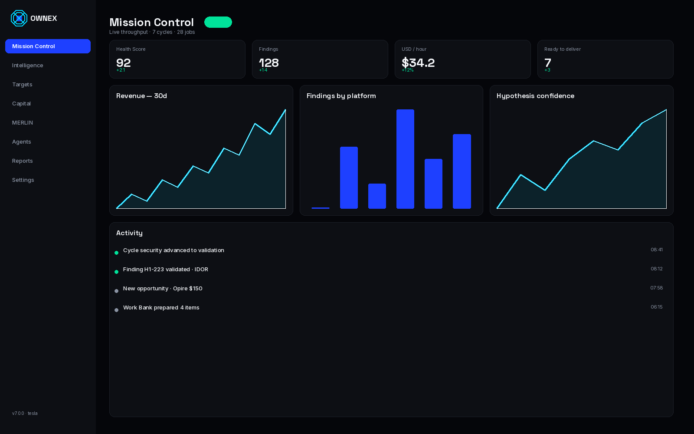
</p>

**Endpoints:** [`GET /api/mission/status`](.ai/CURRENT_STATE.md), [`GET /api/activity`](docs/diagrams/architecture.mmd), [`POST /api/hunt/start`](.ai/ROADMAP.md)

### Intelligence 🧠
> Information processing and opportunity analysis surfaces — findings, hypotheses, evidence, confidence.

<p align="center">
  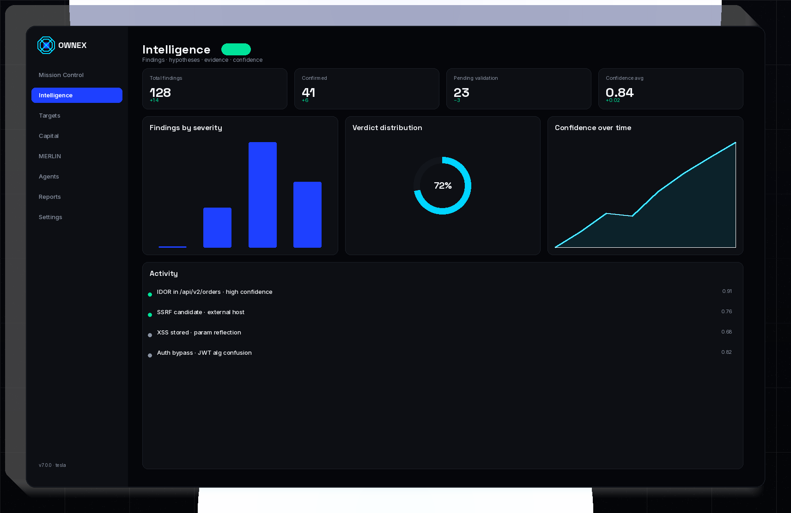
</p>

### Targets 📍
> Target intelligence and opportunity prioritization — scan queues, attack surface, prioritization.

<p align="center">
  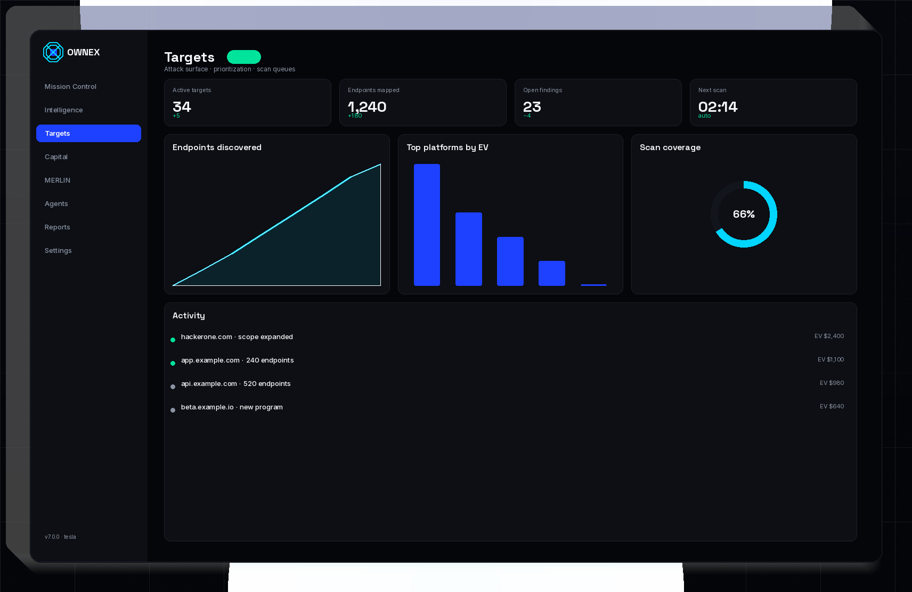
</p>

### Capital 💰
> Revenue tracking and financial intelligence dashboard — USD/hour per platform, payout timelines, ROI.

<p align="center">
  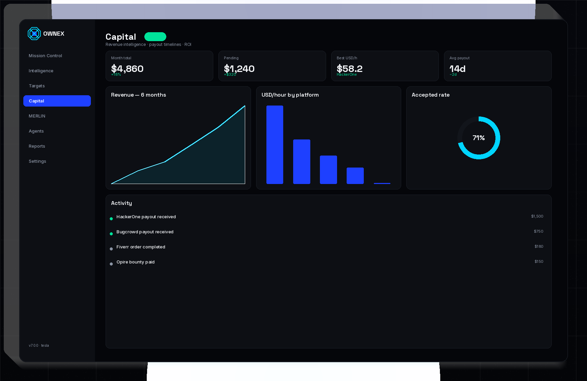
</p>

### MERLIN 🤖
> AI assistant with persistent memory, intent analysis, Office Retro personality (`calm_operator`, local-first Piper TTS, native mic).

<p align="center">
  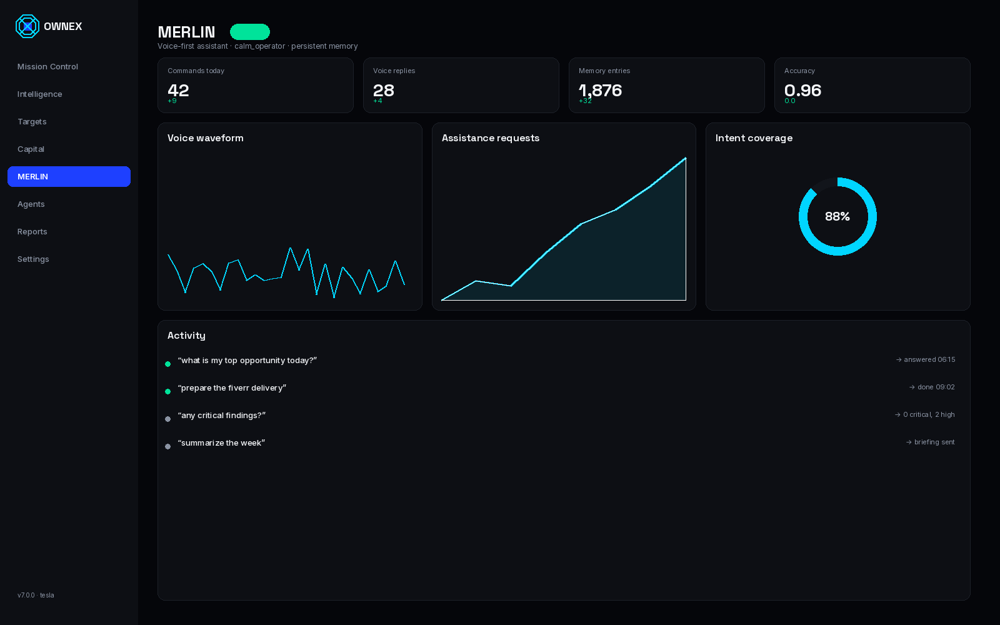
</p>

**API:** [`POST /api/voice/assistant`](.ai/CURRENT_STATE.md), `POST /direct-work/daily-companion`

### Agents 👥
> Twelve departmental specialists — Security, Coding, QA, Debug, Documentation, Research, Product, Revenue, Automation, Infrastructure, Evolution, Orchestrator.

<p align="center">
  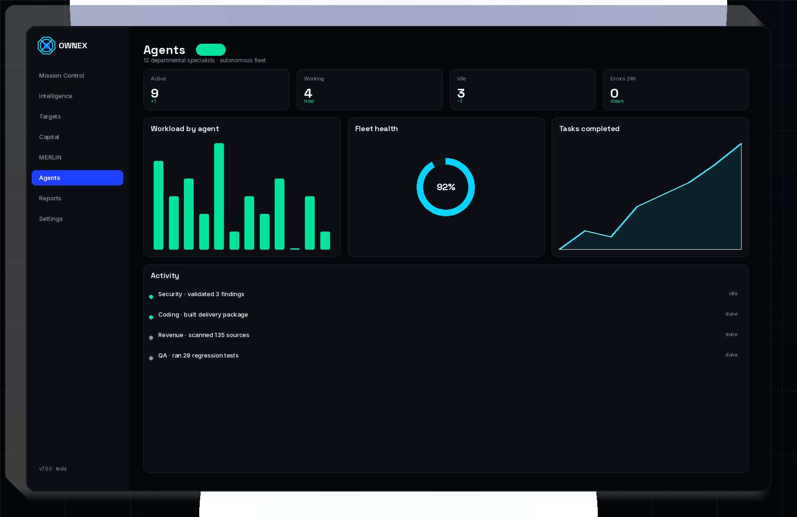
</p>

### Reports 📊
> Report generation, submission tracking, finder queues.

<p align="center">
  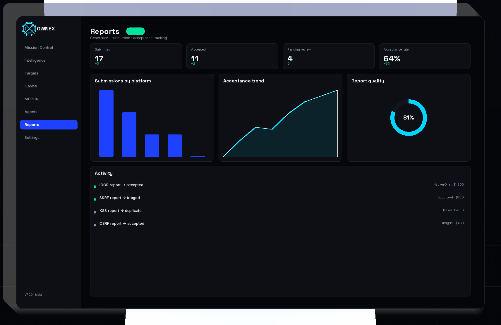
</p>

### Settings ⚙️
> System configuration, AI providers, credentials, scheduler, integrations.

<p align="center">
  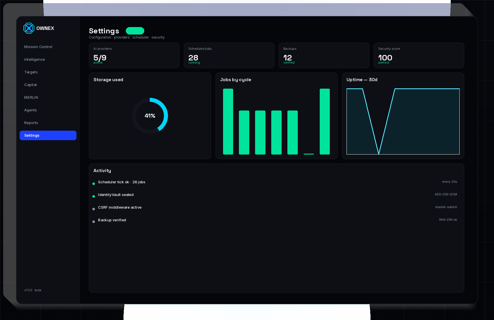
</p>

### Mobile (OMEGA) 📱
> Native companion (Capacitor Android): home, agents, opportunities, MERLIN chat, notifications, watch sync.

<p align="center">
  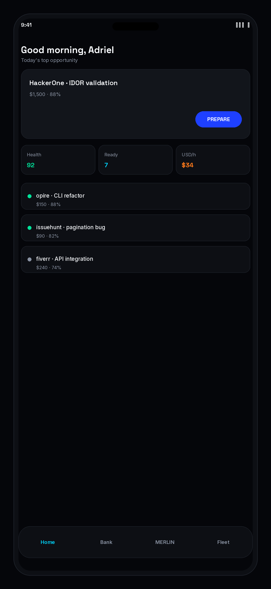
  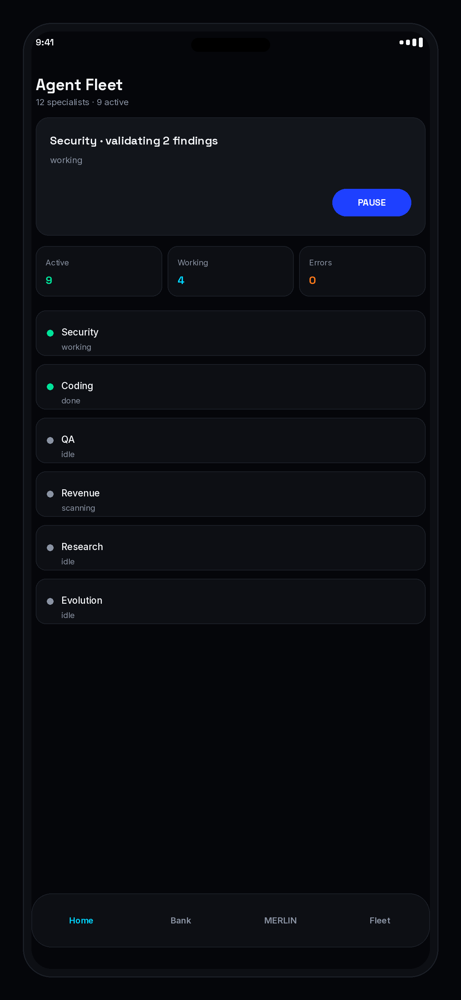
  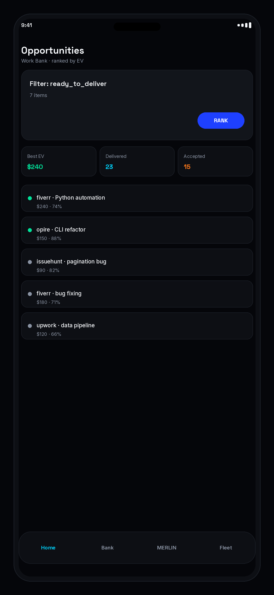
  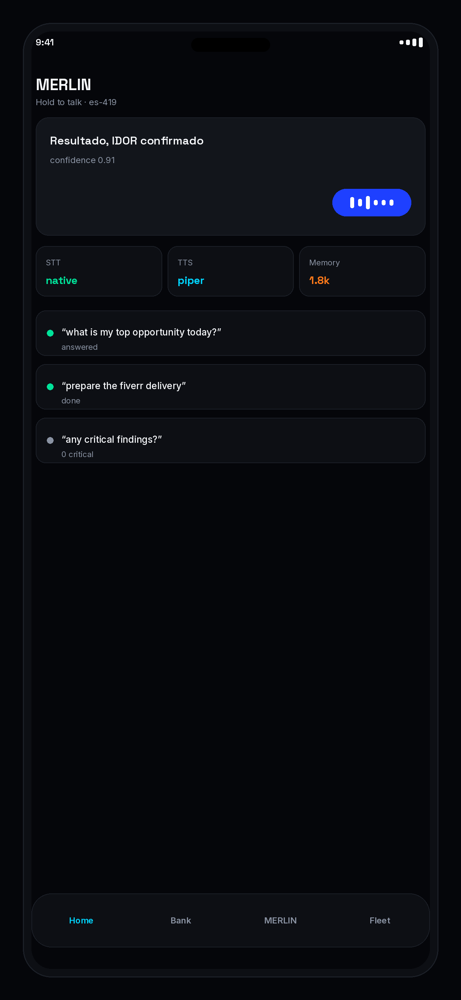
</p>
<p align="center">
  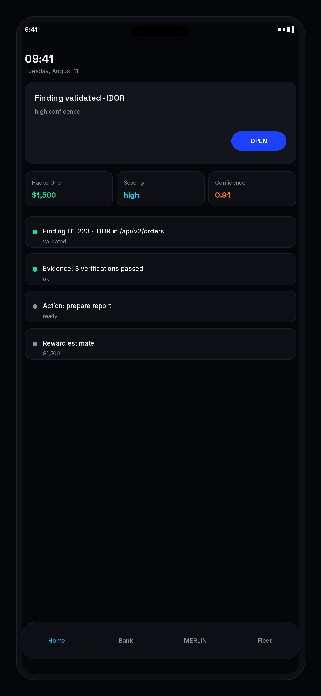
  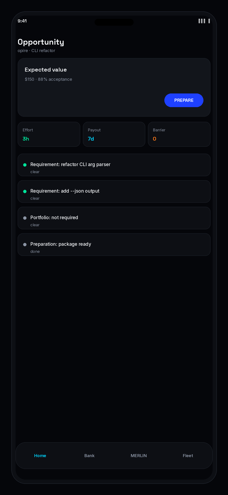
  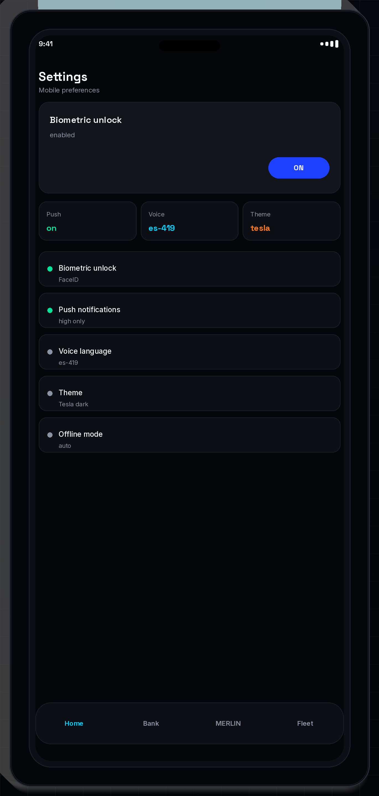
  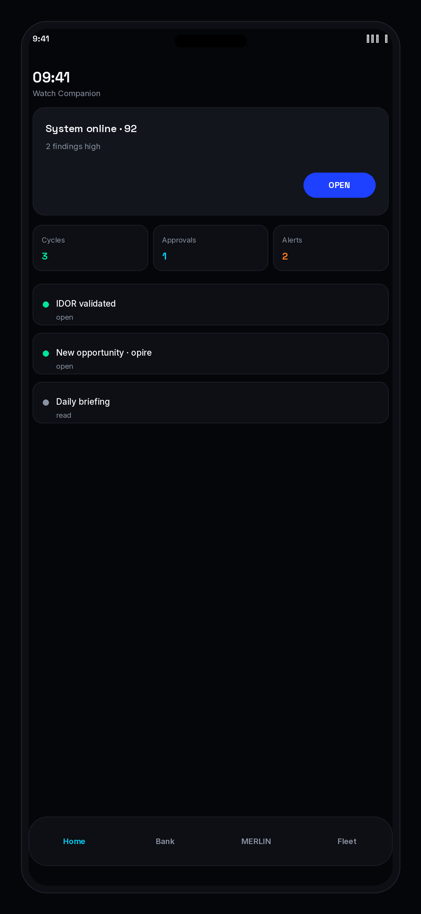
</p>

---

## Architecture 🏗️

A **modular monolith**: one FastAPI process, EventBus-driven, single database. No microservices, no external message queue, no lock-in.


```mermaid
flowchart TB
    subgraph SURFACE["📡 Presentation"]
        MC["Mission Control - Vue 3 SPA"]
        DESK["💻 OWNEX Desktop - Tauri v2"]
        MOB["📱 Mobile Companion - Capacitor"]
        MERLIN["🤖 MERLIN - Copilot"]
    end

    subgraph CORE["🧩 Core Platform - FastAPI"]
        EB["🔌 EventBus"]
        SCH["⏰ Scheduler - 28 cron jobs"]
        UM["🧠 Unified Memory - SQLite"]
        DJ["📓 Decision Journal"]
        VAULT["🔐 Identity Vault"]
        HC["🩺 Health Center"]
    end

    subgraph CYCLES["🔄 Work Cycles"]
        SEC["🛡️ Security"]
        FORGE["🔨 Forge"]
        PULSE["📈 Pulse"]
        VAULT_C["💰 Vault"]
        ATLAS["🗺️ Atlas"]
        QA["🧪 QA Cycle"]
        DW["💼 Direct Work"]
    end

    subgraph ENGINES["⚙️ Engines"]
        DWE["Direct Work Engine"]
        REV["💵 Revenue Intelligence"]
        OPP["🔍 Opportunity Discovery"]
        VAL["✅ Validation & Evidence"]
        EVO["📈 Evolution Learning"]
        OAR["🤖 OAR AI Runtime"]
        CAR["🎓 Career Engine"]
    end

    subgraph AI["🤖 Multi-Provider AI"]
        RT["🧠 OAR Smart Router"]
        P1["🦙 Ollama (local)"]
        P2["🔗 FCC Proxy"]
        P3["🔑 OpenRouter (optional)"]
    end

    SURFACE --> CORE
    CORE --> CYCLES
    CYCLES --> ENGINES
    ENGINES --> AI
```

### Stack (real, no smoke) 🛠️

| Layer | Technology | Notes |
|---|---|---|
| **Backend** 🐍 | Python 3.11+ · FastAPI · SQLAlchemy 2.0 | 3,228+ tests, Ruff clean, mypy strict |
| **Frontend** 🌐 | Vue 3 + TypeScript · Tailwind CSS v4 · Vite | 92 routed pages, Mission Control SPA |
| **Desktop** 💻 | Tauri v2 (Rust+WebView2) + PyInstaller sidecar | Native desktop, `OWNEX OMEGA` binary |
| **Mobile** 📱 | Capacitor (Android) + Expo/React Native (OMEGA) | Native mic, native voice, APK 5.2 MB |
| **AI Stack** 🤖 | Local-first failover: Ollama → FCC Proxy → OpenRouter | OAR router, 7 adapters, 24+ models |
| **Database** 📦 | SQLite (dev/desktop) · PostgreSQL (prod) | Single DB, no external queue |
| **Security** 🔐 | Ed25519 licenses · AES-256-GCM vault · CSRF double-submit | IdentityVault, chmod 600 keys |
| **Testing** ✅ | pytest · pytest-cov · pytest-timeout | `make test`, `make test-fast` |

### 7 Work Cycles 🔄

OWNEX runs as 7 autonomous work cycles, coordinated by the scheduler:

| Cycle | Focus | Key APIs | Schedule |
|---|---|---|---|
| **🛡️ Security** | Bug bounty pipeline | [`/api/cycles/security/*`](docs/diagrams/architecture.mmd) | 30-min cron |
| **🔨 Forge** | Dev bounty opportunities | [`/api/cycles/forge/*`](.ai/ROADMAP.md) | 2-hour cron |
| **📈 Pulse** | AI work / market signals | [`/api/cycles/pulse/*`](docs/audit/INTERNAL_AUDIT.md) | 1-hour cron |
| **💰 Vault** | Wealth management | [`/api/cycles/vault/*`](.ai/CURRENT_STATE.md) | 4-hour cron |
| **🗺️ Atlas** | Intelligence | [`/api/cycles/atlas/*`](docs/audit/INTERNAL_AUDIT.md) | 4-hour cron |
| **🧪 QA Cycle** | Test execution + regression | [`/api/cycles/qa/*`](.ai/ROADMAP.md) | daily 08:30 |
| **💼 Direct Work** | Zero-barrier opportunities | [`/direct-work/*`](.ai/STRATEGIC_AUDIT.md) | daily 06:15 |

---

## How a day runs ⏰

| Time | Cycle | What happens | Key APIs |
|---|---|---|---|
| **06:15** | 💼 Direct Work | Work Bank: discover → filter zero-barrier → rank by EV → prepare packages | [`POST /direct-work/workbank/cycle`](.ai/CURRENT_STATE.md) |
| **06:30** | 🤖 MERLIN | `daily-companion` → consolidated briefing (system + personal + market + focus) | [`POST /direct-work/daily-companion`](.ai/CURRENT_STATE.md) |
| **07:00** | 👁️ Mission Control | Top pick of the day + skill gap + learning plan | [`GET /api/activity`](docs/diagrams/architecture.mmd) |
| **08:00** | 📈 Market | Platform report: friction tiers, retired sources, emerging categories | [`POST /api/direct-work/market-report`](.ai/ROADMAP.md) |
| **09:00** | 💰 Capital | Revenue dashboard: earned/pending/ROI per platform, projection | [`POST /direct-work/income-dashboard`](.ai/CURRENT_STATE.md) |
| **14:00** | 🛡️ Security | Findings → evidence → report → auto-submit | [`POST /api/cycles/security/run_pipe`](.ai/CURRENT_STATE.md) |
| **18:00** | 👨‍💼 Executive | "Did we make money this week?" USD/hour per platform | [`GET /api/cycles/security/dashboard`](docs/audit/GITHUB_PRESENTATION_REPORT.md) |
| **22:00** | 🛡️ Backup | Version backup + health snapshot persisted | [`/api/version-backup/*`](.ai/CURRENT_STATE.md) |

---

## FAQ ❓

<details>
<summary><strong>What is OWNEX exactly?</strong></summary>

**OWNEX** is a personal autonomous work operating system — a private platform that discovers income opportunities (bug bounty, dev bounty, AI work, freelance), analyzes them with economic scoring, prepares deliverables autonomously, and tracks results. It is **not a SaaS product**: it runs on your machine and works for you.
</details>

<details>
<summary><strong>Is OWNEX open source? Can I contribute?</strong></summary>

No — the code is **proprietary** and private. OWNEX is a personal competitive-advantage asset, not a community project. The repository is public for presentation, but the license is Proprietary and contributions are not accepted.
</details>

<details>
<summary><strong>What can it actually do today?</strong></summary>

Verified working features (not roadmap): discovery from **135 curated sources** (HackerOne, Bugcrowd, Intigriti, YesWeHack, Opire, IssueHunt, Freelancer, OpenCollective…), zero-barrier scoring, Work Bank that prepares jobs to 100% ready-to-deliver, EV ranking, Daily Brief/Companion, market evolution engine (OVOS + friction tiers), career/skill gap engine, revenue tracking + projections, security pipeline (recon → hypothesis → validation → evidence → report), scheduler with 28 cron jobs, 7 work cycles, mobile Android companion (APK), desktop (Tauri + PyInstaller), voice assistant, MERLIN chat, CSRF/rate-limit/auth security layers.
</details>

<details>
<summary><strong>Does OWNEX submit reports and work by itself?</strong></summary>

No — by design (**Human Control layer**). OWNEX prepares everything: packages, reports, submissions, and negotiation analysis. The human is the final authority for actions that send data out (submissions, deliveries, payouts). Automations run only for internal preparation, discovery and analysis.
</details>

<details>
<summary><strong>Do I need to be a bug bounty expert?</strong></summary>

No. The Direct Work Engine scores opportunities by **entry barrier** and prioritizes zero-barrier public tasks; the career engine detects skill gaps and builds a daily training plan; the guided onboarding covers the fundamentals. You can start from zero and progress by category.
</details>

<details>
<summary><strong>Does it require an internet connection or cloud services?</strong></summary>

No. Everything runs **100% local**: FastAPI backend, SQLite, local model via Ollama. Optional integrations (SMTP for email verification, platform APIs, cloud backup) are opt-in and never required. There is no telemetry, no account cloud.
</details>

<details>
<summary><strong>Which AI models does it use? Do I need API keys?</strong></summary>

Optional. It works with local models (Ollama), free built-in models (DeepSeek/Nemotron via OpenCode), and optional paid providers (OpenRouter, Groq…) through a failover chain. Zero configuration runs deterministic engines; AI adds analysis and voice on top.
</details>

<details>
<summary><strong>Does it really make money?</strong></summary>

The system optimizes **probability × reward × speed** and tracks real outcomes (earnings, acceptance rates, USD/hour per platform) — it never fabricates rates. Revenue figures in the UI come from actual tracked payouts. Results depend on the market and on delivery; OWNEX maximizes the odds and removes the busywork.
</details>

<details>
<summary><strong>What platforms does it integrate with?</strong></summary>

Bug bounty: HackerOne, Bugcrowd, Intigriti, YesWeHack. Dev bounty: Opire, IssueHunt, OpenCollective, Algora. Freelance: Fiverr engine (11 gigs), Freelancer. Plus 135 curated discovery sources across 36 categories. Connectors for crypto/wealth (CoinGecko, Polymarket) and data annotation categories.
</details>

<details>
<summary><strong>How do I install it?</strong></summary>

```bash
git clone https://github.com/AdriDob/OWNEX.git && cd OWNEX
python3 -m venv .venv && source .venv/bin/activate
pip install -r requirements.txt
python run.py
```

Open http://127.0.0.1:8000 — the guided personalization wizard takes you through setup. See [Quick Start](#quick-start).
</details>

<details>
<summary><strong>What platforms does it run on?</strong></summary>

- **Desktop:** Linux, Windows, macOS (Python 3.11+; Tauri bundle + PyInstaller sidecar)
- **Mobile companion:** Android (Capacitor APK, ~5 MB, native mic/voice)
- The mobile app connects to your local backend; it does not require a cloud server.
</details>

<details>
<summary><strong>Is my data safe?</strong></summary>

Security is layered: AES-256-GCM IdentityVault (random key, `chmod 600`), Ed25519 licenses, double-submit CSRF, identity-based rate limiting, session tokens with device binding, audit log (append-only JSONL, rotated), 100% local storage. Details in [.ai/SECURITY_POLICY.md](.ai/SECURITY_POLICY.md).
</details>

<details>
<summary><strong>Is there a mobile/desktop app?</strong></summary>

Yes — an Android APK (OMEGA companion: dashboard, agents, opportunities, MERLIN chat, notifications, watch sync) and a Tauri desktop bundle (`OWNEX OMEGA`). Both are build-verified; see [Project Status](#project-status).
</details>

<details>
<summary><strong>What is the "Work Bank"?</strong></summary>

The Work Bank is an autonomous production engine: it discovers public zero-barrier jobs, filters and ranks them by EV, **prepares each one to 100% ready-to-deliver** (README, proposal, work package) and accumulates them (target: 10/day, 1000/month). You only review and deliver the best ones.
</details>

<details>
<summary><strong>How is OWNEX different from a SaaS bounty tool?</strong></summary>

SaaS tools are multi-tenant dashboards; OWNEX is a **private autonomous operator**. It doesn't just display findings — it discovers opportunities, prepares deliverables, projects income, learns from outcomes and runs a full daily cycle with zero external infrastructure. And your data never leaves your machine.
</details>

---

## Table of Contents

<details>
<summary>Click to expand 📖</summary>

1. [Overview](#overview)
2. [Product](#product)
3. [Architecture](#architecture)
4. [How a day runs](#how-a-day-runs)
5. [FAQ](#faq)
6. [Quick Start](#quick-start)
7. [Development](#development)
8. [Security](#security)
9. [Project Status](#project-status)
10. [Roadmap](#roadmap)
11. [Branding](#branding)
12. [Documentation](#documentation)
13. [License](#license)

</details>

---

## Quick Start 🚀

### Guided install (recommended)

The universal installer (`install.py`) configures everything interactively:

```bash
python install.py
# → Wizard: use case → modules → experience level → platforms → integrations
# → sets up .venv, DB, credentials, desktop, notifications
```

### Manual

```bash
# 1️⃣ Clone
git clone https://github.com/AdriDob/OWNEX.git
cd OWNEX

# 2️⃣ Virtual environment + deps
python -m venv .venv
source .venv/bin/activate
pip install -r requirements.txt          # backend
cd frontend && npm install               # frontend

# 3️⃣ Start everything
python run.py                              # → FastAPI on http://localhost:8000
# in another terminal:
cd frontend && npm run dev                # → Mission Control on http://localhost:5173
```

### Next steps

| Action | Command / Route | Docs |
|---|---|---|
| Health check | `curl localhost:8000/api/health` | [.ai/CURRENT_STATE.md](.ai/CURRENT_STATE.md) |
| Add a bug bounty target | `python run.py --add-target "demo" --domain example.com` | [Agent Charter](.ai/AGENT_CHARTER.md) |
| Run the QA cycle | `POST /api/cycles/qa/run` | [.ai/ROADMAP.md](.ai/ROADMAP.md) |
| Daily briefing | `POST /direct-work/daily-companion` | [.ai/CURRENT_STATE.md](.ai/CURRENT_STATE.md) |
| Create version backup | `python scripts/version_backup.py backup` | [DECISIONS.md](.ai/DECISIONS.md) |
| Quality gate | `make check` | [.ai/TESTING_POLICY.md](.ai/TESTING_POLICY.md) |
| Fast smoke tests | `python scripts/dev test-fast` | [.ai/TESTING_POLICY.md](.ai/TESTING_POLICY.md) |
| Generate docs diagrams | `scripts/brand/regenerate.sh` | [docs/README.md](docs/README.md) |

> **Tip:** `make` is your friend. Other targets: `make test`, `make fmt`, `make backup`, `make typecheck-fast`.

### Environment variables

API keys go to `IdentityVault` (AES-256-GCM, random key, `chmod 600`) or `.env` (never committed):

```bash
# AI providers (at least one)
OLLAMA_URL=http://localhost:11434                  # local (default)
OPENROUTER_API_KEY=                                 # optional premium
FCC_PROXY_URL=http://localhost:8082                 # free Claude proxy

# Platforms (bug bounty etc.)
HACKERONE_API_KEY=
BUGCROWD_API_KEY=
SYNACK_API_KEY=

# Email verification (optional)
OWNNEX_MAIL_SMTP_HOST=                              # set to enable email verification
```

See **[.ai/SECURITY_POLICY.md](.ai/SECURITY_POLICY.md)** for the full security model.

---

## Development 🛠️

OWNEX is developed as a **single source of truth** system. Everything operational lives in [.ai/](.ai/):

```
.ai/                          ← Sistema de verdad única
├── AGENT_CHARTER.md          # 🏛️ Constitución, Agent Loop, Regla de Oro
├── PRODUCTION_RULES.md       # 📋 Reglas de producción (extend, never break)
├── CURRENT_STATE.md          # 📊 Estado verificado feature por feature
├── TASK_QUEUE.md             # 📋 Cola priorizada con criterios de cierre
├── ROADMAP.md                # 🗺️ Roadmap general
├── DECISIONS.md              # 📓 Decisiones arquitectónicas con evidencia
├── KNOWN_DEBT.md             # ⚠️ Deuda técnica conocida
├── DO_NOT_TOUCH.md           # 🚫 Componentes estables (licencia, vault, auth)
├── STRATEGIC_AUDIT.md        # 🔍 Marco de auditoría permanente
├── CODE_QUALITY.md           # 🧹 Standards de calidad
├── TESTING_POLICY.md         # ✅ Política de testing
├── SECURITY_POLICY.md        # 🔐 Principios de seguridad
├── PROJECT_CONTEXT.md        # 📐 Contexto del proyecto
├── LESSONS.md                # 📚 Lecciones aprendidas
├── MEMORY.md                 # 🧠 Unified Memory subsystem
└── OWNEX_OMEGA_ARCHITECTURE.md  # 🏢 Arquitectura OMEGA
```

**Golden rule:** when code, docs, or agent memory conflict — `.ai/` wins.

### Commands

```bash
# Testing
python scripts/dev test              # full suite (excluye test_security.py)
python scripts/dev test-fast         # smoke: scoring + scheduler + DWE
make test                            # alias

# Lint + typecheck (CI-equivalent)
make check                            # ruff + mypy scoped + fast tests
make fmt                             # write fixes

# Backend
python run.py                        # full system
python run.py --add-target <name> --domain <domain>
python run.py --backup
python scripts/version_backup.py backup --notes "pre-update"

# Frontend (from frontend/)
npm run dev                          # dev server
npm run build                        # production build
npx vite preview                     # serve dist
npx vue-tsc --noEmit                  # typecheck

# Branding pipeline
scripts/brand/regenerate.sh          # logo + banners + README badge sync
scripts/brand/regenerate.sh --shots  # + screenshots (dark + light)
```

### Stack

| Concern | Tool | Config |
|---|---|---|
| Python lint | Ruff | `pyproject.toml[tool.ruff]` |
| Python types | mypy | strict on `core/` |
| Frontend lint | Biome | `frontend/biome.json` |
| Python tests | pytest | `tests/test_*.py`, `--timeout=60` |
| Frontend build | Vite | `frontend/vite.config.ts` |

---

## Security 🔐

| Measure | Implementation | Docs |
|---|---|---|
| Local-first | 100% local by default — nothing leaves the machine | [.ai/SECURITY_POLICY.md](.ai/SECURITY_POLICY.md) |
| Credential vault | IdentityVault AES-256-GCM, random key, `chmod 600` | [core/identity_vault.py](core/identity_vault.py) |
| License validation | Ed25519 asymmetric, 25-char format | [cores/license/](cores/license/) |
| CSRF protection | Double-submit cookie on all mutantes | [api/middleware/csrf_middleware.py](api/middleware/csrf_middleware.py) |
| Rate limiting | Per-identity with IP fallback | [api/middleware/rate_limit_middleware.py](api/middleware/rate_limit_middleware.py) |
| Audit log | Append-only JSONL, 10 MB rotation | [cores/audit_log.py](cores/audit_log.py) |
| Session security | AES-256-GCM, device binding, 30-min expiry | [cores/auth/session.py](cores/auth/session.py) |

See **[.ai/SECURITY_POLICY.md](.ai/SECURITY_POLICY.md)** for the complete security model.

---

## Project Status 🩺

Honest state of the system — nothing here is a mock:

| Layer | State | EVIDENCE |
|---|---|---|
| 🛡️ Security pipeline (7 stages, auto-submit) | ✅ production-hardened | `tests/test_e2e_security_pipeline.py` — 8 passed |
| 💼 Direct Work Engine + Work Bank + Daily Companion + Evolution | ✅ production | `cores/direct_work_engine/` (engine + filters + feedback) |
| 🔄 7 Work Cycles · 28 scheduled jobs · Mission Control · Executive Dashboard | ✅ production | `tests/test_scheduler_jobs.py` — 40 passed |
| 🤖 OAR AI Runtime + Career Engine | ✅ production | `tests/test_oar.py` 12 ✓ · `tests/test_career_engine.py` 14 ✓ |
| 💻 Desktop (Tauri v2) · Mobile (Capacitor) · MERLIN | ✅ build-verified | APKs 5.1 MB · Tauri cargo check OK |
| 📱 OMEGA mobile (Expo/React Native) | 🟡 experimental skeleton | functional shell |
| ⌚ Wear OS native | ❌ discarded | [AUD-14](.ai/TASK_QUEUE.md) — negative ROI |

Single-user, local-first. New surfaces ship as **experimental** until they pass the end-to-end gate (persistence, restart survival, real output — no mocks).

<p align="left">
  <sub>🐝 Bee Monitor active: every <code>/api/health</code>, <code>/api/system/health</code> and <code>/api/system/status</code> is live. Check <code>.ai/CURRENT_STATE.md</code> for the latest honey — findings, reports, payouts.</sub>
</p>

---

## Roadmap 🗺️

See [`.ai/ROADMAP.md`](.ai/ROADMAP.md) for the full roadmap.

| Status | Item | Docs |
|---|---|---|
| ✅ **DONE** | Security pipeline (7 stages) — auto-submit to finder queues | [Security Cycle](.ai/CURRENT_STATE.md) |
| ✅ **DONE** | Direct Work Engine + Work Bank + Daily Companion + Evolution | [DWE](.ai/CURRENT_STATE.md) |
| ✅ **DONE** | 7 Work Cycles, 28 scheduled jobs, Mission Control, Executive Dashboard | [Auditoría](docs/audit/INTERNAL_AUDIT.md) |
| ✅ **DONE** | Desktop (Tauri v2 + PyInstaller sidecar), mobile companion, MERLIN | [PRESENTATION](docs/audit/GITHUB_PRESENTATION_REPORT.md) |
| ✅ **DONE** | OAR AI Runtime — engine + tests + API mounted (`/oar/*`, `/career/*`) | [DECISIONS](.ai/DECISIONS.md) |
| 🟡 **IN PROGRESS** | OMEGA mobile (Expo/React Native) — functional skeleton | [.ai/ROADMAP.md](.ai/ROADMAP.md) |
| 🔲 **PLANNED** | OAR smart-routing wired into API decisions · more discovery adapters (Algora, OpenCollective, Superteam) | [.ai/TASK_QUEUE.md](.ai/TASK_QUEUE.md) |
| ❌ **NOT INCLUDED** | Wear OS native — evaluated and discarded (AUD-14, negative ROI) | [.ai/TASK_QUEUE.md](.ai/TASK_QUEUE.md) |

---

## Branding 🎨

OWNEX mark — **The Aperture Nexus**: octagonal ring + X of rays + central node that breaks the ring. Generated by a **deterministic, GPU-free pipeline** (`scripts/brand/`), zero generative AI, 100% reproducible.

```bash
scripts/brand/regenerate.sh          # logo system + banners + PNG renders + README badge sync
scripts/brand/regenerate.sh --shots  # + real product screenshots (dark + light, Playwright)
```

Design language: **Tesla dark** — pure black surfaces, white primary accent, deep blue `#1E40FF` as the only saturated accent, no noise, no glow.

> 📦 **Assets live at:** [`docs/assets/branding/`](docs/assets/branding/) and [`docs/assets/screenshots/`](docs/assets/screenshots/). See the [Asset Registry](docs/design/ASSET_REGISTRY.md).

```
docs/assets/branding/
├── logo/      # O+X mark (white/black/mono/omega), wordmark, lockup, favicon
├── banners/   # hero-banner 2400×900 — footer-banner, lockup, showdown
├── social/    # open-graph preview 1200×630
└── themes/    # design tokens SSOT (assets/branding/themes/tesla.json)
docs/assets/screenshots/
├── desktop/           # dark product screenshots
└── desktop-light/     # light product screenshots
```

### Branded deliverables 🖼️

<p align="center">
  
</p>

<p align="center">
  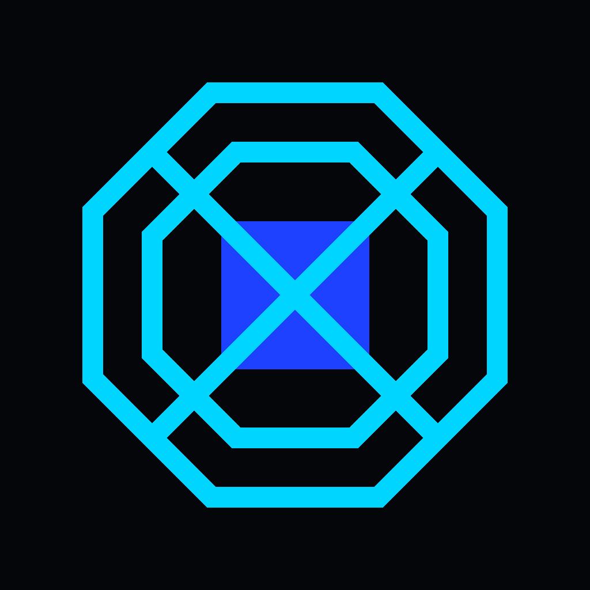
  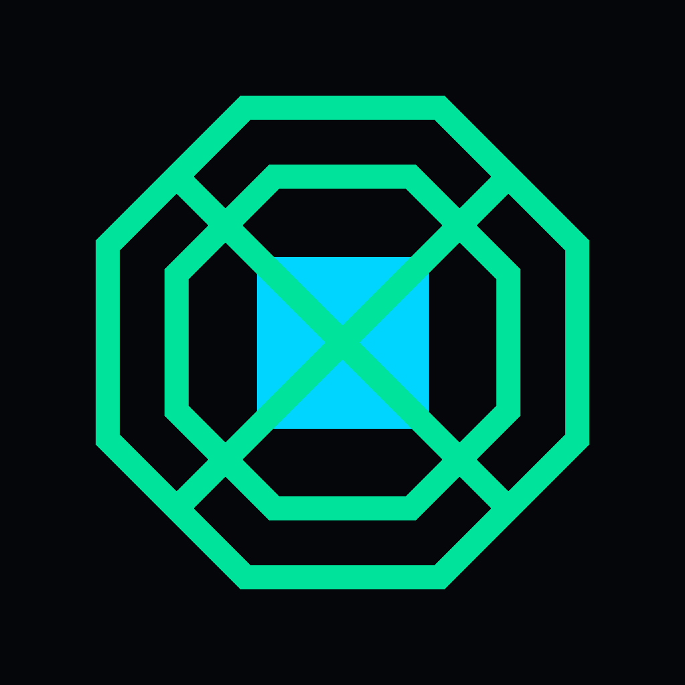
  
</p>

**Color palette:**

| Role | Color | Usage |
|---|---|---|
| `--ownex-bg` | `#05060A` | Page/surface backgrounds |
| `--ownex-blue` | `#1E40FF` | Primary action, links |
| `--ownex-accent` | `#e82127` | Tesla red — the only saturated accent |
| `--ownex-white` | `#F6F8FB` | Text and icons |

---

## Documentation 📚

> The project runs on a **single source of truth**: everything operational lives in [.ai/](.ai/).

### Core (.ai/)

| Document | Purpose |
|---|---|
| [AGENT_CHARTER.md](.ai/AGENT_CHARTER.md) | 🏛️ Constitution, Agent Loop, Golden Rule |
| [PRODUCTION_RULES.md](.ai/PRODUCTION_RULES.md) | 📋 Reglas de producción (never break stable) |
| [CURRENT_STATE.md](.ai/CURRENT_STATE.md) | 📊 Estado verificado feature por feature |
| [TASK_QUEUE.md](.ai/TASK_QUEUE.md) | 📋 Cola de tareas priorizada |
| [ROADMAP.md](.ai/ROADMAP.md) | 🗺️ Roadmap general |
| [DECISIONS.md](.ai/DECISIONS.md) | 📓 Decisiones arquitectónicas con evidencia |
| [KNOWN_DEBT.md](.ai/KNOWN_DEBT.md) | ⚠️ Deuda técnica conocida |
| [DO_NOT_TOUCH.md](.ai/DO_NOT_TOUCH.md) | 🚫 Componentes estables |
| [STRATEGIC_AUDIT.md](.ai/STRATEGIC_AUDIT.md) | 🔍 Marco de auditoría permanente (10 questions, 18 dimensions) |
| [SECURITY_POLICY.md](.ai/SECURITY_POLICY.md) | 🔐 Principios de seguridad |
| [TESTING_POLICY.md](.ai/TESTING_POLICY.md) | ✅ Política de testing |
| [CODE_QUALITY.md](.ai/CODE_QUALITY.md) | 🧹 Standards de calidad |
| [PROJECT_CONTEXT.md](.ai/PROJECT_CONTEXT.md) | 📐 Contexto completo del proyecto |
| [LESSONS.md](.ai/LESSONS.md) | 📚 Lecciones aprendidas |
| [MEMORY.md](.ai/MEMORY.md) | 🧠 Unified Memory subsystem |

### Design & Audit (/docs)

| Document | Purpose |
|---|---|
| [docs/README.md](docs/README.md) | 📚 Documentation hub |
| [docs/audit/INTERNAL_AUDIT.md](docs/audit/INTERNAL_AUDIT.md) | 🔍 Auditoría completa del sistema |
| [docs/audit/GITHUB_PRESENTATION_REPORT.md](docs/audit/GITHUB_PRESENTATION_REPORT.md) | 🐝 Branding + presentation report |
| [docs/design/ASSET_REGISTRY.md](docs/design/ASSET_REGISTRY.md) | 🎨 Asset registry |
| [docs/diagrams/architecture.mmd](docs/diagrams/architecture.mmd) | 🏗️ Architecture diagram (Mermaid) |

### Quick references

- **API:** `curl http://localhost:8000/docs` → FastAPI interactive docs (Swagger + ReDoc)
- **CLI:** `python run.py --help` → all commands (backup, add-target, dev tools)
- **Makefile:** `make help` → all targets

---

## License 📄

**Proprietary.** All rights reserved.

OWNEX is a private competitive-advantage asset. It does **not** sell a service to a customer. **OWNEX works for me.**

---

<p align="center">
  
</p>

<p align="center">
  <strong>OWNEX does not sell a service to a customer. OWNEX works for me.</strong>
</p>

<p align="center">
  <sub>🔮 Personal Autonomous Work Operating System · The Aperture Nexus</sub>
</p>

<p align="center">
  <a href=".ai/AGENT_CHARTER.md">🏛️ Charter</a>
  &bull;
  <a href=".ai/ROADMAP.md">🗺️ Roadmap</a>
  &bull;
  <a href=".ai/SECURITY_POLICY.md">🔐 Security</a>
  &bull;
  <a href="docs/README.md">📚 Docs</a>
  &bull;
  <a href="https://github.com/AdriDob/OWNEX">💻 GitHub</a>
</p>

<p align="center">
  <sub>🐝 Bee Monitor: <code>curl localhost:8000/api/health</code> · built with <code>make check</code></sub>
</p>
