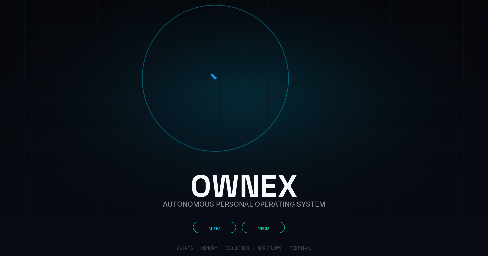
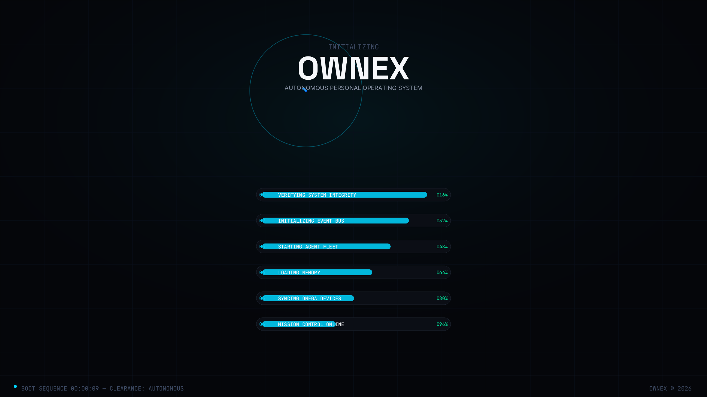
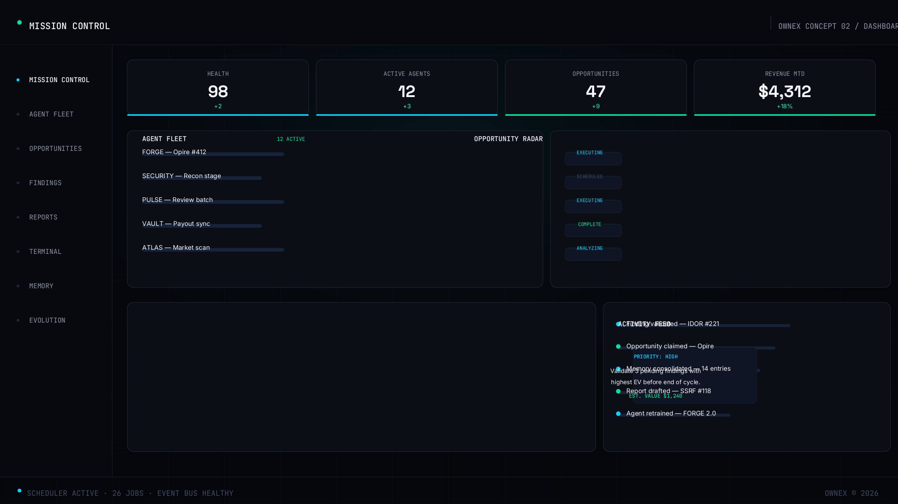
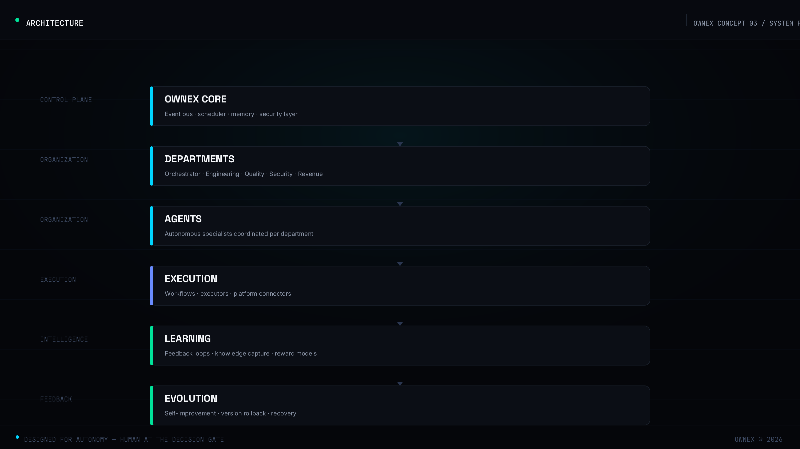
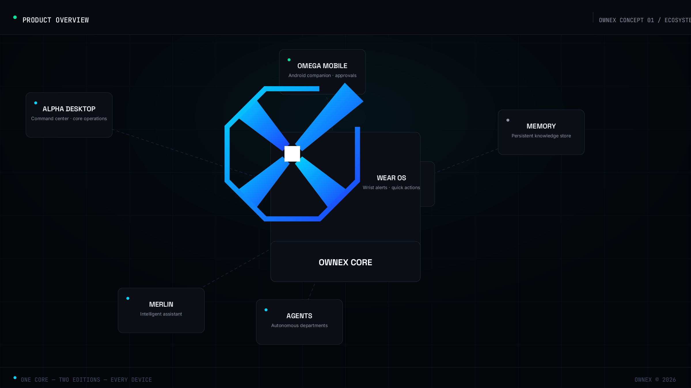
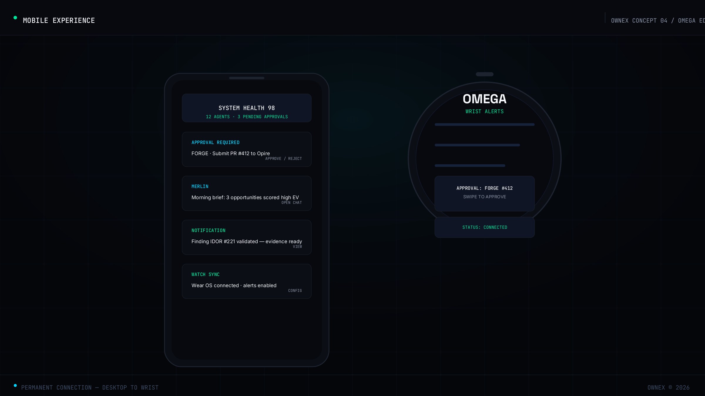
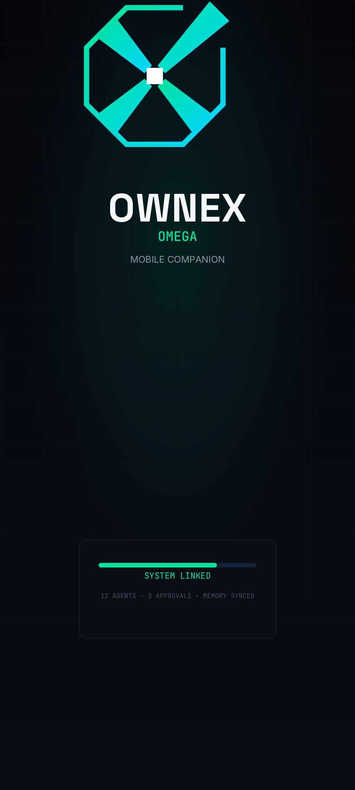
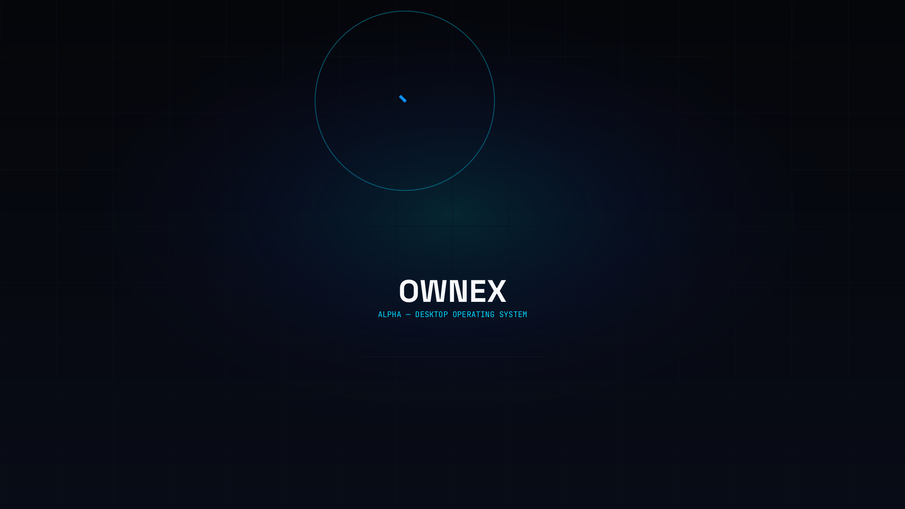

<p align="center">
  
</p>

<h1 align="center">OWNEX</h1>
<p align="center"><strong>Autonomous Personal Operating System</strong></p>

<p align="center">
  
</p>

<p align="center">
  <a href="https://github.com/AdriDob/rastrohunteralpha/releases"></a>
  <a href="https://www.python.org/"></a>
  <a href="https://vuejs.org/"></a>
  <a href="https://www.typescriptlang.org/"></a>
  <a href="https://www.kotlinlang.org/"></a>
  <a href="LICENSE"></a>
</p>

---

## What is OWNEX?

OWNEX is an autonomous personal operating system: a single platform that discovers
opportunities, executes technical work, learns from outcomes, and evolves its own
operation — from a desktop command center to your phone.

It is built around a closed loop: **observe → decide → execute → learn → evolve**.
The human stays at the decision gate; the system handles the rest.

<p align="center">
  
</p>

## One system, two editions

OWNEX ships as two connected identities sharing a single core.

<table>
  <tr>
    <td width="50%" align="center">
      
      <br/><br/>
      <b>ALPHA — Desktop Operating System</b>
      <br/>
      The command center: agents, workflows, terminal, memory,
      evolution engine, and the full mission-control dashboard.
    </td>
    <td width="50%" align="center">
      
      <br/><br/>
      <b>OMEGA — Android Companion</b>
      <br/>
      Permanent connection: approvals, notifications, MERLIN chat,
      system health — on your phone.
    </td>
  </tr>
</table>

## Mission Control

Every operation is visible in one place: system health, the agent fleet,
opportunities scored by expected value, revenue, and the next best action.

<p align="center">
  
</p>

## Architecture

Control plane, departments, agents, execution, learning, feedback — designed for
autonomy, with the human at every decision gate.

<p align="center">
  
</p>

| Layer | Responsibility |
|---|---|
| **OWNEX Core** | Event bus, scheduler, unified memory, security layer |
| **Departments** | Orchestrator · Engineering · Quality · Security · Revenue |
| **Agents** | Autonomous specialists coordinated per department |
| **Execution** | Workflows, executors, platform connectors |
| **Learning** | Feedback loops, knowledge capture, reward models |
| **Evolution** | Self-improvement, version rollback, recovery |

## Ecosystem

<p align="center">
  
</p>

| Component | Role |
|---|---|
| **ALPHA Desktop** | Command center — core operations |
| **OMEGA Mobile** | Android companion — approvals, chat, sync |
| **MERLIN** | Intelligent assistant with persistent memory |
| **Agents** | Autonomous departments working in parallel |
| **Memory** | Persistent knowledge store (SQLite, namespaced) |
| **Evolution Engine** | Continuous self-improvement with recovery |

## Mobile experience

<p align="center">
  
</p>

<p align="center">
  
  
</p>

## Core capabilities

| Capability | Status |
|---|---|
| Bug bounty pipeline (discover → recon → hypothesis → validate → report) | Production |
| Opportunity engine with EV scoring and platform executors | Production |
| Autonomous workflows and agent fleet | Production |
| MERLIN assistant with unified memory | Production |
| Security cycle with 7 stage executors | Production |
| Executive dashboard (revenue verdict, USD/hour, platform speed) | Production |
| ALPHA + OMEGA + Wear OS companions | Production |
| Self-update, version backup, recovery engine | Production |
| 6-language interface (EN, ES, FR, DE, JA, ZH) | Production |

## Quick start

```bash
git clone https://github.com/AdriDob/rastrohunteralpha.git
cd rastrohunteralpha

python -m venv .venv && source .venv/bin/activate
pip install -r requirements.txt
cp .env.example .env          # add your platform credentials

python api/main.py            # backend → http://127.0.0.1:8000

cd frontend && npm install
npm run dev                   # frontend → http://localhost:5173
```

```bash
curl http://127.0.0.1:8000/api/health   # system health
python run.py --backup                   # snapshot before changes
```

## Tech stack

| Layer | Technology |
|---|---|
| Backend | Python 3.11 · FastAPI · SQLAlchemy · Pydantic |
| Data | SQLite (dev) · PostgreSQL (prod) · Unified Memory (SQLite) |
| Frontend | Vue 3 · TypeScript · Tailwind v4 · Vite · ShadCN Vue |
| Mobile | Kotlin · Jetpack Compose · Wear OS 3+ |
| AI | Local models (Ollama) · OpenRouter · free providers · MERLIN |
| Automation | Scheduler (cron-aware) · EventBus · AgentBus · RecoveryEngine |
| Quality | pytest (1,400+ tests) · Ruff · mypy · Biome · Vitest |

## Repository structure

```
api/              FastAPI application and routers
core/ cores/      Domain engines (cycles, opportunities, execution, learning)
apps/             ORION applications (aegis, atlas, odyssey, hermes)
frontend/         Vue 3 single-page application
android/ wearos/  OMEGA companions
scripts/brand/    Deterministic brand pipeline (SVG → PNG)
assets/           Brand system, banners, concept art, video storyboard
```

## Documentation

- [Brand identity](assets/branding/OWNEX_BRAND_IDENTITY.md) — marks, colors, type, usage rules
- [Design tokens](assets/branding/design-tokens.json) — machine-readable brand tokens
- [Trailer storyboard](assets/video/trailer-storyboard.md) — 90s product trailer structure
- [Agent Charter](.ai/AGENT_CHARTER.md) — constitution and operating rules
- [Architecture](.ai/ARCHITECTURE_FINAL.md) — full architectural decisions

## Philosophy

**Consolidation over expansion.** OWNEX does not grow by adding modules; it grows by
closing loops. Every component must produce observable results, survive restarts, and
connect to at least one real consumer. If it cannot be verified, it does not exist.

## License

MIT — see [LICENSE](LICENSE). Brand fonts: SIL OFL 1.1 (Google Fonts).

---

<p align="center">
  <sub>OWNEX — Autonomous Personalizable Operating System · ALPHA + OMEGA</sub>
</p>
