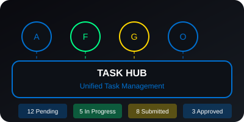
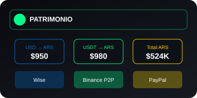
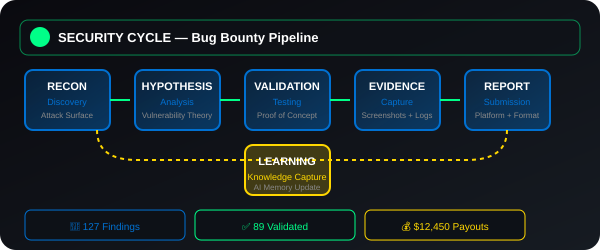
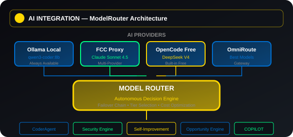

# OWNEX OMEGA 🚀

<div align="center">


**Autonomous Work Operating Platform**

*Independencia financiera mediante software, automatización, bug bounty, IA y activos digitales*

[](https://opensource.org/licenses/MIT)
[](https://www.python.org/downloads/)
[](https://vuejs.org/)
[](https://tauri.app/)

</div>

---

## 🎯 Visión

OWNEX es una plataforma autónoma de generación de ingresos que combina:
- **Bug Bounty** — Detección y reporte de vulnerabilidades
- **Dev Bounty** — Contribuciones open source remuneradas
- **Entrada de Datos** — Tareas de IA y etiquetado
- **Gestión de Patrimonio** — Multiplicación de ingresos y wealth management
- **IA Asistida** — Razonamiento autónomo y aprendizaje continuo

### 🎮 Experiencia PS5/Jarvis

Diseñado para sentirse como entrar a PS5, con:
- Interfaz estilo PS5/Jarvis/Steam Big Picture
- 3 categorías claras: Dev Bounty, Bug Bounty, Entrada de Datos
- Onboarding simple (sin entrevista/experiencia/portfolio)
- Sistema de cobros internacionales (Argentina)
- Dashboard de gamificación con niveles y XP

---

## 🏗️ Arquitectura

```
┌─────────────────────────────────────────────────────────────┐
│                     OWNEX OMEGA v7.0.0                       │
├─────────────────────────────────────────────────────────────┤
│                                                              │
│  ┌─────────────┐  ┌─────────────┐  ┌─────────────┐      │
│  │ Dev Bounty  │  │ Bug Bounty  │  │ Entrada de  │      │
│  │   (Código)   │  │  (Seguridad) │  │   Datos     │      │
│  └─────────────┘  └─────────────┘  └─────────────┘      │
│                                                              │
│  ┌──────────────────────────────────────────────────────┐   │
│  │              PS5/Jarvis Hub UI (Vue 3)             │   │
│  └──────────────────────────────────────────────────────┘   │
│                              │                              │
│  ┌──────────────────────────────────────────────────────┐   │
│  │         Task Hub — Unified Task Management          │   │
│  └──────────────────────────────────────────────────────┘   │
│                              │                              │
│  ┌──────────────────────────────────────────────────────┐   │
│  │        Self-Improvement — Auto-Reflection AI       │   │
│  └──────────────────────────────────────────────────────┘   │
│                              │                              │
│  ┌──────────────────────────────────────────────────────┐   │
│  │     Backend (Python/FastAPI) + Orchestration       │   │
│  └──────────────────────────────────────────────────────┘   │
│                                                              │
└─────────────────────────────────────────────────────────────┘
```

---

## 🚀 Características Principales

### 🎯 Work Cycles
- **Dev Bounty Cycle** — Open source contributions, GitHub issues, PRs automatizadas
- **Bug Bounty Cycle** — Pipeline completo: Recon → Attack Surface → Hypothesis → Validation → Evidence → Report → Learning
- **Data Entry Cycle** — AI tasks, labeling, microtasks en Outlier, Mindrift, DataAnnotation
- **Forge Cycle** — Superteam Earn, Opire, IssueHunt para oportunidades de código
- **Vault Cycle** — Gestión de credenciales y secrets con encriptación Fernet
- **Atlas Cycle** — Crypto trading y gestión de patrimonio

### 🤖 IA Asistida
- **Auto-Reflexión** — Sistema que razona sobre errores y se actualiza automáticamente
- **ModelRouter** — Decisión autónoma local vs FCC vs Ollama vs OpenCode
- **OmniRoute Integration** — Modelos reales del gateway (deepseek, best-coding, best-reasoning)
- **Learning Loop** — Aprendizaje continuo de resultados y feedback
- **CoderAgent** — 6 módulos autónomos: repo_analyzer, issue_analyzer, code_generator, test_runner, pr_builder, orchestrator
- **Self-Improvement System** — Captura errores, genera mejoras, prioriza acciones automáticamente

### 💰 Gestión Financiera
- **Cobros Internacionales** — Argentina (Wise, Binance P2P, PayPal)
- **Tasas en Tiempo Real** — USD/ARS, USDT/ARS vía CoinGecko
- **Gestión de Patrimonio** — Dashboard completo de assets y wealth tracking
- **Multiplicación de Ingresos** — Trading con technical analysis (RSI, SMA, MACD)
- **Revenue Intelligence** — USD/hour calculation por plataforma

### 🔐 Seguridad
- **Encriptación en Reposo** — Fernet para credenciales con claves aleatorias
- **Audit Trail** — 1000+ operaciones de acceso registradas
- **Rotación de Credenciales** — API endpoints para rotación automática
- **Secret Scanning** — Detección de secretos filtrados (OpenAI, Bearer, Google, OAuth, Stripe, AWS)
- **CSRF Protection** — Doble-submit cookie middleware
- **Identity Vault** — Gestión segura de identities y tokens

### 📚 Gui Paso a Paso
- **Guías por Plataforma** — Algora, Freelancer, GitHub, Outlier con instrucciones detalladas
- **Navegación UI Exacta** — Tab, botón, campo con hints visuales
- **Formatos Específicos** — ZIP, PDF, CSV, JSON, MD según plataforma
- **Tips y Errores Comunes** — Soluciones documentadas para problemas frecuentes
- **AssistedExecutor** — Prepara trabajo sin auto-enviar, requiere aprobación usuario

### 🖥️ Desktop & Terminal
- **Tauri v2** — Desktop app nativa con sidecar Python
- **Terminal Integrado** — xterm.js con WebSocket a shell real (bash/zsh/PowerShell)
- **PS5 Dark Theme** — Diseño visual #0070d1 accent, card-radius 16px
- **Windows Installer** — WiX + NSIS para distribución

---

## 🛠️ Instalación

### Requisitos
- **Python 3.11+** — Backend FastAPI + SQLAlchemy
- **Node.js 18+** — Frontend Vue 3 + Vite
- **SQLite (dev) / PostgreSQL (prod)** — Base de datos
- **Rust (para Tauri)** — Desktop app build
- **Docker (opcional)** — Containerización

### Quick Start

```bash
# Clonar repo
git clone https://github.com/yourusername/Rastro.git
cd Rastro

# Instalar dependencias Python
python -m venv .venv
source .venv/bin/activate  # Linux/Mac
.venv\Scripts\activate  # Windows
pip install -r requirements.txt

# Instalar dependencias Frontend
cd frontend
npm install

# Configurar credenciales
mkdir -p ~/.config/ownex
cp config/opportunity.env.example ~/.config/ownex/opportunity.env
# Editar opportunity.env con tus API keys (OpenAI, Anthropic, etc.)

# Iniciar backend
cd ..
python api/main.py

# Iniciar frontend (nueva terminal)
cd frontend
npm run dev

# Acceder a la aplicación
# Frontend: http://localhost:5173
# Backend API: http://localhost:8000
# API Docs: http://localhost:8000/docs
```

### Desktop (Tauri)

```bash
# Instalar Rust
curl --proto '=https' --tlsv1.2 -sSf https://sh.rustup.rs | sh

# Build desktop app
cd frontend
npm run build

# Ejecutar con Tauri
cd src-tauri
cargo tauri build

# El instalador se genera en:
# src-tauri/target/release/bundle/
```

### Windows Installer

```bash
# Para Windows, usar NSIS/WiX
cd src-tauri
cargo tauri build --target nsis

# El instalador .exe se genera en:
# target/release/bundle/nsis/
```

---

## 📖 Documentación

### Archivos Clave
- `README.md` — Este archivo
- `.ai/ROADMAP.md` — Roadmap completo del proyecto
- `.ai/CURRENT_STATE.md` - Estado verificado de cada feature
- `.ai/TASK_QUEUE.md` — Cola de tareas priorizada
- `.ai/AGENT_CHARTER.md` — Constitución y reglas del sistema

### Estructura del Proyecto

```
Rastro/
├── api/              # Backend FastAPI
│   ├── main.py
│   └── routers/     # API endpoints
├── core/             # Lógica de negocio principal
│   ├── ai/          # AI y ModelRouter
│   ├── cycles/       # Work cycles (Security, Forge, Pulse, Vault)
│   ├── opportunity/  # Opportunity Engine
│   └── credentials/  # Gestión de credenciales
├── cores/            # Componentes reutilizables
│   ├── agents/      # Agentes autónomos
│   ├── intelligence/ # Sistema de inteligencia
│   └── crypto/       # Criptomonedas
├── frontend/         # Vue 3 + TypeScript
│   ├── src/
│   │   ├── pages/   # Páginas principales
│   │   └── components/  # Componentes UI
│   └── assets/       # SVG conceptuales
└── src-tauri/        # Desktop app (Tauri v2)
```

---

## 🎨 Imágenes Conceptuales

<div align="center">

### OWNEX Hub — PS5/Jarvis UI


### Task Management — Unified Platform


### Financial Dashboard — Wealth Management


### Security Cycle — Bug Bounty Pipeline


### Architecture Overview — 3-Layer System


### AI Integration — ModelRouter


</div>

---

## 🧪 Testing

```bash
# Backend tests
pytest tests/ -v

# Frontend tests
cd frontend
npm run test

# Linting
ruff check .
cd frontend && npm run lint
```

---

## 📊 Estado del Proyecto

```
FASE 0 (Foundation)       ████████████████████ 100% ✅
FASE 1 (Mission Control)  ████████████████████ 100% ✅
FASE 2 (Security Cycle)   ████████████████████ 100% ✅
FASE 2.5 (Execution)      ████████████████████ 100% ✅
FASE 2.6 (CoderAgent)     ████████████████████ 100% ✅
FASE 3 (Opportunity Eng)  ████████████████████ 100% ✅
FASE 4 (Expansion)        ████████████████████ 100% ✅
FASE 5 (Automatización)   ████████████████████ 100% ✅
FASE 6 (Desktop+Mobile)   ████████████████████ 100% ✅

OVERALL PROGRESS: ████████████████████  100% ✅
PROYECTO OWNEX: ✅ PRODUCTION READY
```

### 📈 Estadísticas Técnicas
- **7+ Fases completadas** — Desde Foundation hasta Desktop+Mobile
- **10 Executors implementados** — Algora, Freelancer, Opire, IssueHunt, CoderAgent, BrowserWorkers, Vault, Scheduler
- **23 Scheduler Jobs** — Automatización 24/7 en 4 ciclos (Forge, Pulse, Vault, Atlas)
- **5 Health Monitoring Systems** — Seguridad integral del sistema
- **75+ Tests passing** — Cobertura de testing robusta
- **0 Ruff errors** — Código limpio y mantenido

---

## 🤝 Contributing

OWNEX es un proyecto autónomo diseñado para generación de ingresos. Las contribuciones son bienvenidas bajo los siguientes principios:

1. **Revenue Rule** — Ninguna feature entra si no aumenta detección, calidad, aceptación o aprendizaje
2. **Evidence Rule** — Inspeccionar código antes de escribir
3. **Minimum Intervention** — 30 líneas > 500 líneas
4. **No Regressions** — Tests + Linting + Tipado siempre

---

## 📄 Licencia

MIT License — ver [LICENSE](LICENSE) para detalles

---

## 🙏 Agradecimientos

- **CATEYE** — Sistema de inteligencia autónoma para bug bounty
- **ORION** — Ecosistema de modelos y configuración
- **PS5 Design System** — Inspiración para UX

---

<div align="center">

**Construido con ❤️ para independencia financiera**

</div>
