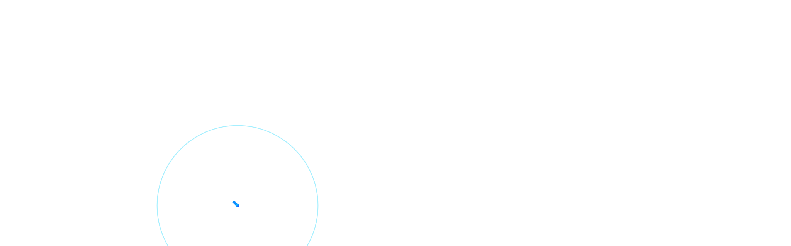
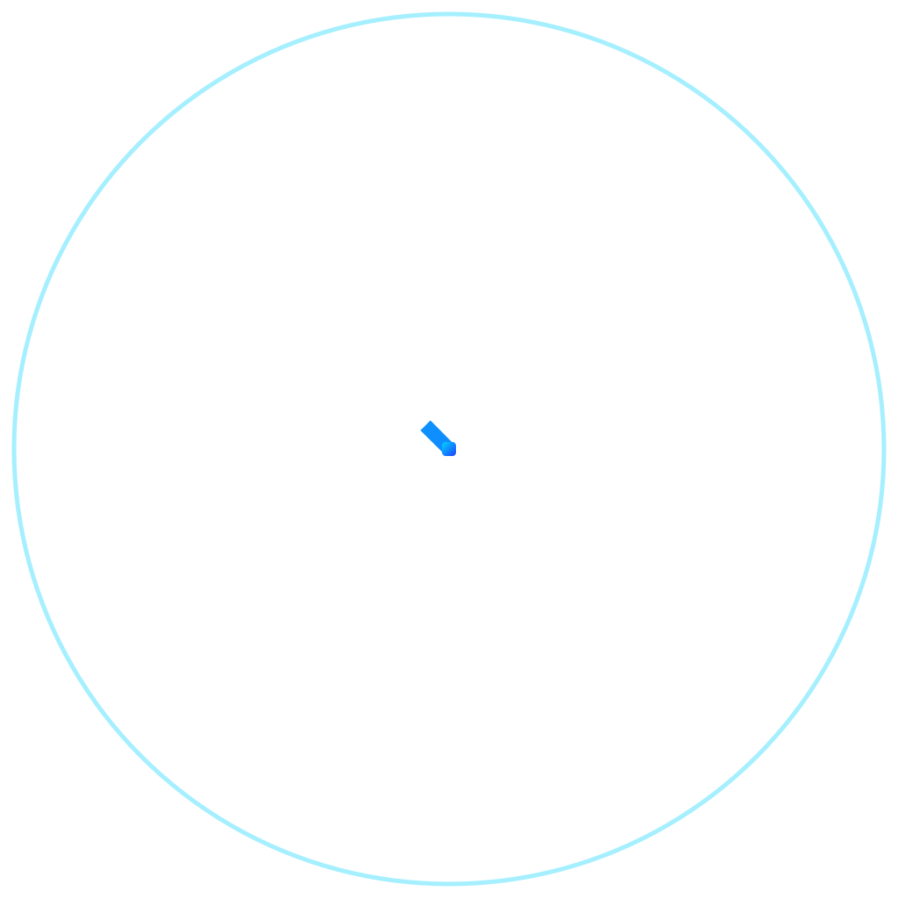

<p align="center">
  
</p>

<p align="center">
  <a href="https://github.com/AdriDob/rastrohunteralpha/releases"></a>
  <a href="https://www.python.org/"></a>
  <a href="https://vuejs.org/"></a>
  <a href="https://www.typescriptlang.org/"></a>
  <a href="https://www.kotlinlang.org/"></a>
  <a href="LICENSE"></a>
</p>

---

## OWNEX ALPHA — Desktop Operating System

The command center for autonomous operations. Mission Control, agent fleet, terminal, memory, evolution engine.

<p align="center">
  
</p>

---

## OWNEX OMEGA — Android & Wear OS Companion

Permanent connection: approvals, notifications, MERLIN chat, system health — on your phone and wrist.

<p align="center">
  
</p>

---

## Core Capabilities

| Capability | Status |
|---|---|
| Bug bounty pipeline (discover → recon → hypothesis → validate → report) | Production |
| Opportunity engine with EV scoring and platform executors | Production |
| Autonomous workflows and agent fleet | Production |
| MERLIN assistant with unified memory | Production |
| Security cycle with 7 stage executors | Production |
| Executive dashboard (revenue verdict, USD/hour, platform speed) | Production |
| Self-update, version backup, recovery engine | Production |
| 6-language interface (EN, ES, FR, DE, JA, ZH) | Production |

---

## Quick Start

```bash
git clone https://github.com/AdriDob/rastrohunteralpha.git
cd rastrohunteralpha

python -m venv .venv && source .venv/bin/activate
pip install -r requirements.txt
cp .env.example .env          # add your platform credentials

python api/main.py            # backend → http://127.0.0.1:8000

cd frontend && npm install
npm run dev                   # frontend → http://localhost:5173
```

```bash
curl http://127.0.0.1:8000/api/health   # system health
python run.py --backup                   # snapshot before changes
```

---

## Tech Stack

| Layer | Technology |
|---|---|
| Backend | Python 3.11 · FastAPI · SQLAlchemy · Pydantic |
| Data | SQLite (dev) · PostgreSQL (prod) · Unified Memory (SQLite) |
| Frontend | Vue 3 · TypeScript · Tailwind v4 · Vite · ShadCN Vue |
| Mobile | Kotlin · Jetpack Compose · Wear OS 3+ |
| AI | Local models (Ollama) · OpenRouter · free providers · MERLIN |
| Automation | Scheduler (cron-aware) · EventBus · AgentBus · RecoveryEngine |
| Quality | pytest (1,400+ tests) · Ruff · mypy · Biome · Vitest |

---

## Documentation

- [Brand Identity](assets/branding/OWNEX_BRAND_IDENTITY.md) — marks, colors, type, usage rules
- [Design Tokens](assets/branding/design-tokens.json) — machine-readable brand tokens
- [Agent Charter](.ai/AGENT_CHARTER.md) — constitution and operating rules
- [Architecture](.ai/ARCHITECTURE_FINAL.md) — full architectural decisions

---

## License

MIT — see [LICENSE](LICENSE). Brand fonts: SIL OFL 1.1 (Google Fonts).

---

<p align="center">
  
</p>

<p align="center"><sub>OWNEX — Autonomous Personal Operating System · ALPHA + OMEGA</sub></p>