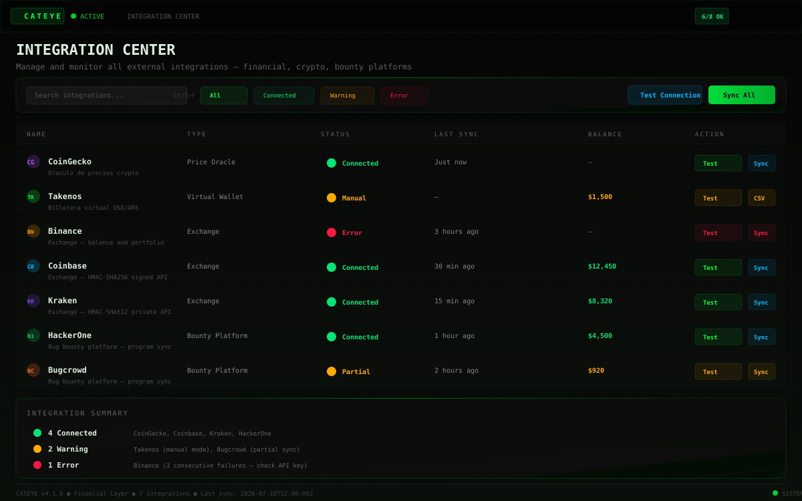

# ORION Platform v4.3.2 — Sistema de Inteligencia Operativa

[](https://github.com/AdriDob/Rastro/releases)
[](https://www.python.org/)
[](https://fastapi.tiangolo.com/)
[](https://vuejs.org/)
[]()
[]()

---

## ¿Qué es ORION?

ORION es una **plataforma de inteligencia operativa privada** diseñada para ejecutar aplicaciones especializadas de análisis, automatización y toma de decisiones.

No es un SaaS. No es una herramienta individual. Es un **sistema operativo personal de automatización** que corre 100% local.

```
ORION Platform
│
├── CATEYE     → Seguridad ofensiva (bug bounty, pentesting, OSINT)
├── ATLAS      → Finanzas, patrimonio e inversiones
├── ODYSSEY    → Investigación y mercados predictivos
├── HERMES     → Automatización del sistema
└── COPILOT    → Inteligencia transversal (parte del Core)
```

---

## Capturas del sistema

| Dashboard principal | Pipeline de hallazgos |
|:---:|:---:|
| [](docs/screenshots/dashboard-main.svg) | [](docs/screenshots/pipeline-monitor.svg) |

| Centro de reportes | Dashboard financiero |
|:---:|:---:|
| [](docs/screenshots/report-detail.svg) | [](docs/screenshots/financial-dashboard.svg) |

| Centro de integraciones | Salud del sistema |
|:---:|:---:|
| [](docs/screenshots/integration-center.svg) | [](docs/screenshots/system-health.svg) |

---

## Filosofía

1. **Eliminar trabajo humano repetitivo** — Toda feature debe responder: "¿esto elimina trabajo humano o solo agrega complejidad?"
2. **ORION decide, las apps ejecutan** — ORION es read-only. Recomienda, el humano decide.
3. **Un pipeline oficial** — El scheduler es el único flujo de ejecución.
4. **Persistencia primero** — Todo estado crítico sobrevive reinicios (SQLite WAL, EventBus persistente, SystemState en DB).
5. **Seguridad sobre features** — Sin secretos en código, CSRF en todas las rutas mutantes, AES-256-GCM, audit logging JSONL.

---

## Arquitectura

```
┌──────────────────────────────────────────────────────────────────┐
│                        ORION CORE                                 │
│  ┌──────────┐ ┌──────────┐ ┌──────────┐ ┌────────────────────┐  │
│  │ EventBus  │ │  Memory  │ │  Copilot  │ │ Decision Journal  │  │
│  │ (pub/sub) │ │ (SQLite) │ │ (AI Agent)│ │ (append-only log) │  │
│  └──────────┘ └──────────┘ └──────────┘ └────────────────────┘  │
│  ┌──────────┐ ┌──────────┐ ┌──────────┐ ┌────────────────────┐  │
│  │ Scheduler │ │ Secrets  │ │  Health  │ │ Integration Center │  │
│  │ (cron)    │ │ (vault)  │ │ (checks) │ │ (23 integraciones) │  │
│  └──────────┘ └──────────┘ └──────────┘ └────────────────────┘  │
└──────────────────────────┬───────────────────────────────────────┘
                           │
┌──────────────────────────▼───────────────────────────────────────┐
│                       APPS LAYER                                  │
│                                                                   │
│  ┌──────────┐  ┌──────────┐  ┌──────────┐  ┌──────────┐        │
│  │  CATEYE   │  │  ATLAS   │  │ ODYSSEY  │  │  HERMES  │  ...   │
│  │seguridad  │  │ finanzas │  │investig. │  │  autom.  │        │
│  └──────────┘  └──────────┘  └──────────┘  └──────────┘        │
└──────────────────────────┬───────────────────────────────────────┘
                           │
┌──────────────────────────▼───────────────────────────────────────┐
│                     API LAYER (FastAPI)                           │
│  60+ routers · CORS · Auth · Rate Limiting · Extension SDK       │
└──────────────────────────┬───────────────────────────────────────┘
                           │
┌──────────────────────────▼───────────────────────────────────────┐
│               FRONTEND (Vue 3 SPA) + DATABASE (SQLite)            │
│  58 páginas · 9 Pinia stores · Tailwind CSS · Radix UI            │
│  36+ tablas · SQLAlchemy · WAL mode · FK constraints              │
└──────────────────────────────────────────────────────────────────┘
```

---

## Lo que ORION puede hacer

### 🧠 Core Platform
- **EventBus** persistente con SQLite — pub/sub entre todos los módulos
- **Decision Journal** — log append-only de todas las decisiones con feedback loop
- **Unified Memory** — 10 namespaces con búsqueda, tags, prioridad, expiración
- **Senior Copilot Agent** — 5 niveles de autoridad, 4 bandas de confianza, 6 reglas de policy
- **Evidence Graph** — evidencia a favor/en contra/neutral por hipótesis (SQLite persistente)
- **Integration Center** — 23 definiciones con status checks en runtime (env vars, vault, health callables)
- **Secrets Manager** — IdentityVault bridge (AES-256-GCM) + env var fallback
- **Health Center** — checks unificados por categoría (system/background/integration)
- **Extension SDK** — manifest, hooks before/after, capabilities registry, hot reload
- **Scheduler** adaptativo con cooldown por target + priorización ORION

### 🛡️ CATEYE — Seguridad ofensiva
- **ORION Score** (0.0-1.0) — algoritmo de ranking de programas con 6 factores
- **EVH** (Expected Value per Hour) — ROI monetario por programa
- **Pipeline E2E**: DISCOVER → RECON → HYPOTHESIS → VALIDATE → REPORT
- 8 generadores de hipótesis (IDOR, auth bypass, SSRF, privesc, etc.)
- **Hypothesis Challenger** — 7+ tipos de explicaciones alternativas, tests de contradicción
- Reportes profesionales con exportación a Markdown/PDF/HTML
- Auto-report: finding confirmado → borrador automático vía EventBus
- OWASP ZAP integration (spider + passive scan)
- 16 OSINT clients: Shodan, Censys, VirusTotal, SecurityTrails, etc.

### 💰 ATLAS — Finanzas
- CoinGecko price feed (30+ cryptos, 24h change, cache free tier)
- Takenos connector (balance, CSV import, Solana USDC sync)
- Dashboard de patrimonio total con breakdown por activo
- Objetivo Libertad 30K con progreso tracking
- Exchange connectors: Binance, Coinbase (HMAC), Kraken (HMAC-SHA512)

### 🤖 HERMES — Automatización
- 6 comandos: backup, status, health, logs, doctor, help
- Safe mode con permission control
- Action logging JSONL persistente
- Windows shortcuts (WSL launcher)

### 🔐 Seguridad y privacidad
- 100% local y privacy-first
- AES-256-GCM encrypted credential vault (clave aleatoria, no derivada)
- CSRF double-submit cookie middleware
- Rate limiting por identity + IP fallback
- JSONL audit trail con rotación (10MB, 3 backups)
- Ed25519 para validación de licencias (sin HMAC hardcodeado)

---

## Inicio rápido

```bash
# Clonar
git clone https://github.com/AdriDob/Rastro.git
cd Rastro

# Backend
python3 -m venv .venv
source .venv/bin/activate
pip install -r requirements.txt

# Frontend
cd frontend && npm install && cd ..

# Inicializar base de datos
python run.py --setup

# Modo desarrollo (navegador)
python run.py --browser
```

Abrir `http://127.0.0.1:8000` en el navegador.

---

## Estado actual

| Indicador | Valor |
|---|---|
| **Versión** | 4.3.2 STABLE |
| **Tests backend** | 676 pasan, 2 xfailed, 0 fallos |
| **Tests frontend** | 165 tests (Vitest + jsdom) |
| **Lint** | 0 errores (Ruff + Biome) |
| **Pipeline** | 5-stage E2E funcional |
| **Pre-commit** | Ruff + pytest hooks activos |
| **Apps activas** | CATEYE, ATLAS, ODYSSEY, HERMES |

---

## Documentación

| Documento | Descripción |
|---|---|
| [`SYSTEM.md`](SYSTEM.md) | Arquitectura completa del sistema |
| [`USER_GUIDE.md`](USER_GUIDE.md) | Manual de uso diario |
| [`CONFIGURATION_GUIDE.md`](CONFIGURATION_GUIDE.md) | Guía de configuración |
| [`EXTENSION_SDK.md`](EXTENSION_SDK.md) | Cómo crear extensiones |
| [`HERMES_GUIDE.md`](docs/HERMES_GUIDE.md) | Manual de Hermes |
| [`.ai/AGENT_CHARTER.md`](.ai/AGENT_CHARTER.md) | Constitución del sistema |
| [`CHANGELOG.md`](CHANGELOG.md) | Historial de versiones |
| [Screenshots](docs/screenshots/README.md) | Galería de capturas |

---

## Tech Stack

| Capa | Tecnología | Versión |
|---|---|---|
| Backend | Python + FastAPI | 3.10+ / 0.95+ |
| ASGI | Uvicorn | 0.22+ |
| ORM | SQLAlchemy + Pydantic v2 | 2.0+ |
| DB | SQLite (WAL) / PostgreSQL | — |
| Frontend | Vue 3 + TypeScript + Vite | 3.5+ / 5.8+ / 6.4+ |
| CSS | Tailwind CSS | 4.1+ |
| State | Pinia | 3.0+ |
| UI | Radix Vue / Reka UI + Lucide Vue | — |
| AI | Gemini · OpenRouter · Ollama · OpenAI | — |
| Desktop | PyInstaller + PyWebView | — |
| Seguridad | Cryptography (AES-256-GCM) | — |
| Testing | pytest + Vitest + @vue/test-utils | — |
| Linting | Ruff (Python) + Biome (frontend) | — |

---

## Licencia

Propietaria. Ver [SECURITY_POLICY.md](.ai/SECURITY_POLICY.md) para detalles de seguridad.

---

<div align="center">
  <sub>Hecho en 🇦🇷. ORION no es una empresa. Es un sistema para uso personal.</sub>
</div>
