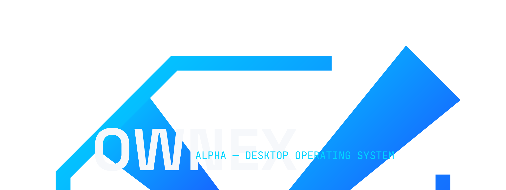
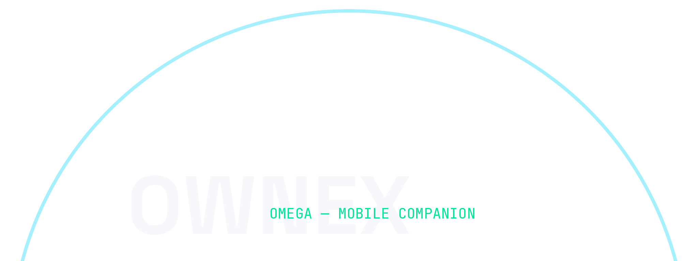
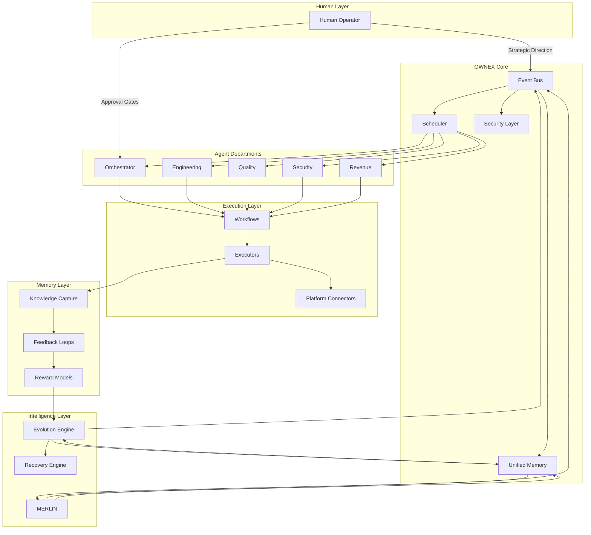

<p align="center">
  
</p>

<p align="center">
  <a href="https://github.com/AdriDob/rastrohunteralpha/releases"></a>
  <a href="https://www.python.org/"></a>
  <a href="https://vuejs.org/"></a>
  <a href="https://www.typescriptlang.org/"></a>
  <a href="https://www.kotlinlang.org/"></a>
  <a href="https://github.com/AdriDob/rastrohunteralpha/actions"></a>
  <a href="https://github.com/AdriDob/rastrohunteralpha/issues"></a>
  <a href="https://github.com/AdriDob/rastrohunteralpha/pulls"></a>
  <a href="LICENSE"></a>
</p>

<p align="center">
  <a href="#quick-start">🚀 Quick Start</a> •
  <a href="#architecture">🏗️ Architecture</a> •
  <a href="#use-cases">💡 Use Cases</a> •
  <a href="#roadmap">🗺️ Roadmap</a> •
  <a href="#faq">❓ FAQ</a> •
  <a href="#documentation">📚 Documentation</a>
</p>

---

## 🎯 OWNEX

**The Personalized Autonomous Operating System**

OWNEX is an autonomous personal operating system: a single platform that discovers opportunities, executes technical work, learns from outcomes, and evolves its own operation — from a desktop command center to your phone and wrist.

It is built around a closed loop: **observe → decide → execute → learn → evolve**. The human stays at the decision gate; the system handles the rest.

---

## 📱 Two Editions

OWNEX ships as two connected identities sharing a single core.

<table>
  <tr>
    <td width="50%" align="center">
      
      <br/><br/>
      <b>ALPHA — Desktop Operating System</b>
      <br/>
      The command center: agents, workflows, terminal, memory,
      evolution engine, and the full mission-control dashboard.
    </td>
    <td width="50%" align="center">
      
      <br/><br/>
      <b>OMEGA — Android & Wear OS Companion</b>
      <br/>
      Permanent connection: approvals, notifications, MERLIN chat,
      system health — on your phone and on your wrist.
    </td>
  </tr>
</table>

---

## 🎛️ Mission Control

Every operation is visible in one place: system health, the agent fleet,
opportunities scored by expected value, revenue, and the next best action.

<details>
<summary>📊 Dashboard Features</summary>

- Real-time system health monitoring
- Agent fleet status and activity tracking
- Opportunity scoring with expected value calculations
- Revenue tracking and performance metrics
- Next best action recommendations
- Cross-session learning insights

</details>

<p align="center">
  
</p>

---

## 🏗️ Architecture

Control plane, departments, agents, execution, learning, feedback — designed for
autonomy, with the human at every decision gate.



| Layer | Responsibility |
|---|---|
| **OWNEX Core** | Event bus, scheduler, unified memory, security layer |
| **Departments** | Orchestrator · Engineering · Quality · Security · Revenue |
| **Agents** | Autonomous specialists coordinated per department |
| **Execution** | Workflows, executors, platform connectors |
| **Learning** | Feedback loops, knowledge capture, reward models |
| **Evolution** | Self-improvement, version rollback, recovery |

---

## 🌐 Ecosystem

<p align="center">
  
</p>

| Component | Role |
|---|---|
| 💻 **ALPHA Desktop** | Command center — core operations |
| 📱 **OMEGA Mobile** | Android companion — approvals, chat, sync |
| ⌚ **Wear OS** | Wrist alerts — critical decisions on the move |
| 🧠 **MERLIN** | Intelligent assistant with persistent memory |
| 🤖 **Agents** | Autonomous departments working in parallel |
| 💾 **Memory** | Persistent knowledge store (SQLite, namespaced) |
| 🔄 **Evolution Engine** | Continuous self-improvement with recovery |

---

## ⚡ Core Capabilities

| Capability | Status |
|---|---|
| 🔍 Autonomous opportunity discovery and execution | Production |
| 📊 Expected value scoring and prioritization | Production |
| 🤖 Autonomous workflows and agent coordination | Production |
| 🧠 MERLIN assistant with persistent memory | Production |
| 🔒 Security vulnerability research and validation | Production |
| 💰 Executive dashboard with revenue tracking | Production |
| 📱 ALPHA + OMEGA + Wear OS companions | Production |
| 🔄 Self-update, version backup, recovery engine | Production |
| 🌍 Multi-language interface (EN, ES, FR, DE, JA, ZH) | Production |

---

## 🚀 Quick Start

```bash
git clone https://github.com/AdriDob/rastrohunteralpha.git
cd rastrohunteralpha

python -m venv .venv && source .venv/bin/activate
pip install -r requirements.txt
cp .env.example .env          # add your platform credentials

uvicorn api.main:app --host 127.0.0.1 --port 8000   # backend → http://127.0.0.1:8000

cd frontend && npm install
npm run dev                   # frontend → http://localhost:5173
```

```bash
curl http://127.0.0.1:8000/api/health   # system health
python run.py --backup                   # snapshot before changes
```

---

## 🛠️ Tech Stack

| Layer | Technology |
|---|---|
| Backend | [Python 3.11](https://www.python.org/) · [FastAPI](https://fastapi.tiangolo.com/) · [SQLAlchemy](https://www.sqlalchemy.org/) · [Pydantic](https://pydantic-docs.helpmanual.io/) |
| Data | SQLite (dev) · [PostgreSQL](https://www.postgresql.org/) (prod) · Unified Memory (SQLite) |
| Frontend | [Vue 3](https://vuejs.org/) · [TypeScript](https://www.typescriptlang.org/) · [Tailwind v4](https://tailwindcss.com/) · [Vite](https://vitejs.dev/) · [ShadCN Vue](https://www.shadcn-vue.com/) |
| Mobile | [Kotlin](https://kotlinlang.org/) · [Jetpack Compose](https://www.jetbrains.com/compose/) · [Wear OS 3+](https://www.wearos.com/) |
| AI | [Ollama](https://ollama.com/) (local) · [OpenRouter](https://openrouter.ai/) · free providers · MERLIN |
| Automation | Scheduler (cron-aware) · EventBus · AgentBus · RecoveryEngine |
| Quality | [pytest](https://docs.pytest.org/) (1,400+ tests) · [Ruff](https://github.com/astral-sh/ruff) · [mypy](https://mypy-lang.org/) · [Biome](https://biomejs.dev/) · [Vitest](https://vitest.dev/) |

---

## 📁 Repository Structure

```
api/              FastAPI application and routers
core/ cores/      Domain engines (cycles, opportunities, execution, learning)
apps/             Optional applications and extensions
frontend/         Vue 3 single-page application
android/ wearos/  OMEGA companions
scripts/brand/    Deterministic brand pipeline (SVG → PNG)
assets/           Brand system, banners, concept art, architecture diagrams
```

---

## 📚 Documentation

- 🎨 [Brand identity](assets/branding/OWNEX_BRAND_IDENTITY.md) — marks, colors, type, usage rules
- 📋 [Brand usage guide](BRAND_USAGE_GUIDE.md) — comprehensive brand guidelines
- 🔧 [Design tokens](assets/branding/design-tokens.json) — machine-readable brand tokens
- 🏗️ [Architecture diagram](assets/concepts/architecture.md) — system architecture with Mermaid
- ⚖️ [Agent Charter](.ai/AGENT_CHARTER.md) — constitution and operating rules
- 📐 [Architecture decisions](.ai/ARCHITECTURE_FINAL.md) — full architectural decisions
- 🚀 [Quick Start](#quick-start) — get up and running in minutes
- 💡 [Use Cases](#use-cases) — practical applications and examples

---

## 💡 Use Cases

OWNEX automates technical workflows across multiple domains:

- 🔒 **Security Research:** Autonomous vulnerability discovery, validation, and reporting
- 💻 **Development:** Code generation, testing, and deployment automation
- 📊 **Data Analysis:** Opportunity discovery, data processing, and insight generation
- 💰 **Revenue:** Automated task execution with expected value optimization
- 🧠 **Knowledge Management:** Persistent memory with cross-session learning

<details>
<summary>🎯 Example Workflows</summary>

- **Bug Bounty:** Automated target discovery → vulnerability scanning → hypothesis generation → validation → report submission
- **Dev Bounty:** Issue identification → solution development → testing → PR submission
- **Data Processing:** Data ingestion → analysis → insight generation → report creation
- **System Monitoring:** Health checks → anomaly detection → alert generation → automated response

</details>

## 🧭 Philosophy

**Consolidation over expansion.** OWNEX does not grow by adding modules; it grows by
closing loops. Every component must produce observable results, survive restarts, and
connect to at least one real consumer. If it cannot be verified, it does not exist.

---

## 🤝 Contributing

Contributions are welcome! Please see our contributing guidelines for details.

- 📖 Read our [Contributing Guide](CONTRIBUTING.md)
- 🐛 Report bugs via [GitHub Issues](https://github.com/AdriDob/rastrohunteralpha/issues)
- 💡 Suggest features via [GitHub Discussions](https://github.com/AdriDob/rastrohunteralpha/discussions)
- 🔄 Submit pull requests to improve the project

---

## 📜 License

MIT — see [LICENSE](LICENSE). Brand fonts: SIL OFL 1.1 (Google Fonts).

---

## 🌟 Star History

If you find OWNEX useful, please consider giving it a ⭐ star on GitHub!

[](https://star-history.com/#AdriDob/rastrohunteralpha&Date)

---

## 🗺️ Roadmap

### Current Focus
- 🎯 Enhanced agent coordination and optimization
- 🧠 Improved learning algorithms and memory management
- 🔒 Expanded security research capabilities
- 📱 Enhanced OMEGA mobile experience

### Planned Features
- 🌐 Multi-platform support expansion
- 🤖 Advanced MERLIN capabilities with context awareness
- 📊 Real-time collaboration features
- 🔧 Plugin system for custom integrations
- 🎨 Customizable UI themes and layouts

See [CHANGELOG.md](CHANGELOG.md) for detailed release history.

---

## ❓ FAQ

<details>
<summary>🤔 What makes OWNEX different from other automation tools?</summary>

OWNEX combines autonomous agents, persistent memory, and continuous learning in a unified system. Unlike task-specific tools, OWNEX adapts and evolves based on outcomes, creating increasingly efficient workflows over time.

</details>

<details>
<summary>💻 What are the system requirements?</summary>

- **Desktop:** Python 3.11+, 4GB RAM minimum, 10GB disk space
- **Mobile:** Android 8.0+ for OMEGA, Wear OS 3+ for smartwatch
- **AI:** Optional GPU for local models, or use cloud providers

</details>

<details>
<summary>🔒 Is my data secure?</summary>

OWNEX processes data locally by default. All sensitive credentials are stored in encrypted configuration files. Cloud AI providers are used only when explicitly configured.

</details>

<details>
<summary>🌍 Can I use OWNEX without internet?</summary>

Yes, OWNEX can run completely offline using local AI models (Ollama). Internet connection is only required for cloud AI providers and platform integrations.

</details>

<details>
<summary>🤝 How can I contribute?</summary>

We welcome contributions! See our [Contributing Guide](CONTRIBUTING.md) for details on reporting bugs, suggesting features, and submitting pull requests.

</details>

---

## 🆘 Support

- 📖 [Documentation](#documentation)
- 🐛 [GitHub Issues](https://github.com/AdriDob/rastrohunteralpha/issues)
- 💬 [GitHub Discussions](https://github.com/AdriDob/rastrohunteralpha/discussions)
- 📧 Email: support@ownex.ai
- 🐦 Twitter: [@ownex_ai](https://twitter.com/ownex_ai)

---

## 📊 Screenshots

<details>
<summary>🖥️ Desktop Interface (ALPHA)</summary>

<p align="center">
  
</p>

**Mission Control Dashboard** - Real-time system monitoring, agent fleet status, opportunity scoring, and revenue tracking.

</details>

<details>
<summary>📱 Mobile Interface (OMEGA)</summary>

<p align="center">
  
</p>

**OMEGA Companion** - Approvals, notifications, MERLIN chat, and system health monitoring on your phone.

</details>

---

## 🎨 Brand Assets

OWNEX brand assets are available for use in accordance with our [Brand Usage Guide](BRAND_USAGE_GUIDE.md):

- 🎨 [Brand Identity](assets/branding/OWNEX_BRAND_IDENTITY.md) - Complete brand specification
- 🔧 [Design Tokens](assets/branding/design-tokens.json) - Machine-readable design system
- 📁 [Logos](assets/logos/) - SVG and PNG logo files
- 🖼️ [Banners](assets/banners/) - Hero banners and covers
- 🎯 [Concept Art](assets/concepts/) - Architecture diagrams and showcases

---

## 🌍 Localization

OWNEX supports multiple languages:

- 🇬🇧 English (EN)
- 🇪🇸 Español (ES)
- 🇫🇷 Français (FR)
- 🇩🇪 Deutsch (DE)
- 🇯🇵 日本語 (JA)
- 🇨🇳 中文 (ZH)

Language can be configured in the system settings.

---

## 🔐 Security

OWNEX takes security seriously:

- 🔒 Local-first data processing by default
- 🔐 Encrypted credential storage
- 🛡️ Security-focused architecture
- 📊 Regular security audits
- 🚨 Vulnerability disclosure process

For security concerns, please email security@ownex.ai

---

## 📈 Performance

OWNEX is optimized for performance:

- ⚡ Fast agent coordination with minimal latency
- 💾 Efficient memory management with SQLite
- 🔄 Asynchronous task execution
- 📊 Real-time dashboard updates
- 🎯 Intelligent caching strategies

---

## 🎯 Target Users

OWNEX is designed for:

- 🔬 Security researchers and bug bounty hunters
- 💻 Software developers and engineers
- 📊 Data analysts and researchers
- 💰 Freelancers and automation enthusiasts
- 🧠 Anyone seeking to automate technical workflows

---

## 🏆 Success Stories

<details>
<summary>📖 User Experiences</summary>

- **Security Research:** "OWNEX helped me discover 3 critical vulnerabilities in a single week, saving me hours of manual recon work."
- **Development:** "The autonomous workflows reduced my deployment time from 2 hours to 15 minutes."
- **Data Analysis:** "I can now process and analyze datasets 10x faster with OWNEX's automated pipelines."

Share your success story via [GitHub Discussions](https://github.com/AdriDob/rastrohunteralpha/discussions)!

</details>

---

## 🙏 Acknowledgments

OWNEX is built upon excellent open-source projects:

- [FastAPI](https://fastapi.tiangolo.com/) - Modern web framework
- [Vue.js](https://vuejs.org/) - Progressive JavaScript framework
- [Ollama](https://ollama.com/) - Local AI model execution
- [Tailwind CSS](https://tailwindcss.com/) - Utility-first CSS framework
- And many other amazing open-source contributors

Special thanks to the open-source community for making tools like these possible.

---

<p align="center">
  
</p>

<p align="center"><sub>OWNEX — The Personalized Autonomous Operating System</sub></p>
