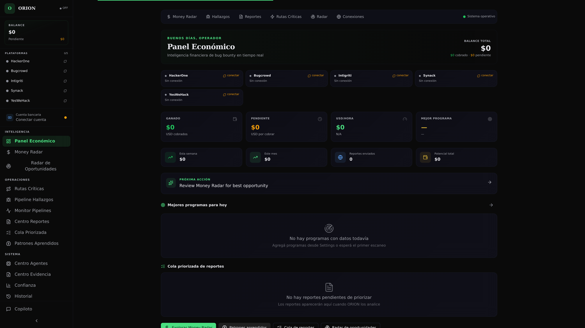
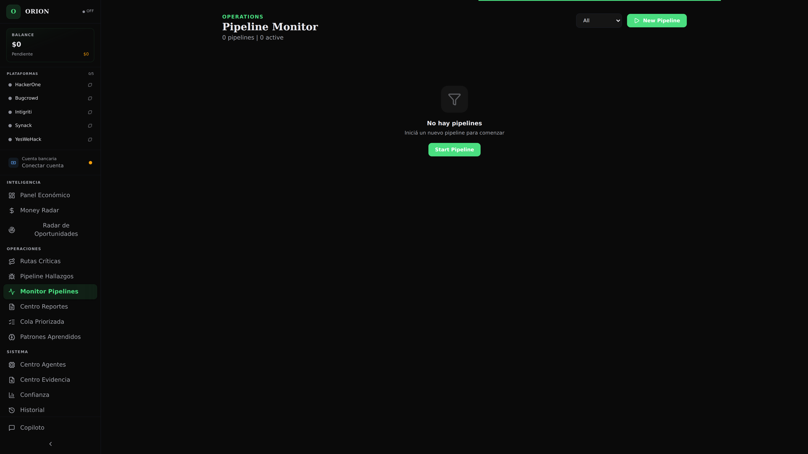
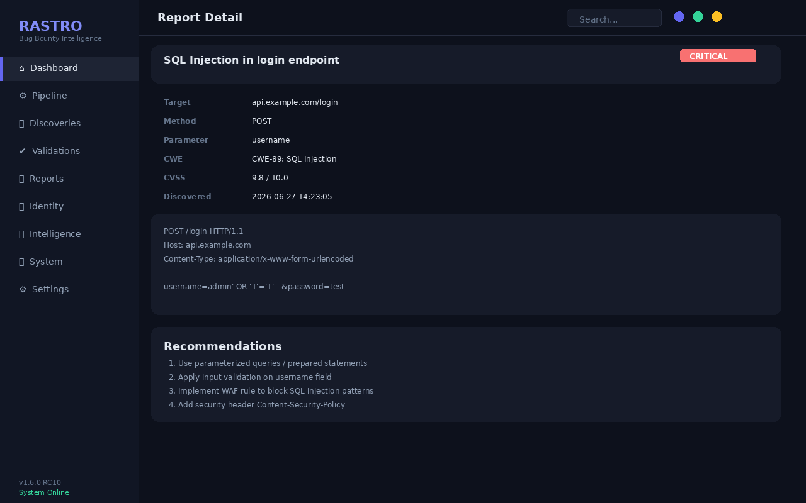
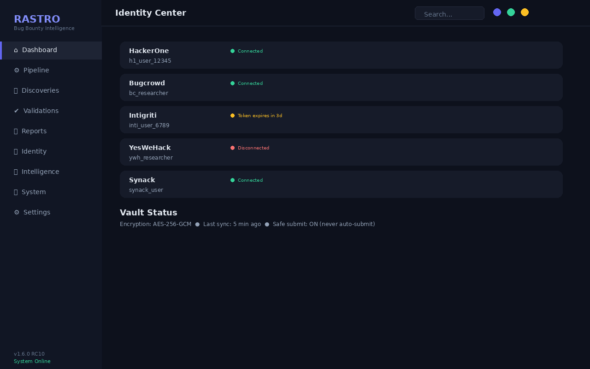
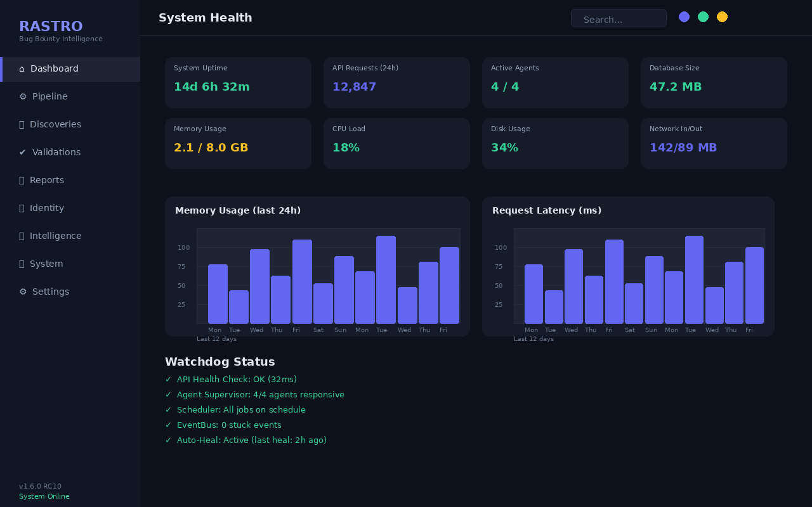

<p align="center">
  <picture>
    <source media="(prefers-color-scheme: dark)" srcset="">
    
  </picture>
</p>

<h1 align="center">ORION</h1>
<p align="center"><em>Autonomous Bug Bounty Intelligence System</em></p>

<p align="center">
  <b>From discovery to payout. Your entire bug bounty workflow, automated.</b><br>
  100% local. Total privacy. Zero subscriptions.
</p>

<p align="center">
  <a href="#overview">
    
  </a>
  <a href="#quick-start">
    
  </a>
  <a href="https://github.com/AdriDob/rastrohunteralpha/releases">
    
  </a>
</p>

<p align="center">
  
  
  
  
  
  
</p>

---

## Overview

ORION is a **private SaaS** for bug bounty hunters that runs entirely on your machine. It is not a decorative dashboard — it is an **Economic Intelligence Center** designed for a single mission: **increase your earnings as a vulnerability hunter**.

Every component answers one question:

| Question | Module |
|---|---|
| How much money do I have? | Financial Summary |
| How much can I collect? | Pending Payments Tracker |
| Where is the best money? | Money Radar & ORION Score |
| What should I do right now? | Next Action Engine |
| How much time should I invest? | ROI Calculator |

No empty charts. No decorative stats. Everything exists to help you make better economic decisions in under 20 seconds.

> ORION does not scan or attack systems. It is an orchestration platform that centralizes, prioritizes, and documents your bug bounty work with artificial intelligence.

---

## Screenshots

<p align="center">
  
  <br>
  <em>Economic Intelligence Dashboard — real-time KPIs, platform earnings, and top opportunities</em>
</p>

<table>
  <tr>
    <td width="50%"><br><em>Findings Pipeline — from detection to paid report</em></td>
    <td width="50%"><br><em>Report Center — AI-generated drafts with one click</em></td>
  </tr>
  <tr>
    <td width="50%"><br><em>Identity Vault — encrypted multi-platform credential storage</em></td>
    <td width="50%"><br><em>System Health — real-time component monitoring</em></td>
  </tr>
</table>

<details>
<summary><b>View all 14 pages (click to expand)</b></summary>
<br>

| Page | Description |
|---|---|
| **Economic Dashboard** `/` | Primary financial panel: KPIs, platform earnings, top opportunities, ROI summary |
| **Money Radar** `/money-radar` | Programs ranked by ORION Score with search and filters |
| **Opportunity Radar** `/radar` | Sortable, paginated opportunity table with bulk actions |
| **Hot Paths** `/hot-paths` | Prioritized attack paths with risk scoring |
| **Findings Pipeline** `/findings` | Full pipeline: detected → validated → confirmed → reported → paid |
| **Program Intel** `/programs/:id` | Deep intelligence per program: scope, tech stack, bounty tiers |
| **Opportunity Planner** `/programs/:id/plan` | Generated hunting plan with time estimates |
| **Report Center** `/reports` | Report management with AI generation, Markdown/PDF export |
| **Report Queue** `/report-queue` | Prioritized report queue by expected value |
| **Verification Guide** `/verify` | Step-by-step manual validation wizard |
| **Memory Patterns** `/memory-patterns` | Learned patterns from hunting history |
| **Connections** `/connections` | Platform connections, payout accounts, withdrawals |
| **Settings** `/settings` | System configuration |
| **Copilot Panel** `Ctrl+B` | Contextual AI assistant with full system awareness |

</details>

---

## Quick Start

### Option 1: Installer (recommended)

```bash
# Download OrionInstaller.exe from GitHub Releases
# Run it. No Python, Node, or dependencies required.
```

### Option 2: From source

```bash
git clone https://github.com/AdriDob/rastrohunteralpha.git
cd rastrohunteralpha

# Terminal 1 — Backend
python -m venv .venv && source .venv/bin/activate
pip install -r requirements.txt
python run.py

# Terminal 2 — Frontend (dev mode)
cd frontend && npm install && npm run dev
```

### Requirements

| Resource | Minimum | Recommended |
|---|---|---|
| OS | Windows 10 / Linux / macOS | Windows 11 |
| RAM | 4 GB | 8 GB |
| Storage | 500 MB | 2 GB |
| Python | 3.12+ | 3.12+ |
| Node.js | 20 LTS | 22 LTS |

### OWASP ZAP (optional)

ORION integrates OWASP ZAP in passive mode for endpoint discovery and security analysis — no active scanning.

```bash
# Linux / WSL
sudo snap install zaproxy --classic
zap.sh -daemon -port 8090 -config api.disablekey=true
```

ORION auto-connects to `http://localhost:8090`. The spider discovers endpoints; passive analysis detects missing headers, cookie flags, technologies, etc.

---

## Architecture

```
┌──────────────────────────────────────────────────────────────────┐
│                        ORION SYSTEM                              │
│                                                                  │
│  ┌──────────┐  ┌──────────┐  ┌──────────┐  ┌──────────────────┐ │
│  │  FRONTEND │  │   API    │  │  CORES   │  │   EXTERNAL       │ │
│  │  Vue 3 +  │◄─┤  FastAPI │◄─┤  48      │  │   INTEGRATIONS   │ │
│  │  ShadCN   │  │  57      │  │  modules │  │                  │ │
│  │  Pinia    │  │  routers │  │  45K LOC │  │  ┌────────────┐  │ │
│  └──────────┘  └──────────┘  └──────────┘  │  │ HackerOne  │  │ │
│       │              │              │       │  │ Bugcrowd   │  │ │
│       │              │              │       │  │ Intigriti  │  │ │
│       ▼              ▼              ▼       │  │ Synack     │  │ │
│  ┌──────────────────────────────────────┐   │  │ YesWeHack  │  │ │
│  │         DATA LAYER                   │   │  │ OWASP ZAP  │  │ │
│  │  SQLAlchemy + SQLite/PostgreSQL      │   │  └────────────┘  │ │
│  │  Identity Vault (AES-256-GCM)        │   └──────────────────┘ │
│  │  Encrypted Token Store               │                       │
│  └──────────────────────────────────────┘                       │
│                                                                  │
│  ┌──────────────────────────────────────────────────────────┐   │
│  │              AI PROVIDERS                                 │   │
│  │  OpenRouter (cloud, free tier) → Ollama (local fallback)  │   │
│  └──────────────────────────────────────────────────────────┘   │
└──────────────────────────────────────────────────────────────────┘
```

### Offensive Tool Integration

ORION now includes a unified offensive scan stack that combines passive enumeration, crawling, historical URL discovery, JS endpoint extraction, fuzzing, XSS and SQLi candidate analysis, and vulnerability scanning.

The unified scan pipeline currently integrates:
- `subfinder` for subdomain enumeration
- `httpx` for live endpoint probing
- `katana` for web crawling and endpoint discovery
- `gau` for gathering historical URLs from archived sources
- `LinkFinder` for extracting JS and dynamic endpoints
- `ffuf` for content discovery and directory fuzzing
- `Dalfox` for targeted XSS candidate scanning
- `sqlmap` for SQL injection candidate analysis
- `nuclei` for templated vulnerability scanning

This pipeline feeds all findings into a correlation engine that creates evidence chains and cross-tool confidence scores.

### Backend — 48 Domain Modules

The `cores/` package is organized by domain, not by layer:

| Module | Responsibility |
|---|---|
| `ai/` | AI providers (Ollama, OpenAI, OpenRouter), Orion agent with tool calling, unified context |
| `recon/` | OWASP ZAP wrapper, subfinder/httpx/katana/ffuf/gau runners, result parsing |
| `engine/` | Hypothesis generation (LLM + ZAP), scoring, risk model, ROI model |
| `intelligence/` | Learning loop, reinforcement learning, adaptive memory, pattern registry |
| `scope_reader/` | Program scope document download, extraction, diff detection |
| `orchestrator/` | Pipeline orchestration, scan service, assistant orchestration |
| `autonomous/` | 24/7 autonomous hunting engine |
| `opportunity/` | EVH scoring, opportunity ranking, program intelligence |
| `platforms/` | Bug bounty platform integrations (5 platforms) |
| `bounty_scraper/` | Program discovery via public platform scraping |
| `reporting/` | Professional report generation (Markdown/PDF) |
| `validation/` | Validation engine, verdict handling, evidence building |
| `evidence/` | Technical evidence management |
| `artifacts/` | Pipeline artifacts (hypothesis, differential, quick wins) |
| `tracking/` | Submission tracking, payment history |
| `memory/` | Long-term memory, insight archive, pattern extraction |
| `agents/` | Multi-agent system (coordinator, exploit, research, financial, etc.) |
| `orion/` | Orion context engine, next-action prediction |
| `events/` | Internal pub/sub event bus |
| `ws/` | WebSocket bridge for real-time updates |

### API — 57 Routers

| Prefix | Routers | Description |
|---|---|---|
| `/api/economic` | 1 | Programs, money-radar, ROI, financial-summary, patterns, report-queue |
| `/api/orion` | 1 | System context, next-action prediction |
| `/api/targets` | 1 | Program/objective CRUD |
| `/api/findings` | 1 | Findings and pipeline |
| `/api/reports` | 1 | Reports, submission, export, reward learning |
| `/api/pipeline` | 1 | Pipeline stage management |
| `/api/attack` | 1 | Attack decisions (hot paths) |
| `/api/verdicts` | 1 | Validation verdicts |
| `/api/evidence` | 1 | Evidence upload and management |
| `/api/zap` | 1 | OWASP ZAP integration |
| `/api/hunt` | 1 | Autonomous hunt control |
| `/api/assistant` | 1 | AI chat (stream + no-stream) |
| `/api/validation` | 1 | Validation registration |
| `/api/auth` | 1 | Authentication |
| `/api/license` | 1 | License management |
| `/api/system` | 1 | Timeline, replay, confidence, health |
| `/api/sync` | 1 | Multi-device sync |
| `/api/webhooks` | 1 | External platform webhooks |
| `/api/connections` | 1 | Platform and bank account management |
| `/api/platforms` | 1 | Platform connection status |
| 30+ more | — | Specialized functionality |

### Frontend — 14 Pages

Built with **Vue 3 + TypeScript + Vite + Tailwind CSS v4 + ShadCN Vue**:

- **Economic Dashboard** — primary landing page with financial KPIs, platform earnings, top opportunities, and ROI summary
- **Money Radar** — program discovery ranked by ORION Score
- **Opportunity Radar** — sortable, paginated opportunity table
- **Hot Paths** — prioritized attack vectors with risk scoring
- **Findings Pipeline** — full pipeline management with stage transitions
- **Report Center** — report generation, management, and submission
- **AI Copilot** — contextual chat with full system awareness
- **Identity Vault** — encrypted credential management
- **Memory Patterns** — learned pattern visualization
- **Program Intel** — per-program deep intelligence
- **Opportunity Planner** — generated hunting plans
- **Settings** — system configuration
- **Connections** — platform and payout account management

---

## Key Features

### 🧠 Autonomous Intelligence Pipeline

11 orchestrated pipeline stages from discovery to paid report. The system advances autonomously, evaluating and deciding the next step without constant manual intervention.

**Pipeline flow:**

```
Discovery → Scope Analysis → Reconnaissance → Hypothesis Generation
→ Validation → Finding Confirmation → Report Draft → Human Review
→ Submission → Payment Tracking → Learning Loop
```

### 🎯 ORION Scoring Engine

Every program is scored on 15+ signals:

| Signal | Weight | Source |
|---|---|---|
| Maximum reward | 30% | Program disclosure |
| Historical success rate | 20% | Your submission history |
| Competition level | 15% | Public program data |
| Time efficiency | 15% | Estimated effort vs reward |
| Personal experience | 10% | Past interactions with program |
| Technology fit | 10% | Your skills vs target tech stack |

**EVH (Expected Value per Hour):**

```
EVH = (max_reward × 0.6 × ORION_SCORE × 0.7) / max(effort_hours, 0.5)
```

### 🤖 AI Copilot

Contextual assistant with full system awareness:

- Knows every target, finding, report, and pipeline state
- Generates hypothesis drafts with PoC, severity, and impact analysis
- Suggests next actions based on current system state
- Estimates effort and expected value for each recommendation

Supports **OpenRouter** (cloud, free tier available) with automatic **Ollama** fallback for fully offline operation.

### 🔐 Identity Vault

Multi-platform credential management with enterprise-grade security:

- AES-256-GCM encryption for all stored credentials
- Fernet key derivation from hardware-bound identity
- Encrypted token store on disk (not in browser storage)
- Per-platform session management with automatic reconnection

### 📊 12-Block Economic Center

| Block | Function |
|---|---|
| General Summary | Historical total, pending, averages, top payments |
| Economic Pipeline | Money at each flow stage |
| Expected Revenue | Conservative, expected, and optimistic scenarios |
| Time ROI | USD/hour, day, program, vulnerability |
| Money Radar | ORION Score per program |
| Program ROI | Full per-program financial profile |
| Vulnerability ROI | Per-type (IDOR, SSRF, XSS, RCE...) |
| Intelligent History | Every payment tells a story |
| Program Ranking | Speed, communication, payment, clarity |
| Goals | Daily, monthly, yearly targets |
| Withdrawals | Wallets: USDT, USDC, BTC, ETH, PayPal |
| AI Finance Copilot | Natural language metric queries |

### 🔄 Autonomous Hunting

One-click "Start Autonomous Hunt" launches background recon + analysis:

- Scans targets in ORION Score priority order
- Generates hypotheses automatically via LLM + ZAP
- Validates findings with heuristic rules
- Advances findings through the pipeline
- Generates report drafts automatically

### 🔧 Platform Integrations

| Platform | Submission | Status Sync | Auto-Discovery |
|---|---|---|---|
| HackerOne | ✅ | ✅ | ✅ |
| Bugcrowd | ✅ | ✅ | ✅ |
| Intigriti | ✅ | Partial | ✅ |
| YesWeHack | ✅ | Partial | ✅ |
| Synack | ✅ | Partial | ✅ |

---

## Project Structure

```
Rastro/
├── SYSTEM.md                ← Complete system documentation
├── run.py                   ← Launcher state machine
│
├── cores/                   ← Core business logic (48 modules)
│   ├── ai/                  ←   AI providers, agents, tools
│   ├── recon/               ←   Reconnaissance runners
│   ├── engine/              ←   Scoring, risk, hypothesis
│   ├── intelligence/        ←   Learning loop, memory
│   ├── platforms/           ←   Bug bounty integrations
│   ├── orchestrator/        ←   Pipeline orchestration
│   ├── autonomous/          ←   24/7 hunting engine
│   ├── reporting/           ←   Report generation
│   ├── validation/          ←   Validation engine
│   ├── opportunity/         ←   Opportunity scoring
│   └── ... (37 more)
│
├── api/                     ← FastAPI (57 routers)
│   ├── main.py              ←   Application entry point
│   ├── routers/             ←   Domain routers
│   ├── middleware/          ←   Auth, rate-limit, CORS
│   └── schemas/             ←   Pydantic models
│
├── frontend/                ← Vue 3 SPA
│   ├── src/
│   │   ├── pages/           ←   14 pages
│   │   ├── components/      ←   UI + domain components
│   │   ├── stores/          ←   Pinia state management
│   │   ├── lib/             ←   API client, utilities
│   │   └── router/          ←   Route definitions
│   └── ...
│
├── database/                ← SQLAlchemy models
├── desktop/                 ← PyWebView desktop app
├── scripts/                 ← Build, release, validation
├── tests/                   ← Backend test suites
├── installer/               ← NSIS installer scripts
└── docs/                    ← Screenshots, documentation
```

---

## Development

```bash
# Backend
python run.py                          # Full stack (backend + frontend + browser)
python launcher/start.py --backend     # API only

# Frontend (standalone dev)
cd frontend && npm install && npm run dev

# Testing
python -m pytest tests/ -v
make test                              # Full test suite
make lint                              # Ruff linting
make typecheck                         # mypy type checking

# Desktop builds
make build-desktop                     # PyInstaller executable
python run.py --build                  # Alternative build command

# Release
python scripts/autorelease.py          # Automated GitHub release
```

---

## Roadmap

| Version | Focus | Status |
|---|---|---|
| v1.0 | Foundation — FastAPI + SQLAlchemy + initial React frontend | ✅ Complete |
| v1.1 | AI & Intelligence — Copilot, OrionAgent, memory system, autonomous pipeline | ✅ Complete |
| v1.2 | Vue 3 Migration — Full frontend rewrite with ShadCN Vue, 14 pages | 🚧 ~90% |
| v1.3 | Polish — Skeleton states, error handling, unit testing | 🔜 Next |
| v1.4 | Mobile — Responsive design, PWA, Capacitor Android | 🔜 Future |
| v1.5 | Enterprise — Multi-user, workspaces, audit logging (on hold) | 🔜 Future |

---

## FAQ

**Is ORION free?**
Yes. ORION is MIT licensed. Use, modify, and distribute freely.

**Is ORION a vulnerability scanner?**
No. ORION orchestrates your workflow. It does not scan systems — it centralizes, prioritizes, and documents your bug bounty work. ZAP integration is passive-only.

**Do I need internet?**
ORION works 100% offline. Internet is only needed for external platform integrations or cloud AI.

**Does ORION store data in the cloud?**
No. All data stays on your machine. No telemetry, no exfiltration, no external servers.

**Which AI models does ORION support?**

| Provider | Type | Default Model | Cost |
|---|---|---|---|
| Ollama | Local | qwen3:14b | Free |
| OpenRouter | Cloud | gpt-4o-mini | Free tier available |
| OpenAI | Cloud | gpt-4o-mini | Pay-per-use |

**Can I contribute?**
Yes. The project is MIT. Fork, improve, send PRs. Every contribution that helps hunters earn more is welcome.

---

## Documentation

| Document | Description |
|---|---|
| [SYSTEM.md](SYSTEM.md) | Complete system architecture, modules, and configuration |
| [docs/SISTEMA.md](docs/SISTEMA.md) | System documentation (Spanish) |
| [CHANGELOG.md](CHANGELOG.md) | Version history and release notes |
| [LICENSE](LICENSE) | MIT License |

---

## License

MIT License — 2026. See [LICENSE](LICENSE) for details.

---

<p align="center">
  <sub>ORION v1.6.0 — Autonomous Bug Bounty Intelligence System</sub><br>
  <sub>Built with Vue 3, FastAPI, TypeScript, ShadCN Vue, PyInstaller</sub><br><br>
  <sub>
    <a href="https://github.com/AdriDob/rastrohunteralpha/issues">Report Bug</a> •
    <a href="https://github.com/AdriDob/rastrohunteralpha/discussions">Discussions</a> •
    <a href="https://github.com/AdriDob/rastrohunteralpha/releases">Releases</a>
  </sub>
</p>
