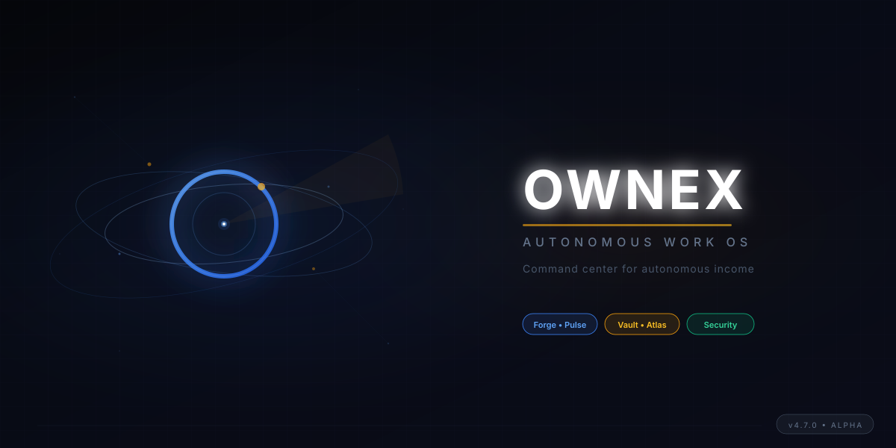

<p align="center">
  <picture>
    <source media="(prefers-color-scheme: dark)" srcset="brand/ownex/hero-cover.svg">
    
  </picture>
</p>

<p align="center">
  <a href="#"></a>
  <a href="#"></a>
  <a href="#"></a>
  <a href="#"></a>
  <a href="#"></a>
</p>

<br>

<p align="center">
  <b>Un sistema operativo personal que trabaja con vos.</b><br>
  <i>No otra herramienta de productividad. Tu centro de comando autónomo.</i>
</p>

<br>

---

## 🚀 What Is OWNEX OMEGA?

**OWNEX OMEGA** is an **Autonomous Work Operating System** — a personal command center that converts scattered opportunities into executable work cycles. It's not a dashboard. Not a SaaS panel. An **OS for autonomous work**.

Built for bug bounty hunters, security researchers, and autonomous agents who need *outcomes over activity*, *action over information*, *cycles over pages*.

| Capability | What It Means |
|---|---|
| **🔨 Forge** | Dev bounty operations — Superteam Earn, TaskBounty, Opire, Freelancer.com |
| **📡 Pulse** | AI work & microtasks — Outlier, DataAnnotation, Mindrift, Remotasks |
| **🏦 Vault** | Wealth management — crypto, DeFi, portfolio tracking |
| **🗺️ Atlas** | Reconnaissance & intelligence — opportunity discovery |
| **🔵 Rastro** | Full security research pipeline — Recon → Attack Surface → Hypothesis → Validation → Evidence → Report → Learning |
| **🤖 OWNEX** | Coordinator OS — orchestration, scheduling, learning, cross-cycle intelligence |

Each cycle is a **self-contained app** with its own adapters, scoring engine, scheduler, and execution pipeline.

---

## ✨ Core Philosophy

| Principle | OWNEX Approach |
|---|---|
| **Clarity over Complexity** | One concept = one name. No User/Client/Customer confusion. |
| **Action over Information** | Every screen answers: *"What should I do now?"* |
| **Cycles over Pages** | Work Cycles = apps. Not menu navigation. |
| **Outcomes over Activity** | Revenue, findings, acceptance rate > vanity metrics. |
| **Agents over Tools** | AI invisible. You see capabilities, not model names. |
| **Throughput over Metrics** | Continuous flow > static snapshots. |

---

## 🎨 Design System

```yaml
Backgrounds:     #050505  #080808  #0F1117     Near-black depth
Primary Blue:    #3B82F6                       Intelligence, action
Gold:            #F59E0B                       Money, rewards, premium
White:           #FFFFFF                       Important info, results
States:          🟢 #10B981  🔴 #EF4444  🟡 #FBBF24
```

- **Typography:** Space Grotesk (Display) · Inter (Body) · JetBrains Mono (Code)
- **Materials:** Glassmorphism · Mica · Acrylic — Fluent-inspired
- **Motion:** 120-350ms spring transitions · respects `prefers-reduced-motion`

---

## 🖥️ Desktop App (Tauri + Vue 3)

```
OWNEX OMEGA.app / OWNEX OMEGA.exe
├── Vue 3 + TypeScript + Tailwind CSS v4
├── Rust shell (Tauri v2) — native, ~15MB, low RAM
├── Python sidecar (FastAPI) — business logic, agents
├── SQLite / PostgreSQL — local-first data
├── Ollama integration — local LLMs
└── System tray + global shortcuts (⌘K, ⌘Space)
```

---

## 📱 OWNEX Companion (Android)

Tactile companion for rapid decisions — not a reduced clone:

- 🔔 Critical notifications (findings, approvals, errors)
- ✅ One-tap approvals ("Start cycle", "Submit report")
- 🎯 Mobile Opportunity Radar (top 5, swipe actions)
- 🤖 Compact Agent Fleet status
- 💰 Vault: balance, pending payouts
- 📊 System health at a glance

---

## ⌚ OWNEX Watch (Wear OS)

Command center on your wrist:

- 🟢 ORION Online / 🔴 Offline at a glance
- ⚡ Quick actions: approve, escalate, snooze
- 📈 N workflows active, M approvals pending
- 🔔 Silent critical alerts (vibration patterns)
- 🔗 Syncs with Companion via Bluetooth

---

## 📸 System Preview

| Dashboard | Scheduler | Discovery |
|---|---|---|
|  |  |  |

| Security Cycle | Wealth & Health | AI Coder |
|---|---|---|
|  |  |  |

---

## 🚀 Quick Start

### Requirements

| Requirement | Purpose |
|---|---|
| **Email** | Daily management, notifications |
| **Platform accounts** | Where you execute work (register directly) |
| **DNI / Tax ID** | Only for withdrawals & KYC on each platform |
| **Python 3.11+** | Backend runtime |
| **Node.js 20+** | Frontend development |
| **Ollama** (optional) | Local LLMs: `curl -fsSL https://ollama.ai/install.sh | sh` |

### One-Command Install

```bash
bash <(curl -sSf https://raw.githubusercontent.com/yourusername/ownex-omega/main/install.sh)
```

### Manual Setup

```bash
# Clone
git clone https://github.com/yourusername/ownex-omega.git
cd ownex-omega

# Backend
python3 -m venv .venv
source .venv/bin/activate
pip install -r requirements.txt
python run.py --scheduler

# Frontend
cd frontend
npm install
npm run dev           # → http://localhost:5173

# API Server
uvicorn api.main:app --reload --port 8000
```

### Verify Installation

```bash
python -m core.scripts.verify_system --verbose
```

---

## 🏗️ Architecture

```
ownex-omega/
├── api/                       # FastAPI routers (80+ endpoints)
│   ├── routers/               # Mission Control, Security, Forge...
│   └── scheduler.py           # 23 jobs, 4 cycles
├── core/                      # Domain logic
│   ├── cycles/                # Forge, Pulse, Vault, Atlas, Security
│   ├── autonomy/              # Workflow engine, coder agent
│   ├── opportunity/           # Adapters, scoring, executors
│   └── credentials/           # Vault (api keys, secrets)
├── frontend/                  # Vue 3 + TypeScript + Tailwind
│   ├── src/pages/             # MissionControl, Pulse, Dashboard...
│   └── src/components/        # UI primitives + compound
├── brand/ownex/               # Logos, design tokens, assets
├── tests/                     # 2000+ tests
└── .ai/                       # Single source of truth (rules, decisions, state)
```

---

## 🤖 AI Integration

OWNEX is designed for **human + AI collaboration**:

- **24/7 autonomous agents** — Forge, Pulse, Vault, Atlas run on schedule
- **COPILOT** — Context-aware assistant that recommends next actions
- **Local LLMs** — Ollama integration for privacy-sensitive tasks
- **Multi-provider failover** — Ollama → FCC Proxy → OpenCode free models
- **Agent Fleet** — Monitor and direct AI agents from the dashboard

AI agents follow the same work cycles as humans. They discover, score, execute, and report — you approve and collect.

---

## 📋 Test Suite

```bash
# Core tests
pytest tests/test_executors.py tests/test_coder_agent.py tests/test_workflow_engine.py -q
→ 111 passed

# Full test suite
pytest tests/ --ignore=tests/test_security.py -q
→ 2006 passed
```

---

## 📦 v7.0.0 — OMEGA Release Candidate

> **RC release** — installs, starts, opens API, maintains state, registers errors, can restart.
> All daily operational features are present. Advanced features continue in v7.1.

### ✅ What's Included

| Feature | Status |
|---|---|
| **Clean Installation** | ✓ `setup.sh` / `setup_windows.ps1` |
| **API Starting** | ✓ FastAPI on port 8000 |
| **Unified EventBus** | ✓ `core.events` → `cores.events` |
| **Capability Registry** | ✓ 10 capabilities registered at boot |
| **Revenue Engine** | ✓ Discovery, scoring, tracking, payments |
| **AR Payment Methods** | ✓ PayPal, Payoneer, Wise, Crypto, Transfer |
| **USD → ARS Conversion** | ✓ Built-in converter |
| **ownex doctor** | ✓ System diagnostic (`scripts/ownex_doctor.py`) |
| **Windows 11 Installer** | ✓ `start.bat`, `start.ps1`, `setup_windows.ps1` |
| **Windows 11 Guide** | ✓ `README_INSTALL_WIN11.md` |
| **75 tests passing** | ✓ 63 original + 12 new revenue tests |
| **API docs** | ✓ `http://localhost:8000/docs` |

### Revenue Engine (NEW)

```text
Discovery → Scoring → Preparation → Execution → Delivery → Validation → Payment → Learning
```

- **RevenueEngine** — daily discovery, EV scoring, payment processing
- **PaymentTracker** — tracking by platform, status, and period
- **USD/ARS converter** — with exchange rate support
- **5 Argentina payment methods** — Wise, PayPal, Payoneer, Crypto, Transfer

### Windows 11 Quick Start

```powershell
git clone <repo>
cd rastro
.\setup_windows.ps1
python -m api.main
```

Then open **http://localhost:8000/docs**

### Diagnostics

```bash
python scripts/ownex_doctor.py
```

Output:
```text
OWNEX Doctor
  ✓ Python
  ✓ Dependencies
  ✓ API
  ✓ Capabilities
  ✓ EventBus
  ✓ Sensors
  ✓ Revenue

System ready
```

---

## 📜 License

Proprietary — All Rights Reserved.

---

<p align="center">
  
  <br>
  <b>OWNEX OMEGA v7.0.0</b> — <i>Autonomous Work Operating Platform</i><br>
  Built with 🔥 by CATEYE Research
</p>