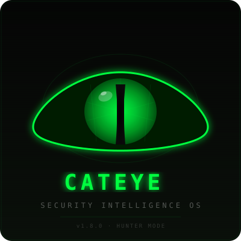

<div align="center">
  <a href="docs/screenshots/cateye-logo.svg">
    
  </a>
  <br/>
  
  
  
  
  <br/>
  <sub>Sistema de Inteligencia Operativa · 100% local · Privado · Autónomo</sub>
</div>

---

## 🧿 ¿Qué es ORION?

**ORION** no es una aplicación. Es un **sistema operativo de trabajo**: una plataforma de inteligencia operativa privada que ejecuta aplicaciones especializadas de análisis, automatización y toma de decisiones. Corre 100% local, no depende de la nube, y está diseñado para reducir fricción en lugar de agregar complejidad.

```
┌─────────────────────────────────────────────────────────────────┐
│                       ORION CORE                                 │
│   EventBus · Scheduler · Copilot · Memory · Secrets · Health     │
│   Decision Journal · Evidence Graph · Extension SDK · Workflows  │
└──────────────────────────┬──────────────────────────────────────┘
                           │
┌──────────────────────────▼──────────────────────────────────────┐
│                        APPS LAYER                                │
│  🛡️ AEGIS    👁️ CATEYE    📈 ATLAS    🎲 ODYSSEY    🤖 HERMES  │
│  pentesting   bug bounty   finanzas   estrategias   automatiz.   │
└──────────────────────────┬──────────────────────────────────────┘
                           │
┌──────────────────────────▼──────────────────────────────────────┐
│                    API LAYER (FastAPI)                            │
│  60+ routers · Auth · CSRF · Rate Limiting · Extension API       │
└──────────────────────────┬──────────────────────────────────────┘
                           │
┌──────────────────────────▼──────────────────────────────────────┐
│         FRONTEND (Vue 3 SPA) + DATABASE (SQLite WAL)             │
│  58 páginas · Pinia · Tailwind · 36+ tablas · AES-256-GCM        │
└──────────────────────────────────────────────────────────────────┘
```

---

## 🚀 Día normal con ORION

| Paso | ¿Qué hizo ORION? | ¿Qué hacés vos? |
|:---:|---|---|
| ☀️ Mañana | Mission Control muestra score 98/100, backups OK, 2 oportunidades | Abrís, ves que no hay nada crítico |
| 🔄 Automático | Scheduler pipeline: DISCOVER → RECON → HYPOTHESIS → VALIDATE → REPORT | Nada — corre solo |
| 🎯 Priorización | ORION decide qué target escanear hoy según ROI esperado | Revisás y aprobás |
| 🩺 Salud | Health Center corre todos los checks, todo verde | Ignorás (no hay alertas) |
| 💾 Respaldo | Backup automático con WAL checkpoint + manifest SHA256 | Ocurrió mientras dormías |
| 📱 Movilidad | Companion te notifica si algo requiere atención urgente | Solo si hay algo rojo |
| 🧠 Decisiones | Decision Journal registra cada acción del sistema en append-only | Consultás el historial si necesitás |
| 👋 Cierre | Update Manager + Auto-Vacuum + WAL truncate | Apagás. ORAIN se encarga de todo. |

> **Vos no operás. Vos decidís.** Ese es el objetivo.

---

## 🧩 Apps incluidas

| App | Propósito | Estado |
|:---|:---|---|
| <a href="docs/screenshots/dashboard-main.svg"></a> **AEGIS** | 🛡️ Pentesting activo — targets, recon pipeline (subfinder → httpx → katana → gau), scanner (nuclei → ffuf → dalfox), 10 conectores de plataformas, reportes Markdown/HTML | ✅ Production |
| <a href="docs/screenshots/pipeline-monitor.svg"></a> **CATEYE** | 👁️ Bug bounty — ORION Score, EVH, pipeline E2E, 8 generadores de hipótesis, Hypothesis Challenger, auto-report | ✅ Production |
| <a href="docs/screenshots/financial-dashboard.svg"></a> **ATLAS** | 📈 Finanzas personales — CoinGecko feed, Takenos, dashboard unificado, exchange connectors | ✅ Production |
| **ODYSSEY** | 🎲 Investigación y mercados predictivos — bankroll, bets, estrategias | ✅ Stable |
| <a href="docs/screenshots/report-detail.svg"></a> **HERMES** | 🤖 Automatización del sistema — 11 comandos, safe mode, action logging | ✅ Production |
| <a href="docs/screenshots/system-health.svg"></a> **COPILOT** | 🧭 Asistencia transversal — 5 niveles de autoridad, 4 bandas de confianza, 6 políticas de seguridad | ✅ Production |

---

## 📸 Capturas del sistema

| | | |
|:---:|:---:|:---:|
| [](docs/screenshots/dashboard-main.svg) | [](docs/screenshots/pipeline-monitor.svg) | [](docs/screenshots/report-detail.svg) |
| 🎯 **Mission Control** — prioridades, health score, próxima acción | 🔄 **Pipeline** — estado de cada etapa E2E | 📄 **Reportes** — exportación Markdown/PDF/HTML |
| [](docs/screenshots/financial-dashboard.svg) | [](docs/screenshots/integration-center.svg) | [](docs/screenshots/system-health.svg) |
| 💰 **ATLAS** — patrimonio, cryptos, exchanges | 🔌 **Integration Center** — 23 integraciones con status check | 🩺 **Health Center** — checks unificados + histórico |

---

## 🔧 Capacidades del Core

| Módulo | Descripción |
|:---|---|
| 🧠 **EventBus** | Pub/sub persistente sobre SQLite. Todos los módulos se comunican sin acoplamiento directo. |
| 📓 **Decision Journal** | Log append-only de todas las decisiones. Cada acción queda registrada con quién, cuándo, por qué y resultado. Feedback loop integrado. |
| 🧩 **Unified Memory** | 10 namespaces (global, cateye, atlas, odyssey, hermes, copilot...). Búsqueda por texto, tags, prioridad, expiración. Preparado para embeddings. |
| 🧭 **Senior Copilot** | 5 niveles de autoridad (Observer → Administrator), 4 bandas de confianza, 6 reglas de policy. Analyzer + Planner + Reviewer + 4 Auditors. |
| 🔗 **Evidence Graph** | Evidencia a favor / en contra / neutral por hipótesis. SQLite persistente, balance scoring. Integrado con Copilot + EventBus. |
| 🔌 **Integration Center** | 23 definiciones de integración en 7 categorías. Status checks en runtime (env vars, vault, health callables). |
| 🔐 **Secrets Manager** | IdentityVault bridge con AES-256-GCM. Cache in-memory, fallback a env vars. API REST para gestión. |
| 🩺 **Health Center** | Checks unificados por categoría (system / background / integration / extension). Score 0-100, histórico de snapshots, status green/yellow/red. |
| 🧩 **Extension SDK** | Manifest, hooks before/after, capabilities registry, declarative settings, hot reload, failure isolation. Auto-descubrimiento desde `extensions/*/manifest.py`. |
| 🔄 **Workflow Engine** | Automatizaciones YAML con 3 plantillas pre-built (recon-full, scan-quick, report-auto). Ejecución paso a paso. |
| 🎯 **Mission Control** | Centro de decisiones unificado. Health score, prioridades, próxima acción, estado de módulos, ingresos. Todo en una sola pantalla. |
| 💬 **Assistant Layer** | Hints contextuales por página, bubble tips con onboarding, spotlight en elementos clave. Todo desactivable. |
| 📱 **Mobile Companion** | API de polling para Android. Notificaciones push web. Status snapshots. Quick-wins. |
| ⚙️ **Setup Wizard** | Onboarding guiado de 5 pasos. Se auto-muestra en el primer inicio. |

---

## 🛡️ AEGIS — Pentesting activo

| Capacidad | Detalle |
|:---|---|
| 🎯 **Targets CRUD** | Creación, seguimiento de estado, historial por target |
| 🔍 **Recon pipeline** | Subfinder → HTTPx → Katana → GAU. Cada etapa con timeout y reporte individual |
| 🧪 **Scanner** | Nuclei (vuln templates) + FFuF (fuzzing) + Dalfox (XSS). Resultados como findings |
| 🔗 **10 conectores** | Bugcrowd, HackerOne, Intigriti, YesWeHack, Synack, y más |
| 📊 **Dashboard** | Stats en tiempo real, findings recientes, health checks |
| 📝 **Reportes** | Markdown / HTML con evidencia adjunta. Exportación individual o por batch |

---

## 👁️ CATEYE — Bug Bounty

| Capacidad | Detalle |
|:---|---|
| 📊 **ORION Score** | 0.0-1.0 — algoritmo de ranking de programas con 6 factores de peso ajustable |
| 💰 **EVH** | Expected Value per Hour — ROI monetario por programa de recompensas |
| 🔄 **Pipeline E2E** | `DISCOVER → RECON → HYPOTHESIS → VALIDATE → REPORT`. 6 etapas automáticas |
| 🧪 **8 generadores** | IDOR, auth bypass, SSRF, privesc, SQLi, XSS, open redirect, RCE |
| 🤔 **Hypothesis Challenger** | 7+ tipos de explicaciones alternativas, tests de contradicción con info_gain, uncertainty penalty en confidence score |
| 📄 **Auto-report** | Finding confirmado → borrador de reporte automático vía EventBus |
| 🔌 **16 OSINT clients** | Shodan, Censys, VirusTotal, SecurityTrails, etc. |
| 🛡️ **OWASP ZAP** | Spider + passive scan integrado |

---

## 💰 ATLAS — Finanzas

| Capacidad | Detalle |
|:---|---|
| 🪙 **CoinGecko** | 30+ cryptos, 24h change, cache free tier |
| 💳 **Takenos** | Balance, CSV import, Solana USDC sync |
| 📊 **Dashboard** | Patrimonio total, breakdown por activo, objetivo Libertad 30K |
| 🔗 **Exchanges** | Binance, Coinbase (HMAC-SHA256), Kraken (HMAC-SHA512) |

---

## 🤖 HERMES — Automatización del sistema

| Comando | Qué hace |
|:---|---|
| `backup` | Backup completo con WAL checkpoint, manifest SHA256, prune automático |
| `status` | Resumen del sistema: version, uptime, DBs, apps cargadas |
| `health` | Health score + checks desglosados por categoría |
| `logs` | Últimas N líneas de logs del sistema |
| `doctor` | Diagnóstico completo: disco, DBs, health, updates, sistema |
| `update` | Buscar y aplicar actualizaciones con rollback |
| `help` | Lista todos los comandos disponibles |

---

## 🔐 Seguridad y privacidad

- **100% local** — nada sale de tu máquina. Sin telemetría, sin datalake, sin cloud
- **AES-256-GCM** — vault de credenciales cifrado. Clave aleatoria (no derivada de machine-id)
- **CSRF** — middleware double-submit cookie en todas las rutas mutantes
- **Rate limiting** — por identity con fallback a IP
- **Audit log** — JSONL append-only con rotación (10MB, 3 backups). chmod 600
- **Ed25519** — validación de licencias asimétrica. Sin HMAC hardcodeado en el binario
- **Sin secretos en repositorio** — API keys en IdentityVault o variables de entorno

---

## 📦 Inicio rápido

```bash
# 1. Clonar
git clone https://github.com/AdriDob/Rastro.git
cd Rastro

# 2. Backend
python3 -m venv .venv
source .venv/bin/activate
pip install -r requirements.txt

# 3. Frontend
cd frontend && npm install && npm run build && cd ..

# 4. Iniciar
python run.py
```

Abrir `http://127.0.0.1:8000` en el navegador.

---

## 🔁 Migrar a otra PC

```bash
# PC A — crear backup
python run.py --backup

# Copiar backup.zip + proyecto a PC B

# PC B — preparar entorno
bash scripts/setup.sh

# PC B — restaurar todo
python run.py --migrate backup.zip

# PC B — verificar
python run.py --verify

# PC B — iniciar
python run.py
```

> El modo portable (`CATEYE_PORTABLE=1`) permite que la licencia funcione temporalmente
> en la nueva máquina hasta que se reactive.

---

## 📊 Estado actual

| Indicador | Valor |
|:---|---|
| **Versión** | `v4.3.2 STABLE` |
| **Tests backend** | 753 pasan · 2 xfailed · 0 fallos |
| **Lint** | 0 errores (Ruff) |
| **Pipeline** | 6-stage E2E funcional (DISCOVER → REPORT) |
| **Pre-commit** | Ruff + pytest hooks activos |
| **Apps activas** | 🛡️ AEGIS · 👁️ CATEYE · 📈 ATLAS · 🎲 ODYSSEY · 🤖 HERMES |
| **Integraciones** | 23 definidas · 10 conectores AEGIS · 16 OSINT |
| **DBs** | 6 SQLite WAL · 36+ tablas · integrity check ✅ |
| **Backup** | 127 archivos · ~88 MB · SHA256 manifest |

---

## 📚 Documentación

| Guía | Descripción |
|:---|---|
| [SYSTEM.md](SYSTEM.md) | Arquitectura completa del sistema |
| [USER_GUIDE.md](USER_GUIDE.md) | Manual de uso diario |
| [CONFIGURATION_GUIDE.md](CONFIGURATION_GUIDE.md) | Guía de configuración |
| [EXTENSION_SDK.md](EXTENSION_SDK.md) | Cómo crear extensiones |
| [HERMES_GUIDE.md](docs/HERMES_GUIDE.md) | Manual de Hermes |
| [AGENT_CHARTER.md](.ai/AGENT_CHARTER.md) | Constitución del sistema |
| [ARCHITECTURE_DECISIONS.md](ARCHITECTURE_DECISIONS.md) | Decisiones arquitectónicas |

---

## 🛠️ Stack tecnológico

| Capa | Tecnología |
|:---|---|
| Backend | Python 3.10+ · FastAPI · Uvicorn |
| ORM | SQLAlchemy 2.0+ · Pydantic v2 |
| DB | SQLite WAL · PostgreSQL |
| Frontend | Vue 3.5+ · TypeScript · Vite 6.4+ |
| CSS | Tailwind CSS 4.1+ · Radix Vue |
| State | Pinia 3.0+ · Composables |
| Desktop | PyInstaller · PyWebView · PyStray |
| AI | Gemini · OpenRouter · Ollama · OpenAI |
| Seguridad | Cryptography · AES-256-GCM · Ed25519 |
| Testing | pytest 753 tests · Vitest · @vue/test-utils |
| Linting | Ruff · Biome |

---

<div align="center">
  <a href="docs/screenshots/cateye-logo.svg">
    
  </a>
  <br/>
  <sub>Hecho en 🇦🇷 · ORION no es una empresa. Es un sistema para uso personal.</sub>
  <br/>
  <sub>v4.3.2 STABLE · Julio 2026</sub>
</div>
