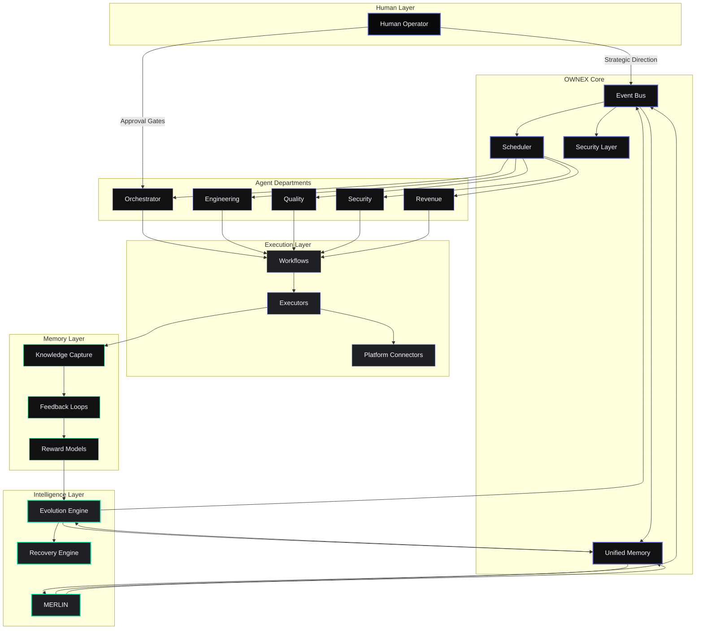

# OWNEX Architecture Diagram

## Architecture Layers

| Layer | Responsibility | Components |
|-------|---------------|-------------|
| **Human Layer** | Strategic direction, approval gates | Human Operator |
| **OWNEX Core** | Event bus, scheduling, memory, security | Event Bus, Scheduler, Unified Memory, Security Layer |
| **Intelligence Layer** | AI assistance, evolution, recovery | MERLIN, Evolution Engine, Recovery Engine |
| **Agent Departments** | Specialized autonomous teams | Orchestrator, Engineering, Quality, Security, Revenue |
| **Execution Layer** | Workflow execution, platform integration | Workflows, Executors, Platform Connectors |
| **Memory Layer** | Learning, feedback, improvement | Knowledge Capture, Feedback Loops, Reward Models |

## Data Flow

1. **Human Direction** → Operator provides strategic goals and approval gates
2. **Event Bus** → Coordinates all system components
3. **Departments** → Autonomous agents work in parallel
4. **Execution** → Workflows run on target platforms
5. **Memory** → Outcomes captured for learning
6. **Evolution** → System improves from feedback
