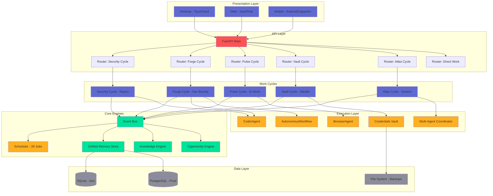

# OWNEX Architecture Overview

```mermaid
graph TB
    subgraph "Presentation Layer"
        A[Desktop - Tauri/Vue3]
        B[Web - Vue3/Vite]
        C[Mobile - Android/Capacitor]
    end
    
    subgraph "API Layer"
        D[FastAPI Main]
        E[Router: Security Cycle]
        F[Router: Forge Cycle]
        G[Router: Pulse Cycle]
        H[Router: Vault Cycle]
        I[Router: Atlas Cycle]
        J[Router: Direct Work]
    end
    
    subgraph "Core Engines"
        K[Event Bus]
        L[Scheduler - 28 Jobs]
        M[Unified Memory Store]
        N[Knowledge Engine]
        O[Opportunity Engine]
    end
    
    subgraph "Work Cycles"
        P[Security Cycle - Rastro]
        Q[Forge Cycle - Dev Bounty]
        R[Pulse Cycle - AI Work]
        S[Vault Cycle - Wealth]
        T[Atlas Cycle - System]
    end
    
    subgraph "Execution Layer"
        U[CoderAgent]
        V[BrowserAgent]
        W[AutonomousWorkflow]
        X[Credentials Vault]
        Y[Multi-Agent Coordinator]
    end
    
    subgraph "Data Layer"
        Z[(SQLite - Dev)]
        AA[(PostgreSQL - Prod)]
        AB[File System - Backups]
    end
    
    A --> D
    B --> D
    C --> D
    
    D --> E
    D --> F
    D --> G
    D --> H
    D --> I
    D --> J
    
    E --> P
    F --> Q
    G --> R
    H --> S
    I --> T
    
    P --> K
    Q --> K
    R --> K
    S --> K
    T --> K
    
    K --> L
    K --> M
    K --> N
    K --> O
    
    P --> U
    Q --> U
    R --> V
    Q --> W
    S --> X
    T --> Y
    
    M --> Z
    M --> AA
    X --> AB
    
    style A fill:#5E6AD2
    style B fill:#5E6AD2
    style C fill:#5E6AD2
    style D fill:#FF5252
    style K fill:#00E39A
    style L fill:#FFB020
    style M fill:#00E39A
    style N fill:#00E39A
    style O fill:#00E39A
    style P fill:#5E6AD2
    style Q fill:#5E6AD2
    style R fill:#5E6AD2
    style S fill:#5E6AD2
    style T fill:#5E6AD2
    style U fill:#FFB020
    style V fill:#FFB020
    style W fill:#FFB020
    style X fill:#FFB020
    style Y fill:#FFB020
    style Z fill:#8B8D98
    style AA fill:#8B8D98
    style AB fill:#8B8D98
```