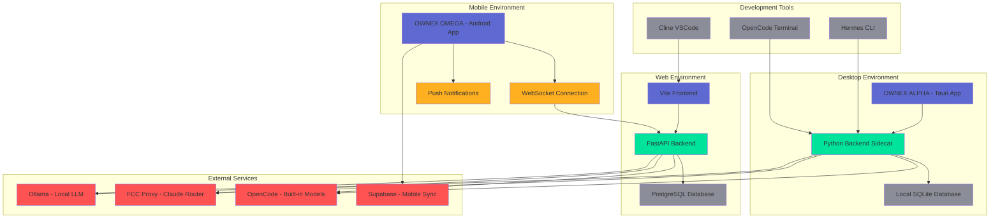

# Deployment Architecture

```mermaid
graph TB
    subgraph "Desktop Environment"
        A[OWNEX ALPHA - Tauri App]
        B[Python Backend Sidecar]
        C[Local SQLite Database]
    end
    
    subgraph "Web Environment"
        D[Vite Frontend]
        E[FastAPI Backend]
        F[PostgreSQL Database]
    end
    
    subgraph "Mobile Environment"
        G[OWNEX OMEGA - Android App]
        H[WebSocket Connection]
        I[Push Notifications]
    end
    
    subgraph "External Services"
        J[Ollama - Local LLM]
        K[FCC Proxy - Claude Router]
        L[OpenCode - Built-in Models]
        M[Supabase - Mobile Sync]
    end
    
    subgraph "Development Tools"
        N[Hermes CLI]
        O[Cline VSCode]
        P[OpenCode Terminal]
    end
    
    A --> B
    B --> C
    B --> J
    B --> K
    B --> L
    
    D --> E
    E --> F
    E --> J
    E --> K
    E --> L
    
    G --> H
    H --> E
    G --> I
    G --> M
    
    N --> B
    O --> D
    P --> B
    
    style A fill:#5E6AD2
    style B fill:#00E39A
    style C fill:#8B8D98
    style D fill:#5E6AD2
    style E fill:#00E39A
    style F fill:#8B8D98
    style G fill:#5E6AD2
    style H fill:#FFB020
    style I fill:#FFB020
    style J fill:#FF5252
    style K fill:#FF5252
    style L fill:#FF5252
    style M fill:#FF5252
    style N fill:#8B8D98
    style O fill:#8B8D98
    style P fill:#8B8D98
```