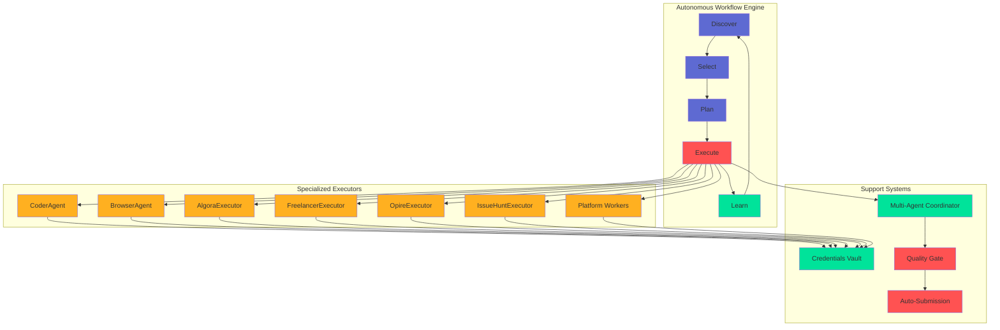

# Execution Layer Architecture

```mermaid
graph TB
    subgraph "Autonomous Workflow Engine"
        A[Discover]
        B[Select]
        C[Plan]
        D[Execute]
        E[Learn]
    end
    
    subgraph "Specialized Executors"
        F[CoderAgent]
        G[BrowserAgent]
        H[AlgoraExecutor]
        I[FreelancerExecutor]
        J[OpireExecutor]
        K[IssueHuntExecutor]
        L[Platform Workers]
    end
    
    subgraph "Support Systems"
        M[Credentials Vault]
        N[Multi-Agent Coordinator]
        O[Quality Gate]
        P[Auto-Submission]
    end
    
    A --> B
    B --> C
    C --> D
    D --> E
    E --> A
    
    D --> F
    D --> G
    D --> H
    D --> I
    D --> J
    D --> K
    D --> L
    
    F --> M
    G --> M
    H --> M
    I --> M
    J --> M
    K --> M
    L --> M
    
    D --> N
    N --> O
    O --> P
    
    style A fill:#5E6AD2
    style B fill:#5E6AD2
    style C fill:#5E6AD2
    style D fill:#FF5252
    style E fill:#00E39A
    style F fill:#FFB020
    style G fill:#FFB020
    style H fill:#FFB020
    style I fill:#FFB020
    style J fill:#FFB020
    style K fill:#FFB020
    style L fill:#FFB020
    style M fill:#00E39A
    style N fill:#00E39A
    style O fill:#FF5252
    style P fill:#FF5252
```