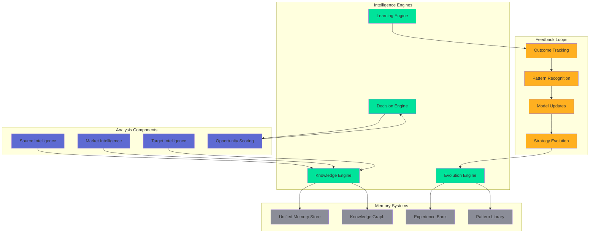

# Intelligence System Architecture

```mermaid
graph TB
    subgraph "Intelligence Engines"
        A[Knowledge Engine]
        B[Evolution Engine]
        C[Decision Engine]
        D[Learning Engine]
    end
    
    subgraph "Memory Systems"
        E[Unified Memory Store]
        F[Knowledge Graph]
        G[Experience Bank]
        H[Pattern Library]
    end
    
    subgraph "Analysis Components"
        I[Source Intelligence]
        J[Market Intelligence]
        K[Target Intelligence]
        L[Opportunity Scoring]
    end
    
    subgraph "Feedback Loops"
        M[Outcome Tracking]
        N[Pattern Recognition]
        O[Model Updates]
        P[Strategy Evolution]
    end
    
    A --> E
    A --> F
    B --> G
    B --> H
    C --> L
    D --> M
    
    I --> A
    J --> A
    K --> A
    L --> C
    
    M --> N
    N --> O
    O --> P
    P --> B
    
    style A fill:#00E39A
    style B fill:#00E39A
    style C fill:#00E39A
    style D fill:#00E39A
    style E fill:#8B8D98
    style F fill:#8B8D98
    style G fill:#8B8D98
    style H fill:#8B8D98
    style I fill:#5E6AD2
    style J fill:#5E6AD2
    style K fill:#5E6AD2
    style L fill:#5E6AD2
    style M fill:#FFB020
    style N fill:#FFB020
    style O fill:#FFB020
    style P fill:#FFB020
```