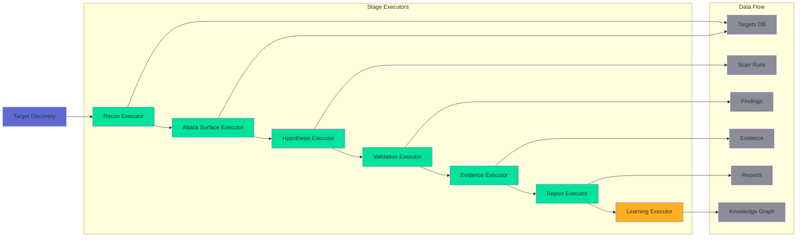

# Security Cycle Pipeline (Rastro)

```mermaid
graph LR
    A[Target Discovery] --> B[Reconnaissance]
    B --> C[Attack Surface Analysis]
    C --> D[Hypothesis Generation]
    D --> E[Validation]
    E --> F[Evidence Collection]
    F --> G[Report Generation]
    G --> H[Knowledge Capture]
    
    subgraph "Stage Executors"
        B[Recon Executor]
        C[Attack Surface Executor]
        D[Hypothesis Executor]
        E[Validation Executor]
        F[Evidence Executor]
        G[Report Executor]
        H[Learning Executor]
    end
    
    subgraph "Data Flow"
        I[Targets DB]
        J[Scan Runs]
        K[Findings]
        L[Evidence]
        M[Reports]
        N[Knowledge Graph]
    end
    
    B --> I
    C --> I
    D --> J
    E --> K
    F --> L
    G --> M
    H --> N
    
    style A fill:#5E6AD2
    style B fill:#00E39A
    style C fill:#00E39A
    style D fill:#00E39A
    style E fill:#00E39A
    style F fill:#00E39A
    style G fill:#00E39A
    style H fill:#FFB020
    style I fill:#8B8D98
    style J fill:#8B8D98
    style K fill:#8B8D98
    style L fill:#8B8D98
    style M fill:#8B8D98
    style N fill:#8B8D98
```