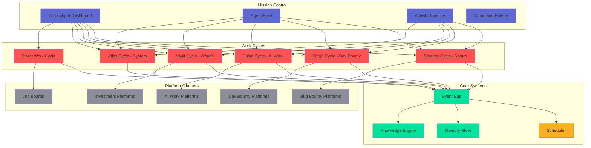

# Work Cycles Architecture

```mermaid
graph TB
    subgraph "Mission Control"
        A[Throughput Dashboard]
        B[Agent Fleet]
        C[Activity Timeline]
        D[Command Palette]
    end
    
    subgraph "Work Cycles"
        E[Security Cycle - Rastro]
        F[Forge Cycle - Dev Bounty]
        G[Pulse Cycle - AI Work]
        H[Vault Cycle - Wealth]
        I[Atlas Cycle - System]
        J[Direct Work Cycle]
    end
    
    subgraph "Core Systems"
        K[Event Bus]
        L[Scheduler]
        M[Memory Store]
        N[Knowledge Engine]
    end
    
    subgraph "Platform Adapters"
        O[Bug Bounty Platforms]
        P[Dev Bounty Platforms]
        Q[AI Work Platforms]
        R[Investment Platforms]
        S[Job Boards]
    end
    
    A --> E
    A --> F
    A --> G
    A --> H
    A --> I
    A --> J
    
    B --> E
    B --> F
    B --> G
    B --> H
    B --> I
    
    C --> E
    C --> F
    C --> G
    C --> H
    C --> I
    
    E --> K
    F --> K
    G --> K
    H --> K
    I --> K
    J --> K
    
    K --> L
    K --> M
    K --> N
    
    E --> O
    F --> P
    G --> Q
    H --> R
    J --> S
    
    style A fill:#5E6AD2
    style B fill:#5E6AD2
    style C fill:#5E6AD2
    style D fill:#5E6AD2
    style E fill:#FF5252
    style F fill:#FF5252
    style G fill:#FF5252
    style H fill:#FF5252
    style I fill:#FF5252
    style J fill:#FF5252
    style K fill:#00E39A
    style L fill:#FFB020
    style M fill:#00E39A
    style N fill:#00E39A
    style O fill:#8B8D98
    style P fill:#8B8D98
    style Q fill:#8B8D98
    style R fill:#8B8D98
    style S fill:#8B8D98
```